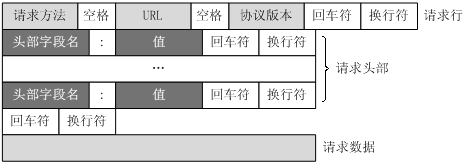
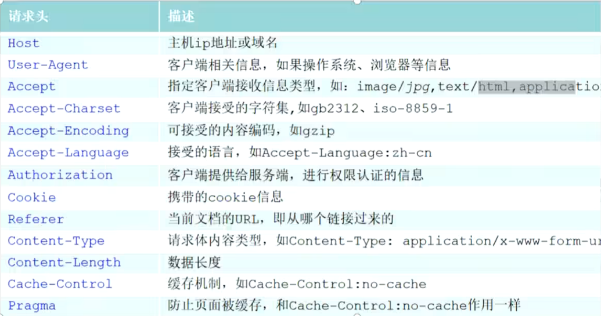
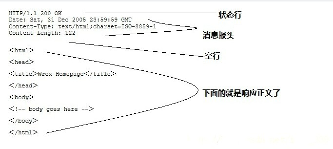
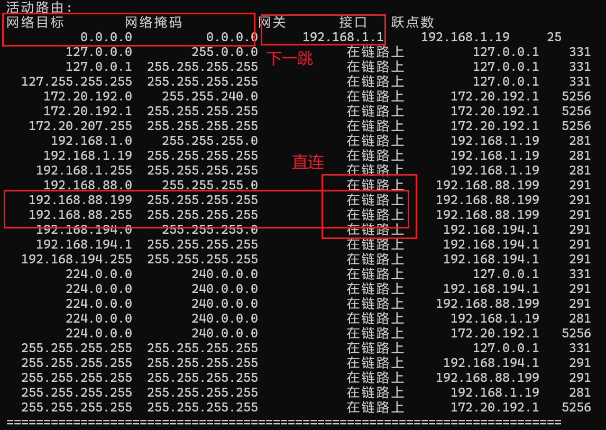
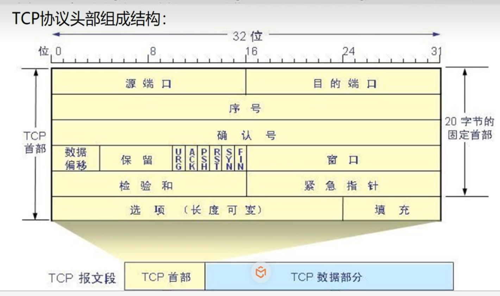
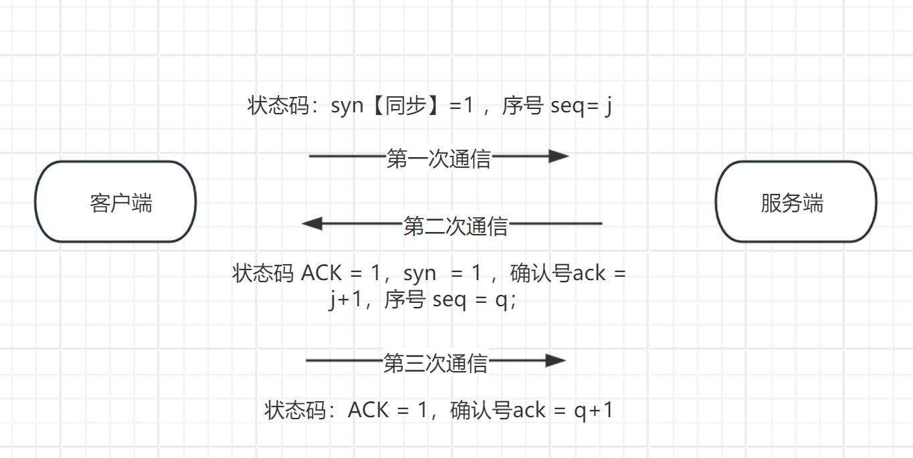
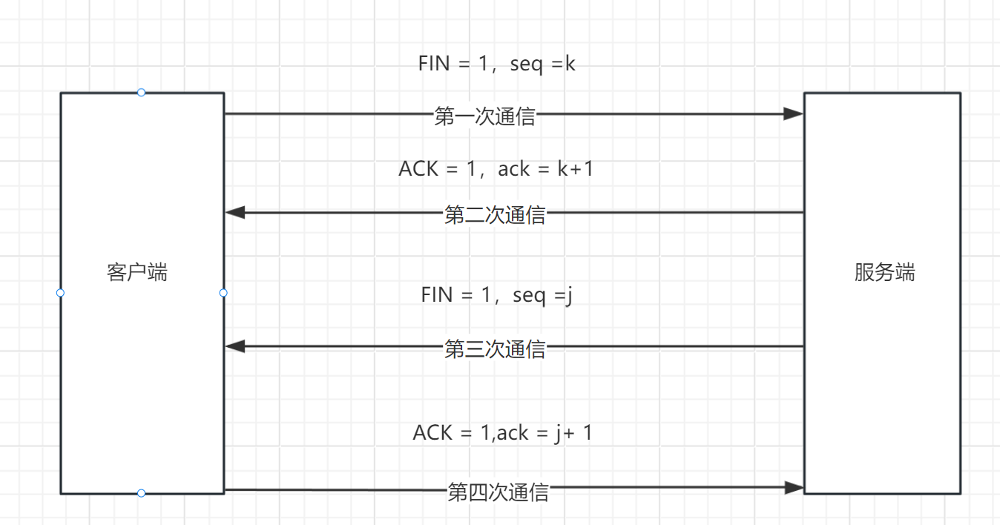

 # http协议原理

## 一、http协议简介

http协议是超文本（html 、带链接的文字和图片）传输的协议。它定义了**客户端**与**服务器**之间请求和响应的格式。工作于`tcp/ip`模型之上

### 1.1 基本工作原理

HTTP 协议工作于客户端-服务端架构上。

工作流程：

1. 客户端发送请求 ：用户通过客户端(如浏览器)输入URL，客户端向服务器发起一个HTTP请求。
2. 服务器处理请求 ： 服务器接收到请求后，根据请求的类型(如GET、POST等)和请求的资源，进行相应的处理。
3. 服务器返回响应：服务器将处理结果包装成HTTP响应消息，发送回客户端。
4. 浏览器进行渲染页面 ： 客户端接收到响应后，根据响应内容(如HTML、图片等)渲染页面，展示给用户。

### 1.2 Http三个要点

+ **http是无连接：**无连接的含义是限制每次连接只处理一个请求。服务器处理完客户的请求，并收到客户的应答后，即断开连接。采用这种方式可以节省时间.
+ **HTTP是媒体独立的**:这意味着，只要客户端和服务器知道如何处理的数据内容，任何类型的数据都可以通过HTTP发送。客户端以及服多器指定使用适合的MIME-type内容类型。
+ **HTTP是无状态的：**HTT协议是**无状态**协议。无状态是指协议对于事务处理没有记忆能力。缺少状态意味着如果后续处理需要前面的信息，则它必须重传，这样可能导致每次连接传送的数据量增大。另一方面，在服务器不需要先前信息时它的应答就较快。

### 1.3 http协议请求协议详解

####  客户端发送请求

**请求报文**

```html
GET /sugrec?&prod=pc_his&from=pc_web&json=1&imod=2&sid=60275_63144_67152_67218_67318_67314_67322_67321_67448_67472_67469_67496_67564_67548_67535_67600_67617_67612_67637_67645_67648_67655_67679_67703_67714_67753_67744_67728&hisdata=%5B%7B%22time%22%3A1711199902%2C%22kw%22%3A%22maven%E7%94%9F%E5%91%BD%E5%91%A8%E6%9C%9F%22%2C%22fq%22%3A2%7D%2C%7B%22time%22%3A1714492823%2C%22kw%22%3A%22%E5%85%A8%E5%9B%BD%E8%BD%AF%E4%BB%B6%E6%B0%B4%E5%B9%B3%E8%80%83%E8%AF%95%22%7D%2C%7B%22time%22%3A1714528756%2C%22kw%22%3A%22%E8%8B%B9%E6%9E%9C%E6%9B%B4%E6%96%B0%E4%B8%BA%E4%BB%80%E4%B9%88%E8%AF%B4%E6%88%91%E6%97%A0%E6%B3%95%E8%BF%9E%E6%8E%A5%E5%88%B0%E7%BD%91%E7%BB%9C%22%7D%2C%7B%22time%22%3A1714528831%2C%22kw%22%3A%22%E8%8B%B9%E6%9E%9C%E6%9B%B4%E6%96%B0%E9%9C%80%E8%A6%81%E5%85%85%E7%94%B5%E5%90%97%22%7D%5D&_t=1770537885302&req=2&usegosug=1&csor=0 HTTP/1.1

Accept: application/json, text/javascript, */*; q=0.01
Accept-Encoding: gzip, deflate, br, zstd
Accept-Language: zh-CN,zh;q=0.9,en;q=0.8,en-GB;q=0.7,en-US;q=0.6
Connection: keep-alive
Cookie: BAIDUID_BFESS=B0F4B1FE1A33226EC3CDCF34E1134932:FG=1; __bid_n=19269bb2d4d372865ea443; MCITY=-%3A; H_WISE_SIDS_BFESS=62038_62184_62187_62183_62197_62230_62257_62325_62346_62329; H_WISE_SIDS=62325_62969_63195_63243_63248_63267_63351_63368; BAIDU_WISE_UID=wapp_1750517424946_974; ZFY=VgUU1IHJo1f2DEsxtc0UoxueCoTKHPPeDUPwcnspF7Q:C; sensorsdata2015jssdkcross=%7B%22distinct_id%22%3A%22383956689%22%2C%22first_id%22%3A%22197ab1406701acd-0bd4b1ec333cea-4c657b58-1821369-197ab1406711e0d%22%2C%22props%22%3A%7B%7D%2C%22%24device_id%22%3A%22197ab1406701acd-0bd4b1ec333cea-4c657b58-1821369-197ab1406711e0d%22%7D; BIDUPSID=B0F4B1FE1A33226EC3CDCF34E1134932; PSTM=1768624050; RT="z=1&dm=baidu.com&si=1a7fcec5-71de-434b-93e1-073b7f31d95f&ss=ml58xdl1&sl=3&tt=bbt&bcn=https%3A%2F%2Ffclog.baidu.com%2Flog%2Fweirwood%3Ftype%3Dperf&ld=ww2v&ul=ww3z&hd=ww47"; H_PS_PSSID=60275_63144_67152_67218_67318_67314_67322_67321_67448_67472_67469_67496_67564_67548_67535_67600_67617_67612_67637_67645_67648_67655_67679_67703_67714_67753_67744_67728; BD_HOME=1; BD_UPN=12314753; BA_HECTOR=21al2101ah21a1212g00ala4808l211koggpd26
Host: www.baidu.com
Ps-Dataurlconfigqid: 0xadce320b0151be7b
Referer: https://www.baidu.com/
Sec-Fetch-Dest: empty
Sec-Fetch-Mode: cors
Sec-Fetch-Site: same-origin
User-Agent: Mozilla/5.0 (Windows NT 10.0; Win64; x64) AppleWebKit/537.36 (KHTML, like Gecko) Chrome/127.0.0.0 Safari/537.36 Edg/127.0.0.0
sec-ch-ua: "Not)A;Brand";v="99", "Microsoft Edge";v="127", "Chromium";v="127"
sec-ch-ua-mobile: ?0
sec-ch-ua-platform: "Windows"
```

**请求信息**： 请求行（request line）、请求头部（header）、空行和请求数据四个部分组成



- **请求行**（Request Line）：

  - **方法**：如 GET、POST、PUT、DELETE等，指定要执行的操作。
  - **请求 URI**（统一资源标识符）：请求的资源路径，通常包括主机名、端口号（如果非默认）、路径和查询字符串。
  - **HTTP 版本**：如 HTTP/1.1 或 HTTP/2。

  请求行的格式示例：`GET /index.html HTTP/1.1`

- **请求头**（Request Headers）：

  - 包含了客户端环境信息、请求体的大小（如果有）、客户端支持的压缩类型等。
  - 常见的请求头包括`Host`、`User-Agent`、`Accept`、`Accept-Encoding`、`Content-Length`等。

- **空行**：

  - 请求头和请求体之间的分隔符，表示请求头的结束。

- **请求体**（可选）：

  - 在某些类型的HTTP请求（如 `POST` 和 PUT）中，请求体包含要发送给服务器的数据。

请求头字段描述

 

####  响应报文

```html
HTTP/1.1 200 OK
Access-Control-Allow-Credentials: true
Access-Control-Allow-Headers: Content-Type
Access-Control-Allow-Methods: POST, GET
Access-Control-Allow-Origin: https://www.baidu.com
Content-Length: 105
Content-Type: application/json; charset=utf-8
Date: Sun, 08 Feb 2026 08:27:59 GMT
Tracecode: 19024205891650906122020804
```

**响应信息由状态行、消息报头、空行和响应正文。**

 


- **状态行**（Status Line）：

  - **HTTP 版本**：与请求消息中的版本相匹配。

  - **状态码**：三位数，表示请求的处理结果，如 200 表示成功，404 表示未找到资源。

    - 3xx  重定向 

      `304 Not Modified` 走缓存 判断你本地的资源和我这里的一样

  - **状态信息**：状态码的简短描述。

  状态行的格式示例：`HTTP/1.1 200 OK`

- **响应头**（Response Headers）：

  - 包含了服务器环境信息、响应体的大小、服务器支持的压缩类型等。
  - 常见的响应头包括`Content-Type`、`Content-Length`、`Server`、`Set-Cookie`等。

- **空行**：

  - 响应头和响应体之间的分隔符，表示响应头的结束。

- **响应体**（可选）：

  - 包含服务器返回的数据，如请求的网页内容、图片、JSON数据等。


## 二、网络层协议

### 2.1  arp协议

实现通过对方的`IP`地址（域名)寻找对方的 MAC 地址ARP的功能

用wireshark去抓取网络请求查看arp协议

### 2.2 ip协议

分配给用户上网使用网际协议的设备的数字标签，分为两大类: IPV4 和 IPv6.

**ip地址的组成**

结构：ip地址 = 网络号 + 主机号

网络号: 标识了一个子网

主机号：标识的是子网中某台主机

**子网掩码**

作用: 用来标识子网,**必须**跟IP地址一起存在。
组成:子网掩码跟IP地址一样，二进制:也是由连续的1和0组成，连续的1表示网络地址，连续的0表示主机地址。**只有网络地址相同的主机在同一个子网**，才能直接通信。

例子：

````
192.168.1.87  255.255.255.0 -- 机器1
192.168.2.77  255.255.255.01--机器2
机器1和机器2他们能直接通信么?--IP协议
````

```
# 解释
根据子网掩码 255.255.255.0
网络号三位是不对的，如果子网掩码前两位255.255，才对
```

### 2.3 路由协议

当我们不在同一子网下怎么和其他电脑通信呢

查看路由表  route print

通过 组协议 路由协议。
静态路由:目的地址---指定下一跳 ---默认路由(0.0.0.000.0 -匹配所有)(主机--默认网关--指定下一跳)
动态路由协议(RIPv1v2，OSPF，BGP):配置之后，动态学习路由条目   --路由表



## 三、tcp协议

tcp协议是传输控制协议，对数据的传输进行一定的控制。

**tcp和http之间的联系**

第一，TCP属于传输层，而http属于应用层，第二，http协议的数据传输 是依赖于tcp协议的传输能力，所以TCP为HTTP提供传输的通道，http定义应用层的交互规则。

**tcp是怎么去连接？**



TCP连接请求--TCP三次握手--TCP四次挥手--断开连接

+ 序号--sequence number     编号:TCP数据包过大，分段(10段:1,2,3，4..10)---按顺序重组 seq==1

+ 确认号--acknowledge number  服务器能够回应，存在于确认消息里；依据序号。
  + ack（确认号）== seq + 1  表示我服务器期望收到你的下一个包的序号
+ 状态控制码（标志位） 信号灯 1-亮  0-灭   表示数据包的类型
  + ACK 【acknowledge】：确认位 1，表示这个消息是确认消息
  + RST 【reset】 ：重置 1，表示这个消息释放连接，TCP连接出现错误--主机服务器崩溃，断开连接。请重新建立连接。
  + SYN 【synchronous】 同步 1，表示这个消息是，1，发起连接的消息 2，确认受连接的消息
  + FIN 【final】 终止   1，表示发送报文结束了完毕了，释放这个连接  TCP四次挥手

### 3.1 TCP三次握手




```
我的回答tcp三次握手

我理解的tcp三次握手是客户端和服务端的三次信息交互
第一次是客户端向服务端发送，syn = 1 ，序号 假设= k的报文，表示我想连接
第二次是服务端想客户端发送 syn = 1 ，ACK = 1 的一个确认码，还有就是序号j ，确认号k+ 1,
第三次是客户端向服务端，发送ACK确认码 = 1 ，序号k+1 服务端J+1 的信号

```


### 3.2  TCP四次挥手



## 四、 UDP协议

