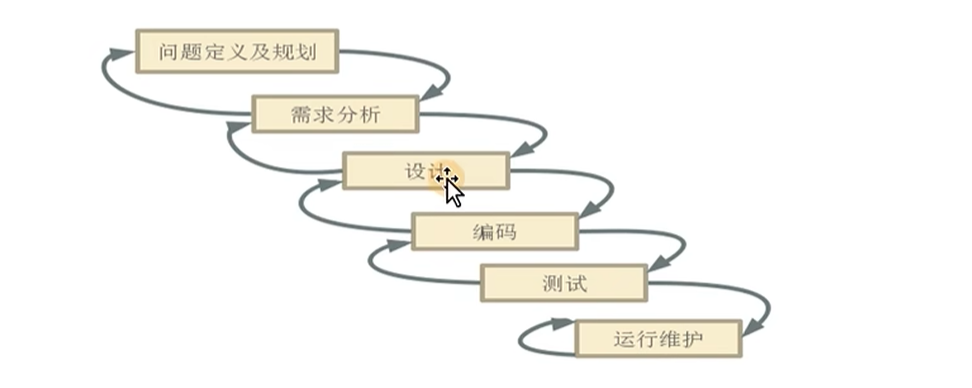
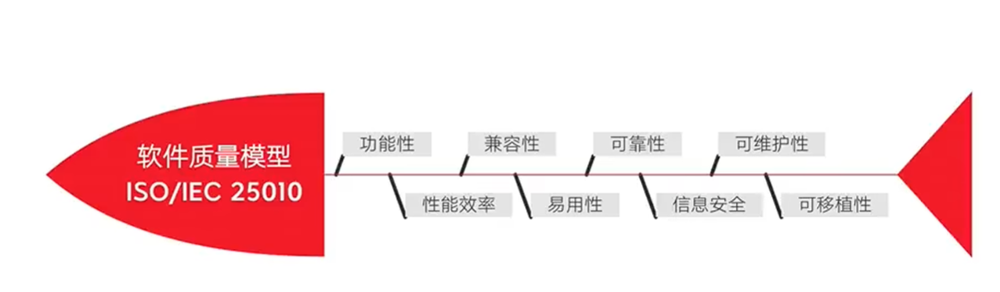
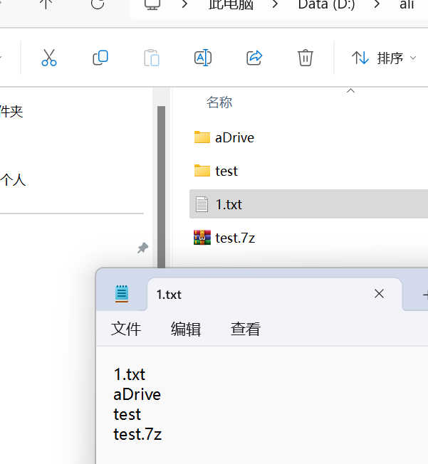
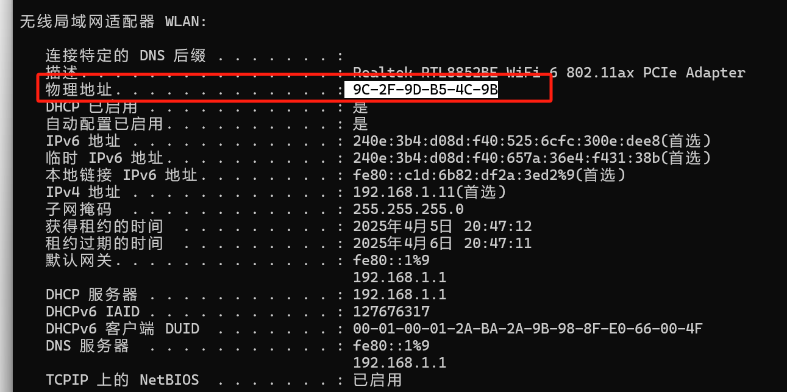
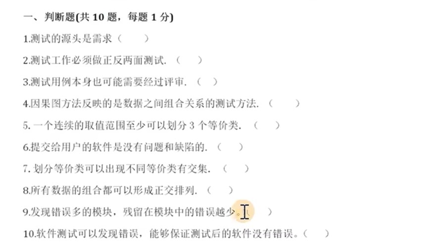
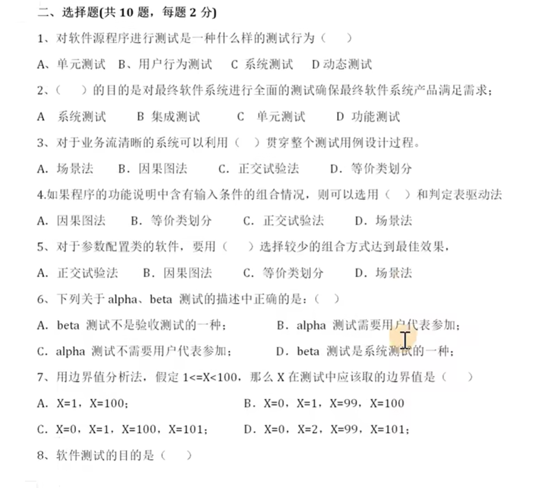
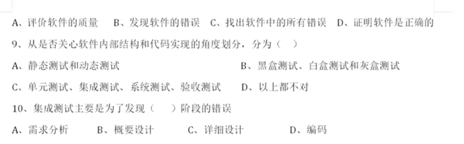
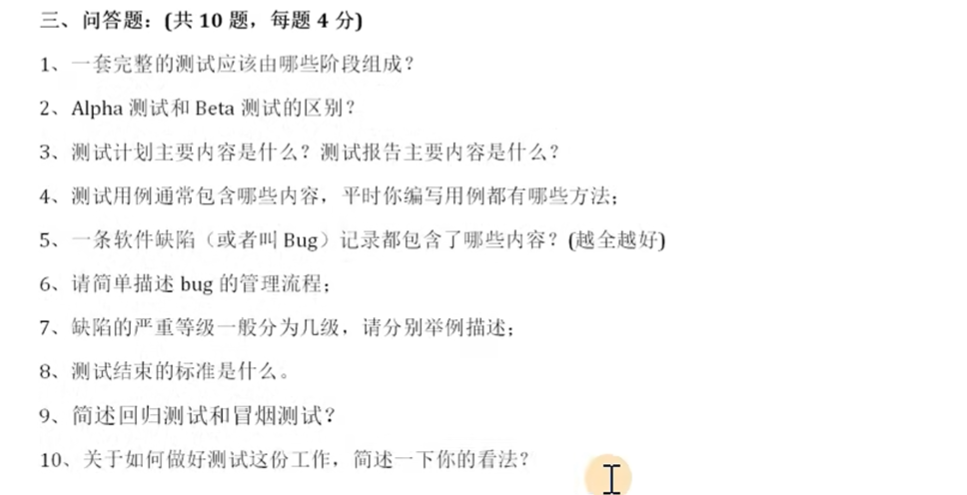
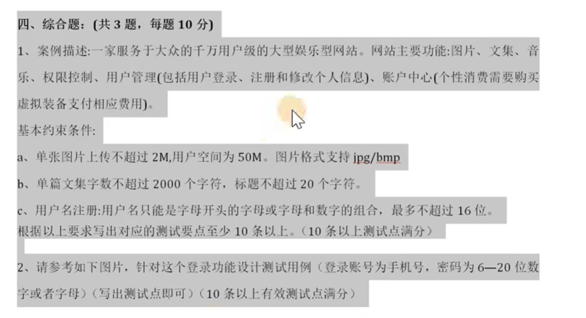
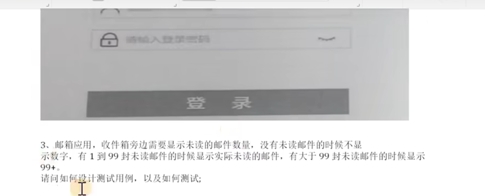

# 测试

+ 什么是软件测试？
  用**人工**或者**自动化**手段运行或者测试某个系统的过程，目的在于**检验**他是否满足规定的需求或者弄清预期结果与实际结果的**区别**
  + 目的
    + 找出bug
    + 高质量
    + 提高用户体验

为什么选择软件测试?
是软件都会缺陷

## 测试基础

### 一、主流测试技能

+ 功能测试：完全看不见程序源代码，只能针对功能进行验证
+ 自动化测试
+ 接口测试，类似postman，看不见部分代码。
+ 性能测试

### 二、常用测试分类

#### 按测试阶段划分

+ 单元测试：针对程序源代码进行测试
+ 集成测试：测试单元之间的接口是否正确，软件之间的接口数据是否正常传递
+ 系统测试：计算机程序结合**网络**，**外设**这些因素去进行测试。
  + 功能测试
  + 性能测试
  + 安全测试
+ 验收测试：
  + alpha测试
    + 把用户请到开发方对软件进行的测试，测试环境受开发方控制，测试人不多，测试时间比较集中
      执行者:测试人员 、用户、公司内部人员
  + beta测试：测试环境不受开发方控制，测试人比较多，测试时间不集中
  + 两者最大区别：
    + 1. 测试场所不一样
    + 2. 一般先做alpha测试，在做beta测试。

#### 按代码可见度划分

- 黑盒测试:又称功能测试(完全看不见程序源代码，只能针对功能进行验证)
- 灰盒测试:又称接口测试(看不见部分代码)
- 白盒测试:又称单元测试(针对程序源代码进行测试)

#### 按测试包含内容去划分

+ 功能测试：验证软件的业务功能是否符合需求
+ 界面测试： 被测系统的界面与原型图是否一致
+ 安全测试： 对被测系统的安全进行测试(对账号多次进行输入用户名密码，是否允许输入 sql注入）

+ 兼容性测试：被测系统在不同的测试环境下是否正常(淘宝(b/s))浏览器:ie/chrome/firefox
+ 性能测试（负载，压力测试）：某个特定的时间，用户数量剧增，软件是否正常

**扩展-测试策略**

冒烟测试：大规模执行测试之前，针对程序主要**核心功能**进行验证，保证程序具备可测性。

面试题：提测标准是什么？--冒烟测试通过！	测试之前怎么做？--冒烟测试

回归测试：开发对存在问题的功能进行修改后，再一次进行的测试

### 三、模型

软件的生命周期的各个阶段

#### 1. 瀑布模型



特点：自上而下
缺点：测试介入比较晚 ---回溯成本比较高
	测试周期比较长

#### 2. v模型

需求规格说明书 （SRS）

测试在需求阶段介入 

传统项目会基于v模型

#### 3. 敏捷开发模型

先分成一个一个小项目，功能迭代。
特点：快
弱化文档，通过人与人之间沟通实现需求分析

#### 3.1.质量模型



```
1. 重点：功能，兼容，性能，易用，安全，界面
```

#### 3.2.w模型

软件开发流程，软件测试在开发流程中的作用

> 开发流程:需求分析、概要设计、详细设计、编码、集成、实施、交付。
>
> 测试流程:单元测试、集成测试、系统测试、验收测试

面试题中，问先测接口还是先测ui功能，当然是先测接口

### 四、测试流程

> 软件在符合什么的条件下可以发布？--剩余bug数量很少，用例覆盖率

发布流程：开发打包 --> 运维/运营/开发 --> 部署到生产环境 实现发布上线。
测试环境：测试人员进行测试的环境(1个或一个以上)
预发布环境（UAT环境）：验收测试（UAT测试）进行的环境 发现问题了怎么办？
生产环境：真实用户使用的环境	

> 你们公司的测试流程是怎样的? 各个阶段的输出是什么?

需求分析---根据需求规格说明书输出项目测试点列表
用例设计---测试用例文档
执行测试---bug以及bug跟踪-通过2-4轮测试
评估测试---测试报告的输出

> ```
> 1、需求分析 
> 2、测试计划
> 3、编写用例
> 4、执行用例
> 5、缺陷管理
> 6、测试报告
> ```

#### 测试需求分析

> 前置：阅读需求分析文档，记录不明确之处。

```
1. 确定各部门的需求一致。
2. 站在不同角度对需求进行（查漏补缺）
```

>  什么是测试需求分析？

+ 根据需求规格说明书明确测试内容，去细分测试点（提取测试点）
+ 什么是测试点？ 
  + --软件包含多个功能点，每个功能点包含多个子功能（测试点），测试点是软件功能细分的最小单元

> 测试需求分析的目的

+ 测试需求分析是编写测试用例的依据
+ 有助于保证测试的质量与进度
+ 测试需求是衡量测试覆盖率的重要指标

> 发布上线标准

+ 测试覆盖率（趋近率为100%）
  + 测试用例**覆盖**率 --影响因素测试点覆盖率
  + 测试用例**执行**率(100%)
  + 测试点覆盖率是决定测试覆盖率的重要指标
+ bug遗留率0%

#### 测试计划

  ```
  核心： 
  	1.测什么 测试目标和范围
      2.谁来测 人员进度安排
      3.怎么测 测试策略，测试工具
  ```

##### 测试计划 

> 一份描述测试工作计划的测试文档，对测试工作进行**统筹**计划安排

##### 测试计划编写者

> 测试主管/测试leader

##### 常见面试题

> 测试计划包含哪些内容 ？ 

**5W1H**

+ why 目的
+ what 测试范围
+ when 时间安排
  + 测试计划：1天
  + 需求分析    需求分析：用例设计=3:4
  + 用例设计
  + 测试执行    测试执行：测试用例执行设计接近1:1    测试执行分多轮
  + 测试报告    1天或者半天
  + 测试周期两周（双休） 
    + 需求分析(2天)
    + 用例编写(3天)
      + 2.5 设计
      + 0.5天评审
    + 执行前准备(0.5天)
      + 测试环境搭建
      + 冒烟测试
    + 测试执行
      + 第一轮测试2.5天
      + 第二轮测试1.5天
    + 测试报告0.5天
+ where 测试环境
+ who   测试人员
+ How   怎么来测（测试方法 + 测试工具）

> 测试风险评估 

企业测试计划文档到底怎么样

> 面试问:
>
> 在测试阶段如何保证测试用例覆盖率?
>
> 首先说说测试流程

####  测试用例设计

  ```
  说明：设计执行测试的文档
  ```

> 什么是测试用例？ --八大因素 输入+动作+预期结果的测试文档

1. 用例编号

   + 用例编号必须唯一
   + 格式:```项目_it/st/uat_功能编号/编号/项目_编号```

2. 模块

   + 当前覆盖的测试点所在的模块
   + 项目分为多个模块，每个模块下存在多个测试点

3. 测试标题

   + 主题描述测试的目的
     + 特点：简单，用例标题不要重复
     + 一般的格式：输入+动作

4. 优先级

   + 根据当前测试点在整个项目中的重要程度来进行划分
     + 高：核心业务功能，冒烟测试
     + 中：错误异常测试点
     + 低：兼容性，界面错误

5. 前置条件

   + 需要满足一些前提条件，否则用例无法执行，如果用例不需要其他什么条件，可以不写条件

6. 测试步骤

   + 具体的测试数据和动作

7. 预期结果 

   按照操作步骤，应该有什么的结果

8. 实际结果

   + 执行测试的结果

     备注，版本

> 编写测试用例的方法

##### **等价类法**

> 找到bug效果等价的

+ 什么是等价类？ --把所有可能的输入项划分为N个子集，在每个子集集中抽取最具有代表性的数据来进行测试。
  + 无效等价类	--有效的，正确的，有意义的输入
  + 有效等价类    --无效的，错误的，无意义的输入
+ 等价类划分法用例设计原则：
  + 1）划分有效及无效等价类，为每一个等价类规定一个唯一的编号；
  + 2）用最少的用例去覆盖最多的有效等价类
  + 3）用最多的用例去--覆盖无效等价类
+ 等价类分析步骤
  1. 根据需求分别找出需求的条件，根据条件，分别找出无效等价类及有效等价类
  2. 对有效等价类和无效等价类进行一一编号
  3. 选择测试用例，根据有效等价类选择正类，根据无效等价类选择反类。
+ 等价类的使用场景
  + 输入项无穷尽的时候，一般会通过有效等价类来实现。
  + 通过有效等价将穷尽测试转换为有限测试

##### **边界值法**

+ 边界值法是等价类的补充	

##### **场景法**

+ 什么是场景法？
  + 通过场景描述的业务流程(业务逻辑)，也包括代码实现逻辑，设计用例来遍历场景(路径)，验证软件系统功能的正确性。
+ 场景法的使用场景？
  + 对项目的业务流程功能用例的设计，基于场景法来进行设计
+ 业务流程图
  + 基于场景设计测试用例的依据
  + 由产品提供业务流程图
  + 流程编辑工具：processon
  + 正常流程 模拟用户正常操作的流程
  + 异常流程/错误流程 模拟用户错误操作的流程   从起点开始，然后可能在**某个节点结束**或者**会返回上一节点**，这样的流程	 

##### **错误推断法**

+ 基于经验，知识和直觉
+ 探索性测试

##### 因果图法

+ 使用场景：当需求中存在多个条件，不同条件中存在不同的结果，就会使用因果图法
+ 因果图法：出需求中的因子(条件)和结果

##### 判定表法 

+ 判定表
  + 条件桩
  + 动作桩
  + 条件项
  + 动作项
+ 因果图判定表分析步骤
  + 找出需求中的因子及结果
  + 确定判定表中条件桩及动作桩
  + 列出所有的条件项
  + 简化判定表，，合并同类项，，1.合并的项，它的动作项是相同，，2、合并的因子，不同值的情况下，动作项的值相同
  + 根据简化的判定表，针对每种条件项及动作项编辑设计测试用例

##### 正交实验法

> 练习：
> 行李托运处理逻辑如下:
> 航天公司规定，乘客可以免费托运30公斤的行李。
> 当重量超过30公斤时，对头等舱的国内乘客超重部分每公斤收费4元;对其他舱的国内乘客超重部分6元每公斤;
> 对外国乘客收费多一倍;对残疾乘客收费减半。用判定表描述以上处理逻辑


> 第一步：编号，是唯一的，项目--st--编号
>
> 第二步，用例标题，可以是用测试目的命名，输入+结果
>
> 第三步，优先级
>
> 第四步，预置条件
>
> 第五步，操作步骤

​		模块名》相机		

​		输入\动作

> 第五步，预期结果

#### 用例评审

评审的目的

+ 用例的覆盖率（漏写）
+ 错写测试用例

#### 测试用例执行

  ```
  说明：项目模块开发完成后开始执行用例文档实施测试
  ```

##### bug

> 什么是bug？

是属于那方面不符合需求导致而划分。

> bug的类型

+ 代码（功能）错误	功能错误、性能、安全
+ 界面优化           界面、易用性测试
+ 设计缺陷           建议优化的bug

####  缺陷管理 

  ```
  说明：提交->验证->关闭
  ```

#### 测试报告

  ```
  说明：测试目标，测试过程，缺陷统计，缺陷分析，测试总结
  在过程条件中，预测试通过，就是冒烟测试通过
  ```

+ 测试报告由谁来编写
  + 由指定某个测试人员来写，需要从其他测试人员收集测试数据
+ 项目有几份测试报告   仅此一份
+ 常见测试题：测试报告包含哪些内容
  + 测试范围
  + 测试环境
  + 数据统计
    + bug数据
    + bug状态
    + bug类型统计
    + 测试阶段统计
    + 按功能模块统计
  + 测试总结
    + 包含测试用例数、执行率、成功率、缺陷关闭率，遗留bug情况(一二级修复情况，遗留bug等级，及情况说明)，结论是ST测试通过/不通过

### 测试用例

+ 用例：用户使用的

### 扩展

灰度测试:先发布**部分功能**，然后看用户的反馈，再去发布另外一部分的功能的更新

A/B测试:先发布的功能先让A部分的**用户**进行更新，再根据用户的反馈，再更新B部分的功能


### 硬件环境+软件环境

#### 硬件环境	

操作系统

+ windows操作系统    不同版本
+ Linux操作系统

CPU/磁盘空间大小

#### 软件环境

web应用服务器

+ apache   PHP语言
+ IIS      C#语言
+ Tomcat    Java
+ nginx

数据库服务器

+ oracle
+ mysql
+ sqlserver
+ db2

#### 常见的测试环境

 PHP + apache/nginx+mysql

java + Tomcat+mysql/oracle


## DOS命令

**dir**

> 查看目录

dir /p 分页展示目录及文件

dir /b 只展示文件名称

```
D:\ali>dir /b
aDrive
test
test.7z
```

**cd** 

> 切换目录/路径

**盘符：**    

> 切换盘符

```
D:\ali>C:
C:\>a
```

**cd 目录**

> 切换当前盘符某个目录下(按tab键自动补全路径)

**cd ..**

**cd** \

根目录

**创建文件夹**

md

**删除文件夹**

rd

**复制文件**

copy 复制文件  目标路径

**修改文件**

ren 1  2 

**把命令的结果保存到文件**  >文件名

```
D:\ali>dir /b >1.txt
D:\ali>
```





**命令管道符**

格式：命令1|命令2|命令3   后一个命令是对前一个命令结果进行处理

比如：dir/b|find "txt"

## 网络协议

### 计算机网络的概念

通过通信设备、网线连接多条计算机，通过网络协议，从而实现数据交换与资源共享。

### 网络分类

从小到大范围划分

+ 1、局域网
+ 2、城域网
+ 3、广域网

### 什么协议

规则、标准，庞大且复杂，但并不可靠

### 网络分层(常见笔试题)

+ 四层模型 

  + 网络接口层
  + 网络层
  + 传输层
  + 应用层

+ 五层模型

  + 物理层
  + 数据链路层 
    + MAC地址：唯一标识每一个计算机(身份证)
    + 查看MAC地址：ipconfig/all
      + 
  + 网络层  
    + ip 地址
      + 唯一性
      + 格式：0-255，0-255，0-255，0-255
    + DNS 域名解析器  比如：https:www.baidu.com-->域名解析DNS--->   ip地址---》访问对应的项目服务器
    + 网关 从一个网络跨到另外一个网络经过的关卡，比如 局域网跨广域网
  + 传输层
  + 应用层

+ OSI 七层模型

  + 物理层     基于物理媒介（网线、光纤）进行传输，传输二进制数据

  + 数据链路层  二进制数据转化为数据帧，定义物理地址（MAC） 

  + 网络层      寻址ip，为数据包选择路由

  + 传输层      提供端对端传输，传输协议TCP/UDP

    + TCP    TCP是传输控制协议，基于连接的协议

      + 建立连接，通过三次握手  

          第一次握手：客户端发送SYN包给服务端，询问是否连接

          第二次握手：服务器接收请求，发送SYN+ACK包客户端确认可以连接

          第三次握手：由客户端发送ACK给服务器，确认连接，建立起连接 

      + 断开连接，四次挥手

          第一次挥手
      
    + UDP  UDP是数据报协议，基于非连接的协议

    + 两者的区别：TCP与UDP相比，资源占有损耗大一些，信息准备，稳定性好，TCP,基于连接的协议,UDP，基于非连接的协议

      UDP性能损耗少，资源占用少，传输速度快，稳定性差。

  + 会话层     建立或解除与别的端的联系

  + 表示层     数据格式化，代码转换，数据加密

  + 应用层     文件传输，电子邮件，文件服务....

### 网络分层

项目：头条

# 面试题

对应视频的15











