# 第一章 linux 常用命令

## 远程连接虚拟机


## 1.1 什么是命令

1. Linux命令的通用格式

command  [-option] [paramer]

+ 命令本体，即命令本身
+ 可选选项，控制命令的行为细节
+ 可选参数，控制命令的指向目标

将test1复制到test2

```
cp -r test1 test2
```

## 1.2 ls 命令

**ls** 

列出当前工作目录下的文件内容

**HOME目录**

每一个用户在Linux系统的专属目录，默认在:/home/用户名

**当前工作目录**

Linux命令行在执行命令的时候,需要一个工作目录,打开命令行程序(终端)**默认**设置工作目录在用户的**HOME目录**

**ls命令的选项**

 -a选项，可以展示出隐藏的内容

​	以.开头的文件或文件夹默认被隐藏

 -l选项，以列表展示内容

 -h选项，需要和-l搭配使用，显示文件大小的单位

**命令行可以组合使用**

ls -lah

## 1.3 cd-pwd命令

1. cd命令的作用

   cd命令可以切换当前工作目录

   不使用参数，切换到工作目录到当前用户的Home目录

2. pwd命令的作用

   输出当前所在的工作目录

## 1.4 相对路径和绝对路径

+ 绝对路径：以根目录做起点，描述路径的方式，路径以/开头
+ 相对路径:以当前目录做起点，描述路径的方式，路径不需以/开头
+ 如无特殊需求，后续学习中，将经常使用相对路径表示

**特殊路径有哪些?**

+ ~表示用户的HOME目录，比如: cd ~ 或cd ~/Desktop
+ .表示当前目录，比如cd.或cd./Desktop
+ ..表示上一级目录，比如:cd..或 cd../..

练习

当前工作目录内有一个test文件夹，文件夹内有一个文件hello.txt，请描述文件的相对路径

`test/hello.txt`

## 1.5 mkdir 命令的语法和功能

+ 用以创建新的目录（文件夹）
+ 语法：`mkdir [-p] [路径]`
+ 参数必填，表示要创建的目录的路径，

**-p选项的作用**

+ 可选，表示自动创建不存在的父目录，适用于**创建连续多层级**的目录

## 1.6 touch-cat-more命令

1. touch命令

   用于创建一个新的文件

   语法：touch linux路径

2. cat命令

   用于查看文件内容

   语法：cat linux路径

3. more命令

   用于查看文件内容，

   可通过空格翻页查看，q退出查看

## 1.7 cp-mv-rm命令

**cp命令**

```
cp [-r] 参数1 参数2
```

用于 复制文件或文件夹

**mv命令**

```
mv 参数1，参数2
```

用于移动文件内容

参数1，表示被移动的文件或文件夹

参数2，表示要移动去的地方，如果目标不存在，则进行改名确保目标存在。

**rm命令**

```
rm [-r ] 参数1，参数2
```

用于删除文件或文件夹

-r 可选，文件夹删除

参数，表示被删除的文件或文件夹路径，支持多个，空格隔开

参数也支持通配符*，用以做模糊匹配

## 1.8 which-find 命令

**which 命令**

查找命令的程序文件

语法：which 【要查找的命令】

**find 命令**

用于查找指定文件

模糊搜索

test*，匹配任何以test开头的内容

*test，匹配任何以test结尾的内容

*test*， 匹配任何包含test的内容

按文件名查找： `find 起始路径 -name “被查找文件名” `

```
atai@atai-virtual-machine:~$ find ~/ -name "1.txt"
/home/atai/1.txt
```

按照大小查找文件：find 起始路径 -size +|- -n [kmg]
实例
查找小于10kb的文件：`find / -size -10k`

查找大于10MB的文件：`find / -size +10M`

## 1.9 grep-wc-管道符命令

**grep命令**

从文件中通过关键字过滤文件行

语法：`grep 【-n】 关键字 文件路径`

选项-n，可选，表示在结果中显示匹配的行的行号。

参数，关键字，必填，表示过滤的关键字，建议使用””将关键字包围起来

参数，文件路径，必填，表示要过滤内容的文件路径，可作为管道符的输入

**wc命令**

命令统计文件的行数、单词数量、字节数、字符数等

语法：`wc 【-c -m -l -w】文件路径` 

不带选项，默认统计行数，单词数，字节数

-c 字节数、-m 字符数、-w单词数 -l 行数

**管道符 |**

将管道符左边命令的结果，作为右边命令的输入

实例：

+ 统计文件中带有user关键字的有几行

  `grep user 1.txt | wc -l`

+ 统计文件中带有user关键字的结果中有多少个单词

  `grep user 1.txt | wc -w`

## 1.10 echo-tail-重定向符

**echo命令**

可以使用echo命令在命令行内输出指定内容

语法:`echo 输出的内容`

可以使用""进行包围

**反引号符 `**

被" ` "包围的内容，会被作为命令执行，而非普通字符

实例

`````linux
echo `ls` #输出ls命令的结果
`````

**重定向符**

">",将左侧命令的结果，**覆盖**写入到符号右侧指定的文件中

">>",将左侧命令的结果，**追加**写入到符号右侧指定的文件中

**tail命令**

查看文件尾部内容，并可以持续跟踪

语法:`tail [-f -num] Linux路径`

-f 表示持续跟踪

## 1.11 vi/vim编辑器

**工作模式**

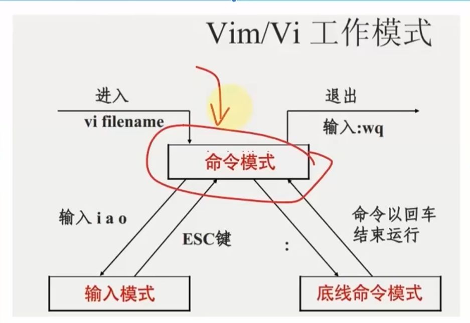

命令行快捷键

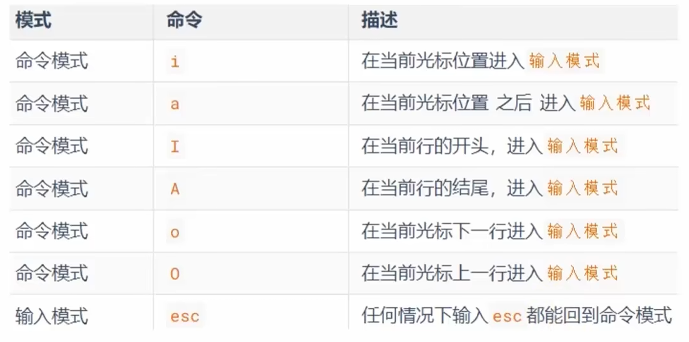

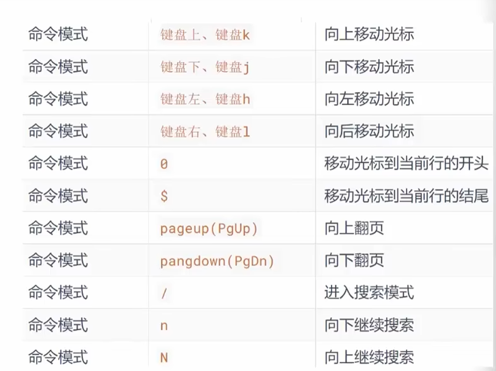

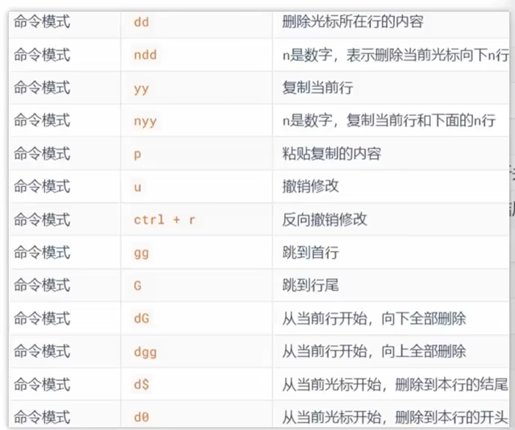

**底线命令模式**

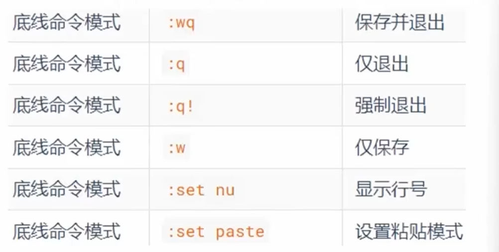

# 第二章 用户和权限

## 2.1 Linux的root用户

1. linux系统的超级管理员是：root用户
2. su命令

+ 可以切换用户，语法：`su [-] [用户名]`
+ -表示切换后加载环境变量，建议带上
+ 用户省略默认切换到root

3. sudo命令

+ 可以让一条普通命令带有root权限，语法：`sudo 其他命令`
+ 需要以root用户执行visudo命令,增加配置方可让普通用户有sudo
  命令的执行权限

## 2.2 用户和用户组

Linux系统中可以:

+ 配置多个用户
+ 配置多个用户组
+ 用户可以加入多个用户组中

**需root用户**

创建用户组

```
groupadd 用户组名
```

删除用户组

```
groupdel 用户组名
```

创建用户

```
useradd 【-g -d】 用户名
-g 选项（指定基本组）
-d 用于指定用户的 家目录路径
```

```shell
useradd -g developers -d /custom/home/alice alice
# 创建用户 alice，基本组为 developers，家目录为 /custom/home/alice。
```

删除用户

```
userdel [r] 用户名
```

查看用户所属组

```
id [用户名]
```

参数:用户名，被查看的用户，如果不提供则查看自身

**getent**

使用getent命令，查看当前系统中有哪些用户

`getent passwd` 查看系统全部用户信息

`getent group` 查看系统全部组信息

## 2.3 查看权限控制信息

**认知权限信息**

权限细节总共分为10个槽位

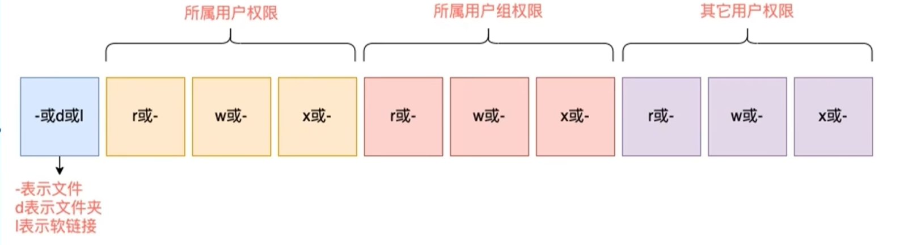

举例：drwxr-xr-x,表示：

+ 这是一个文件夹，首字母d表示
+ 所属用户的权限是：有r有w有x，rwx
+ 所属用户组的权限是有r有x，没W
+ 其他用户的权限是：有r无w有x，r-x

**rwx**

+ r表示读权限
+ w表示写权限
+ x表示执行权限

针对文件、文件夹的不同，rwx的含义有细微差别

+ r，针对**文件**可以查看文件内容

​	针对**文件夹**，可以查看文件夹内容，如1s命令

+ w，针对**文件**表示可以修改此文件

​	针对**文件夹**，可以在文件夹内:创建文件或文件夹、删除文件或文件夹、改名等操作

+ x,针对**文件**表示可以将文件作为程序执行

​	针对**文件夹**，表示可以更改工作目录到此文件夹，即`cd`进入

## 2.4 chomd命令

**chomd命令**

功能：修改命令、文件夹权限的细节

限制：只能是文件、文件夹的所属用户或root有权修改

语法：`chomd【-r】 权限 文件或文件夹`

选项:-R,对文件夹内的全部内容应用同样规则	

**权限的数字序号**

r代表4,w代表2,x代表1

rwx的相互组合可以得到从0到7的8种权限组合

如：7 代表:rwx, 5 代表:r-x,1 代表:--X

## 2.5 chown命令

功能：修改文件、文件夹的所属用户、组

限制，只可root执行

语法：`chown [-R] []` 

选项，-R,同chmod,对文件夹内全部内容应用相同规则

选项，用户,修改所属用户

选项，用户组，修改所属用户组

:用于分隔用户和用户组

#  第三章 linux使用

## 3.1 各类快捷键的使用

**ctrl + c 强制停止**

**ctrl + d 退出或登出**

**历史命令搜索 history**

**ctrl+ r,搜索历史命令**

**ctrl + ←/→ 左右跳转单词**

**ctrl + l 或者 clear清屏**

## 3.2 linux的应用商店

1. 在CentOS系统中，使用yum命令联网管理软件安装

yum语法：yum 【-y】 【install | remove | search 】 软件名称

2. 在Ubuntu系统中,使用apt命令联网管理软件安装

apt语法：apt 【-y】【install | remove | search 】 软件名称

## 3.3 systemctl 控制软件启动与关闭

1. systemctl命令的作用是？

可以控制软件（服务）的启动、关闭、开机自启动

语法： `systemctl start | stop | status | enable | disable 服务名`

enable 是开机自启动，相反是disable

系统内置的服务比较多，比如：

- NetworkManager,主网络服务
- network，副网络服务
- firewalld，防火墙服务
- sshd，ssh服务（finalShell和xshell远程登录linux使用的就是这个服务）

第三方软件，如果自动注册了可以被systemctl控制

第三方软件，如果没有自动注册，可以**手动注**册

## 3.4 软连接

1. 什么事软连接？

可以将文件、文件夹链接到其它位置

链接只是一个指向，并不是物理移动，类似Windows系统的快捷方式

2. 软连接的使用语法

ln -s 参数1 参数2 

+ -s选项，创建软连接
+ 参数1：被连接的文件或文件夹
+ 参数2：要连接去的目的地

实例：

`ln -s /etc/yum.conf ~/yum.conf`

创建/etc/yum.conf，在~/yum.conf`

## 3.5 日期和时区

**date命令的作用和用法**	

date命令可以查看日期时间，可以格式化显示形式以及做日期计算

语法：`date [-d] [+格式化字符串]`

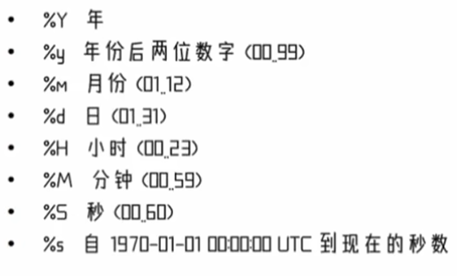

2. **如何修改Linux时区**

```
[root@localhost cen]# rm -f /etc/localtime
[root@localhost cen]# ln -s /usr/share/zoneinfo/Asia/Shanghai /etc/localtime
```

3. ntp的作用

   可以自动联网同步时间，也可以通过ntpdate-untp.aliyun.com手动校准时间

## 3.6 ip地址和主机名

ip地址是联网计算机的网络地址，用于在网络中进行定位

**特殊的IP地址**

0.0.0.0

可以用于指代本机

可以在端口绑定中用来确定绑定关系

在一些IP地址限制中,表示所有IP的意思,如放行规则设置为0.0.0.0,表示允许任意IP访问

**什么是主机名**

主机名就是主机的名称，用于标识一个计算机

**什么是域名解析**

可以通过生机名找到对应计算机的IP地址,这就是主机名映射(域名解析)

windows在C:\Windows\System32\drivers\etc路径下，**用管理员身份去运行** 

/etc/sysconfig/network-scripts/ifcfg-ens33

## 3.7 linux固定ip

centos系统

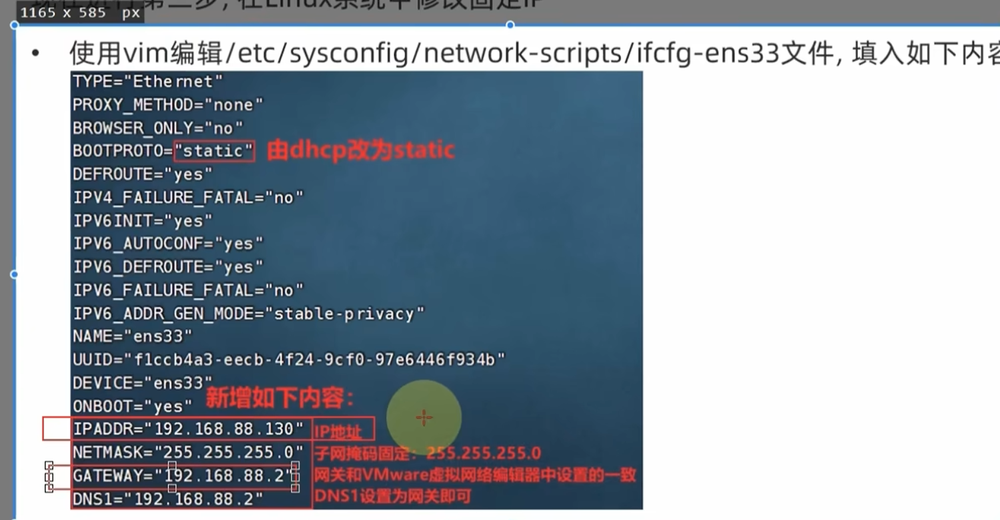

执行`systemctl restart network`

ubuntu系统

```xml
network:
  version: 2
  renderer: NetworkManager
  ethernets:
    ens33:
      dhcp4: false
      addresses: [192.168.88.17/24]
      gateway4: 192.168.88.1
      nameservers:
        addresses: [8.8.8.8, 114.114.114.114]
```

执行`sudo netplan apply`

## 3.8 网络请求和下载

1. 使用ping命令可以测试到某服务器是否联通

语法：ping 【-c num】 ip或主机名

选项：-c，测试次数

2. 使用wget命令可以进行网络文件下载

语法：wget 【-b】 url

选项：-b ，后台下载

查看后台进度，tail -f 表示持续查询

3. 使用curl命令可以发起网络请求

语法：curl 【-o】url

选项：-o。用于下载

## 3.9 端口

1. 什么是端口？

端口是指计算机和外部交互的出入口，可以分为物理端口和虚拟端口。

+ 物理端口：usb、HDMI等
+ 虚拟端口：操作系统和外部交互的出入口

IP只能确定计算机,通过端口才能锁定要交互的程序

2. 端口的划分
   公认端口:1~1023,用于系统内置或常用知名软件绑定使用；

   注册端口：1024~49151,用于松散绑定使用(用户自定义)

   动态端口：49152~65535,用于临时使用(多用于出口)

3. 查看端口占用

nmap 【IP】地址，查看指定ip的对外暴露端口

```
nmap 127.0.0.1 #本机ip的端口
```

netstat -anp | grep 【端口】，查看本机指定端口号的占用情况

## 3.10 进程管理

**什么是进程？**

进程是指 `程序` 在操作系统内运行后被注册为系统内的一个进程，并拥有独立的进程ID;

**管理进程的命令？**

+ ps -ef 查看进程消息

```
-e：显示 所有进程（不限于当前用户）。
-f：以 全格式（Full Format） 输出，包含完整信息（如 UID、PID、PPID、CMD 等）
```

+ ps -ef | grep 【关键字】 过滤关键字进程信息
+ kill [-9] [进程号] 杀掉指定进程号的进程
  + [-9] 强制终止进程

## 3.11 主机状态监控

### 1.top命令

查看cpu，内存使用情况

**top 内容详解**

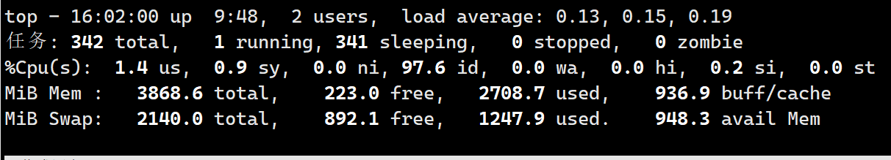

+ 第一行  

  ```
  top - 16:06:48 【系统时间】 up 9:53【运行了9h】,2 users 【表示两个用户】, 
  load average:0.23，0.19，0.18   【负载值 1min ，5min ， 15min】
  ```

+ 第二行  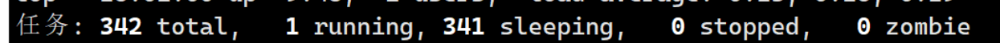

  

  tasks:342个进程

+ 第三行  cpu  

  %Cpu(5):CPU使用率, **us:用户CPU使用率** ,sy:系统CPU使用率 ,ni:高优先级进程占用CPU时间百分比, **id:空闲CPU率,** wa:10等待CPU占用率, hi: CPU硬件中

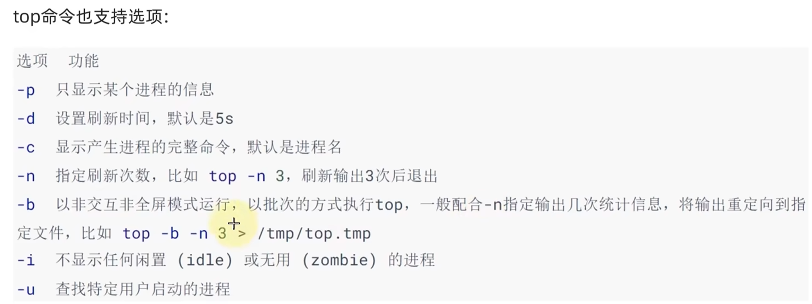

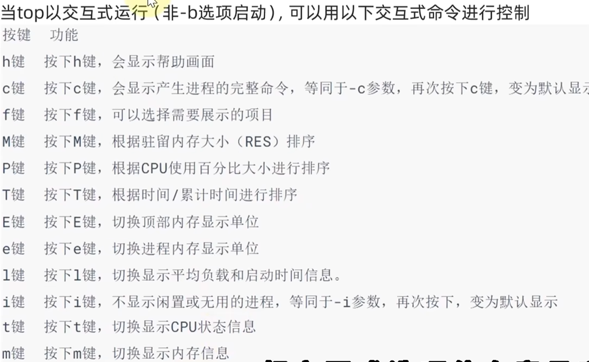

### 2.磁盘监控

使用df命令，可以查看硬盘的使用情况

语法：df【-h】

-h：available 添加单位

```
atai@atai-virtual-machine:~$ df -h
文件系统        大小  已用  可用 已用% 挂载点
tmpfs           387M  2.6M  385M    1% /run
/dev/sda3        39G   20G   18G   52% /
tmpfs           1.9G     0  1.9G    0% /dev/shm
tmpfs           5.0M  4.0K  5.0M    1% /run/lock
/dev/sda2       512M  6.1M  506M    2% /boot/efi
tmpfs           387M   80K  387M    1% /run/user/128
tmpfs           387M   68K  387M    1% /run/user/1000
```

使用`iostat -x [num1][num2]` 

查看cpu，磁盘的相关信息

选项:-x,显示更多信息
num1:数字,刷新间隔,num2:数字,刷新几次

rKB/S:每秒发送到设备的写入请求数
WKB/S:每秒发送到设备的读取请求数
%util:磁盘利用率
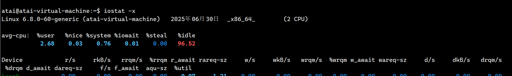

### 3.网络状态监控

sar -n DEV num1 num2

选项:-n,查看网络，DEV表示查看网络接口
num1:刷新间隔(不填就查看一次结束),num2:查看次数(不填无限次数)

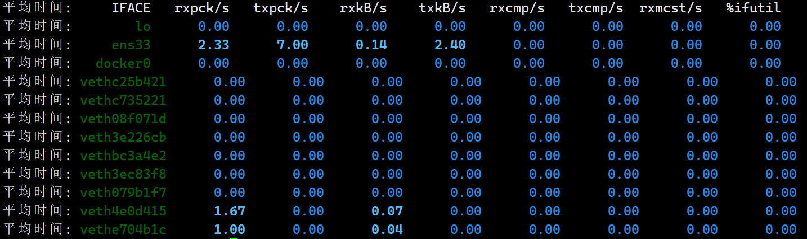

**rxKB/S** 每秒钟接受的数据包大小，单位为KB

**txKB/S** 每秒钟发送的数据包大小，单位为KB

## 3.12 环境变量

环境变量是操作系统(Windows、Linux、Mac)在运行的时候,记录的一些关键性信息,用以辅助系统运行。

使用`env`查看系统中记录的环境变量

**$符号**

在Linux系统中,$符号被用于取”变量”的值。

比如echo $PATH 	

**自行设置环境变量**

临时设置，语法：export 变量名 = 变量值

永久设置环境变量 

+ 针对当前用户设置环境变量，在./.bashrc文件下设置 export 变量名 = 变量值
+ 针对所有用户设置环境变量，在 /etc/profile设置 export 变量名 = 变量值
+ 使用source配置文件使其生效

atai@atai-virtual-machine:~$ nano ./.bashrc
atai@atai-virtual-machine:~$ source ./.bashrc

**自定义环境变量**

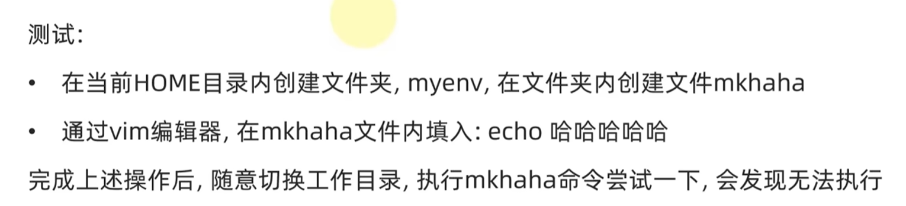

修改环境变量

在/etc/profile上添加`export PATH=$PATH:/home/atai/myenv`

## 3.13 文件的上传和下载

rz是上传

sz是下载

在ubuntu中用xftp可以实现交互式传递

## 3.14 文件的压缩和解压

.tar,称之为tarball,归档文件,即简单的将文件组装到一个,tar的文件内,并没有太多文件体积的减少,仅仅是简单的封装

.9z,也常见为.tar.gz,gzip格式压缩文件,即使用qzip压缩算法将文件压缩到一个文件内,可以极大的减少压缩后的体积

-c,创建压缩文件,用于压缩模式
-V,显示压缩、解压过程,用于查看进度
-x,解压模式
-f,要创建的文件,或要解压的文件,-f选项必须在所有选项中位置处于最后一个-z,gzip模式,不使用-z就是普通的tarball格式
-C,选择解压的目的地，用于解压模式

tar**压缩**常用组合 

`tar -cvf test.tar 1.txt 2.txt 3.txt`

`tar -zcvf test.targz 1.txt 2.txt 3.txt`

-z在第一位

-f在第二位

**解压**

tar -xvf test.tar

``解压test.tar,将文件解压至当前目录``

tar -xvf test.tar -C /home/itheima
`解压test.tar,将文件解压至指定目录`

tar -zxvf test.tar.gz -C /home/itheima

`以Gzip模式解压test.tar.gz,将文件解压至指定目录(/home/itheima)`