# Mysql

## 基础

### Mysql概述

**数据库的相关概念**

名称 				全称  						简称

数据库			存储数据的仓库，数据是有组织的进行存储	db

数据库管理系统	   操纵和管理数据库的大型软件			dbms

SOL                操作关系型数据库的编程语言，定义了一套操作关系型数据库统一标准

**数据模型**

关系型数据库(RDBMS):

建立在关系模型基础上，由多张相互连接的二维表组成的数据库。（`通过表来存储数据都是关系型数据库`）

特点：

+ 使用表存储数据，格式统一，便于维护

+ 使用SQL语言操作，标准统一，使用方便

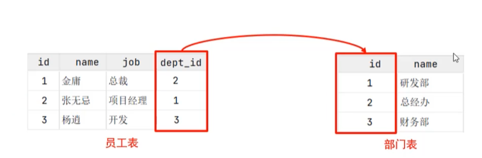


### SQL

#### sql分类

DDL 数据定义语言，用来定义数据库对象(数据库，表，字段)

DMl 数据操作语言，用来对数据库表中的数据进行增删改

DQL 数据查询语言，用来查询数据库中表的记录

DCL 数据控制语言，用来创建数据库用户、控制数据库的访问权限

#### DDl

**数据库操作**

查询：查询所有数据库，该命令会返回当前所创建的所有数据库

```mysql
show databases;
```

查询当前数据库,<u>定位</u>到这个数据库。

```mysql
select database();
```

创建数据库

```mysql
create database [if not exists] databaseName [charset] [排序规则];
```

删除数据库

```mysql
drop database[if exists] databse;
```

使用

```mysql
use 数据库名;
```

**表操作** 

查询

查询<u>当前</u>数据库所有表

```mysql
show tables;
```

在定位了指定的数据库后，我们可以通过该语句查询当前数据库中所有的表，以下是一个示例，查询 `simple` 数据库中的表结果为一个空的集合。

```mysql
use simple;
Database changed -> (message)
show tables;
Empty set (0.01 sec) -> (message)
```

查询表结构

```mysql
DESC 表名;
```

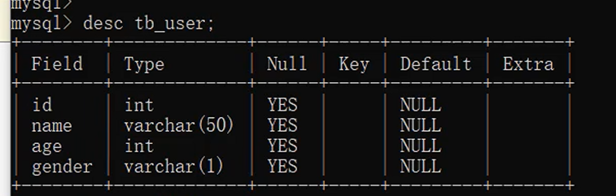

表创建

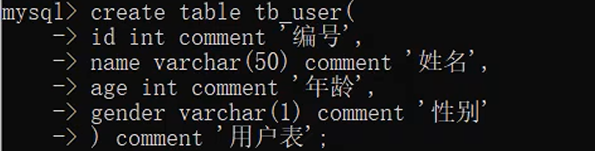

数据类型

+ 数值类型
  + unsigned 无符号范围	

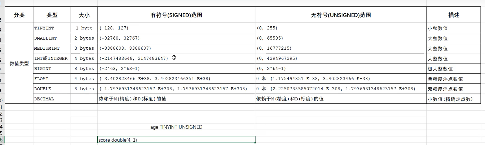

score double (4,1)这里最长100.0表示4，有一位小数。

+ 字符串类型
  + char 定长字符串
  + varchar是变长字符串

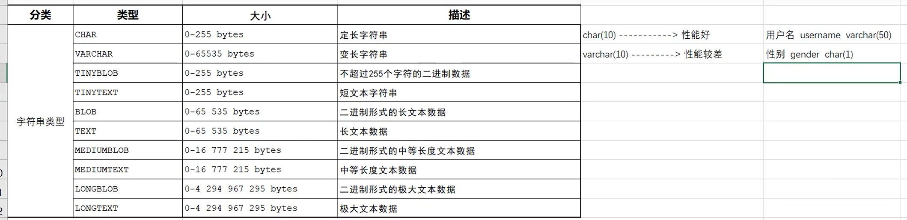

+ 日期类型

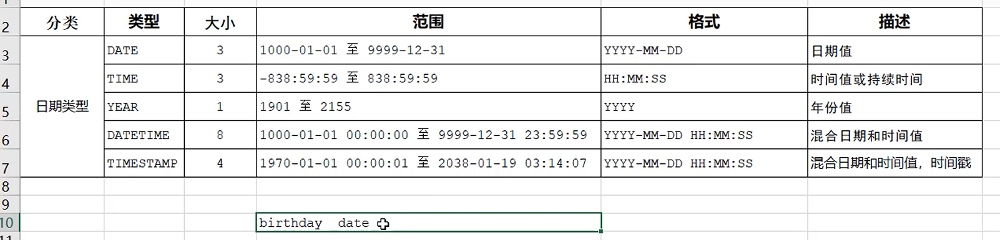

**修改表**

添加字段

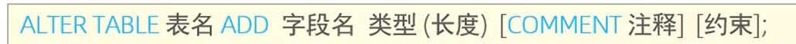

> 练习：为emp表增加一个新的字段”昵称”为nickname，类型为varchar(20)

```mysql
alter table emp add  nickname varchar(20);
```

修改数据类型

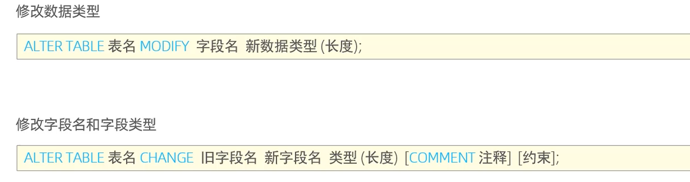

> 练习： 将emp表的nickname字段修改为username，类型为varchar(30)

```mysql
alter table temp change nickname username varchar(30);
```

删除字段


修改表名

**总结：**

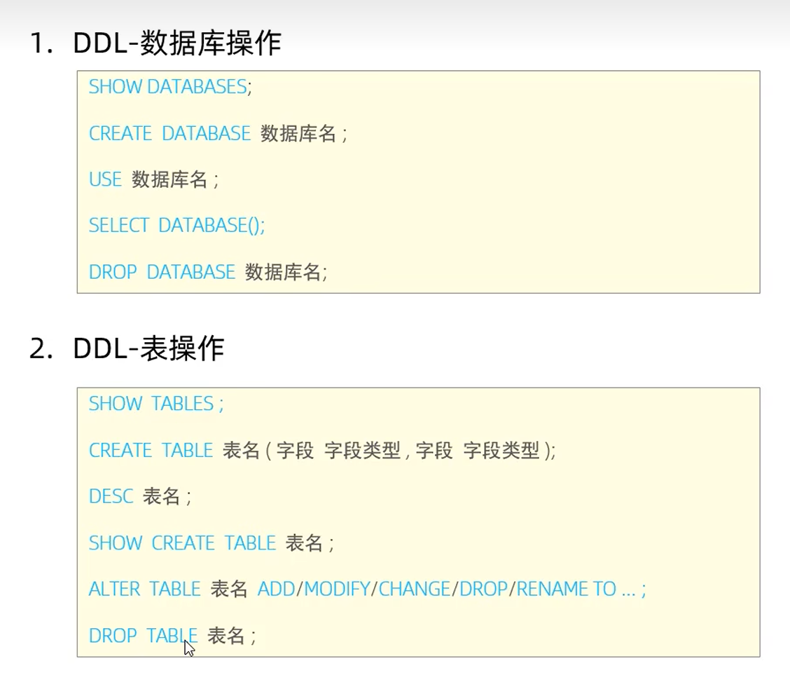

#### DML

概述：用来对数据库中表的<u>数据记录</u>进行增删改操作。

+ 添加数据(INSERT)
+ 修改数据(UPDATE)
+ 删除数据(DELETE)

添加

1. 给指定字段添加数据

   ```mysql
   insert into 表名（字段名1，..） values (值1,...)
   ```

   

2. 给全部字段添加数据

   ```mysql
   INSERT INTO 表名 VALUES (值1,值2, ….);
   ```

   

3. 批量添加数据

   ```mysql
   INSERT INTO 表名 VALUES (值1,值2,….),(值1,值2,….),(值1,值2,….);
   ```

   ```mysql
   INSERT INTO 表名 (字段名1,字段名2,..) VALUES (值1,值2,..),(值1,值2,.),(值1,值2,.);
   ```

   

修改

1. 修改数据

   ```mysql
   UPDATE 表名 SET 字段名1=值1,字段名2=值2,…[WHERE 条件];
   ```

   **注意**:`修改语句的条件如果没有条件，则会修改整张表的所有数据`

> 练习：修改id为1 的数据，将name修改为小昭，gender 修改为女

```mysql
update emplyee set name = '小昭'，gender = '女' where id = 1;
```


删除

删除数据

```
delete from 表名 [where 条件]
```


**总结**

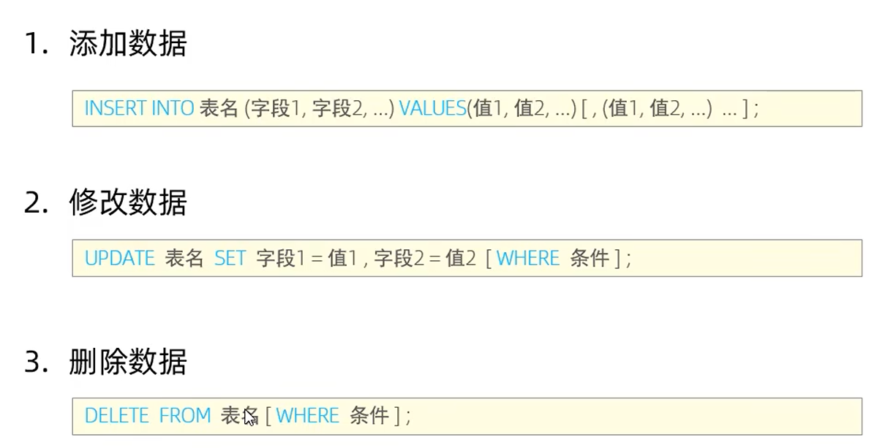

#### DQL

数据查询语言，用来查询表中的记录。

语法

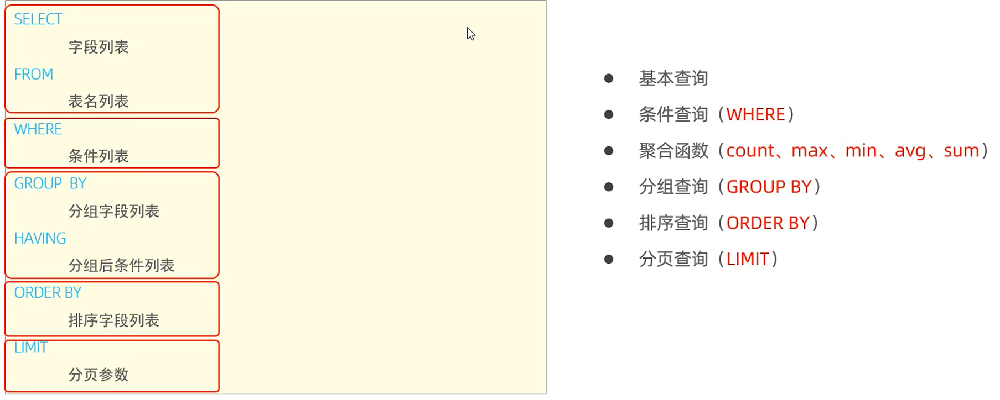

**基本查询**

select

**条件查询**

where

**聚合函数**

​	count ： 统计数量 

​	count（字段）

​	max：最大值

​	min：最小值

​	avg：平均值

​	sum：求和

> null值不参与计算

```mysql
SELECT 字段列表 FROM 表名[WHERE 条件] GROUP BY 分组字段名[HAVING 分组后过滤条件;
```

**分组查询**

根据性别分组，统计男性员工和女性员工的数量

```mysql
select gender,count(*) from emp group by gender;
```

查询年龄小于45的员工 ，并根据工作地址分组，获取员工数量大于等于3的工作地址

```mysql
select address,count(*) from emp where age < 45 group by address having count(*) >= 3;
```

**排序查询**

```mysql
SELECT 字段列表 FROM 表名 ORDER BY 字段1 排序方式1,字段2 排序方式2；
```

ASC:升序(默认值)
DESC:降序

**注意:**如果是多字段排序，当第一个字段值相同时，才会根据第二个字段进行排序

>  根据年龄对公司的员工进行升序排序,年龄相同，再按照入职时间进行降序排序。

```mysql
select name from emp order by age asc,date desc; 
```

**分页查询**

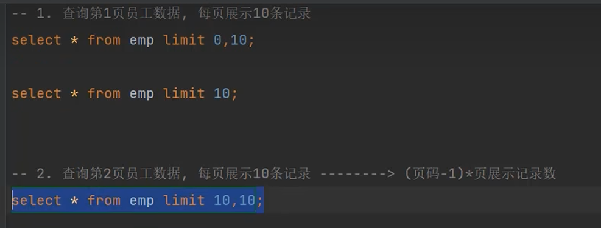

**注意**

+ 起始索引从0开始，起始索引=(查询页码-1)*每页显示记录数。

+ 分页查询是数据库的方言，不同的数据库有不同的实现，MySQL中是LIMIT。

+ 如果查询的是第一页数据，起始索引可以省略，直接简写为limit 10。

  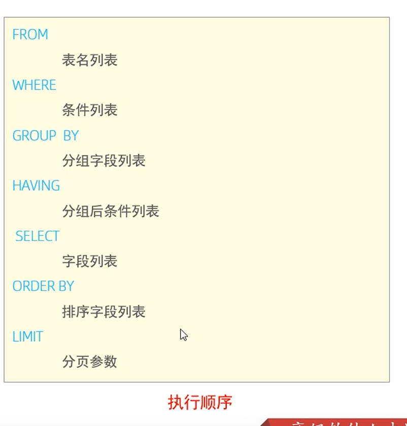

别名的申明

### 函数

**字符串函数**

- `concat(str1, str2,...)` 字符串拼接，将str1, str2, ...拼接成一个字符串
- `lower(str)` 将字符串全部转换为小写
- `upper(str)` 将字符串全部转换为大写
- `lpad(str, n, pad)` 左填充，将pad填充至字符串str的左边，达到n个字符串长度
- `rpad(str, n, pad)` 右填充，将pad填充至字符串str的右边，达到n个字符串长度
- `trim(str)` 去除字符串前后空格
- `substring(str, start, len)` 截取字符串str中从start起始的len个字符（返回一个新的字符串）

```mysql
# 拼接字符串 Hello 与 JavaScript
select concat('Hello', ' JavaScript');

# 将字符串 SELECT * FROM INFORMATION WHERE ID > 3 转换为小写
select lower('SELECT * FROM INFORMATION WHERE ID > 3');

# 将字符串 select * from information where id > 3 转换为大写
select upper('select * from information where id > 3');

# 字符串 str 的长度是三个字符，在该字符左侧填充字符 & 以达到字符串长度为6个字符
# 也就是 6 - str 长度 = 3，故此填充三个 & 字符，&&&str
select lpad('str', 6, '&');
# 现在换一边，填充为 str&&&
select rpad('str', 6, '&');

# 将字符串 JavaScript 左右两侧的空格去除
select trim(' JavaScript ');

# 截取字符串 JavaScript 中的 Script 部分
select substring('JavaScript', 5, 7);
```

```mysql
小练习
现有表 emp ，表中每一条记录对应一个员工的信息，其中 workno 表示员工的工号
# 根据需求完成以下SQL编写
由于业务需求变更，企业员工的工号，统一为5位数，目前不足5位数的全部在前面补0。比如、1号员工的工号应该为00001
update emp set workno = lpad(workno, 5, '0');
```

**数值函数**

- `ceil(x)` 向上取整
- `floor(x)` 向下取整
- `mod(x, y)` 取余，x除以y的余数
- `rand()` 返回0-1以内的随机数
- `round(x, y)` 求参数x四舍五入后的值，保留y位小数

```mysql

```

**日期函数**

+ `Date_sub(date, INTERVAL expr unit)`
  + `date`：你想操作的起始日期（可以是 `CURDATE()`、`NOW()`、某个日期字段等）
  + `INTERVAL expr unit`：表示要减去多长的时间
    - `expr` 是时间数值，比如 7、30、1
    - `unit` 是时间单位，比如 DAY、MONTH、HOUR、MINUTE 等
  + 例子：最近7天就是减去7天 `date_sub(current_date,interval 7 day)`

- `CURRENT_DATE()` 返回当前日期（年月日）
- `CURRENT_TIME()` 返回当前时间（时分秒）
- `now()` 返回当前日期和时间
- `year(date)` 获取date参数中的年份
- `month(date)` 获取date参数中的月份
- `day(date)` 获取date参数中的日期
- `date_add(date, interval n type)` 返回一个日期/时间值加上一个时间间隔n后的时间值，n是一个变量，type表示变量n的单位
- `datediff(date1, date2)` 返回两个时间相差的天数（差值）

```mysql
# 计算当前日期往后推70天后的日期
select date_add(now(), interval 70 day);
# 计算当前日期往后推70个月后的日期
select date_add(now(), interval 70 month);
# 计算当前日期往后推70年后的日期
select date_add(now(), interval 70 year);

# 计算 2022年09月12日 到 2023年05月11日 之间相差的天数
select datediff('2023-05-11', '2022-09-12');	# 241
select datediff('2022-09-12', '2023-05-11');	# -241
```

```mysql
# 现有表 emp ，每个员工信息对应一条表中记录，rtime 字段表示员工的入职日期
# 查询所有员工的入职天数，并根据入职天数降序排序
# 显示员工的姓名和计算后的入职天数，同时给结果表中起别名显示
select name, datediff(curdate(), rtime) as 'entrydays' from emp order by entrydays desc;
```

**流程函数**

流程函数也是很常用的一类函数，可以在SOL语句中实现条件筛选，从而提高语句的效率

- `if(vale, t, f)` 如果value为true，返回t，否则返回f
- `ifnull(value1, value2)` 如果value1不为空，返回value1，否则返回value2
- `case when [val1] then [res1] ... else [default] end` 如果val1为true，返回res1，...否则返回default默认值（val1可以是一个表达式）
- `case [expr] when [val1] then [res1] ... else [default] end` 如果expr的值等于val1，返回res1，...否则返回default默认值（val1只能是一个静态的值，不能做一些判断操作）

```mysql
-- false 应该位条件表达式
select if(false,'ok','error');

# ifnull
select ifnull('0k','Default');
select ifnull(null,'Default');

# case when then else end
# 需求:查询emp表的员工姓名和工作地址(北京|上海---->一线城市，其他---->二线城市)
select
	name,
	(case workaddress when '北京' then '一线城市' when '上海' then '一线城市' else '二线城市' end)
from
emp;

#统计班级各个学员的成绩，展示的规则如下:>= 85，展示优秀 , >=60，展示及格,否则，展示不及格
select
id
name,
	(case when math >= 85 then '优秀' case when math >= 60 '及格' else'不及格' end) '数学'
	...
from score;
```


### 约束

概述： 约束是作用于表中字段上的规则，用于限制存储在表中的数据。

目的:  保证数据库中数据的正确、有效性和完整性。

|           约束           |                           描述                           |   关键字    |
| :----------------------: | :------------------------------------------------------: | :---------: |
|         非空约束         |                限制该字段的数据不能为null                |  NOT NULL   |
|         唯一约束         |          保证该字段的所有数据都是唯一、不重复的          |   UNIOUE    |
|         主键约束         |         主键是一行数据的唯一标识，要求非空且唯一         | PRIMARY KEY |
|         默认约束         |      保存数据时，如果未指定该字段的值，则采用默认值      |   DEFAULT   |
|         外键约束         | 用来让两张表的数据之间建立连接，保证数据的一致性和完整性 | FOREIGN KEY |
| 检查约束(8.0.16版本之后) |                 保证字段值满足某一个条件                 |    CHECK    |

> 练习

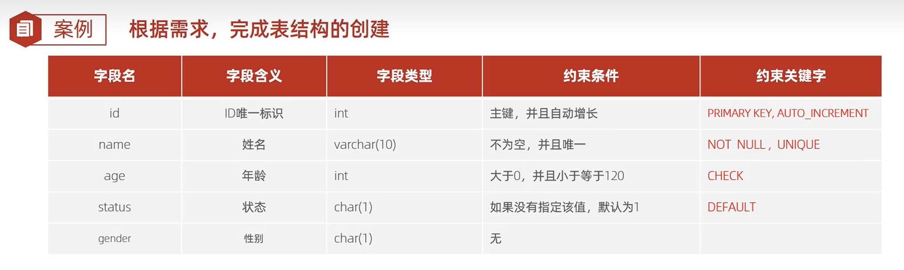

```mysql
create table user
(
    id     int primary key auto_increment comment '主键',
    name   varchar(10) not null unique comment '姓名',
    age    int check (age > 0 && age <= 120) comment '年龄',
    status char(1) default '1' comment '状态',
    gender char(1) comment '性别'
)
    comment '用户表';
```


**外键约束**

外键用来让两张表的数据之间建立连接，从而保证数据的一致性和完整性

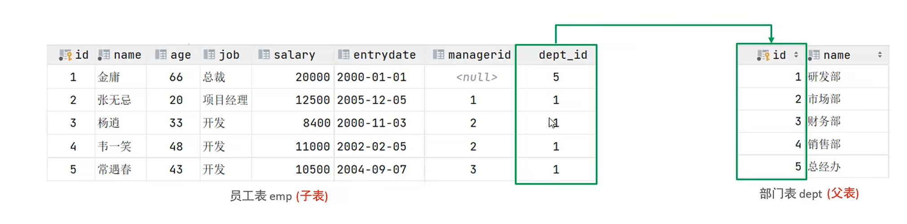

>  添加外键

```mysql
-- 外键关联（员工表外键关联部门表主键）
alter table user add constraint fk_user_dept_id foreign key (dept_id) references dept(id);
```

> 删除外键

```mysql
ALTER TABLE emp DROP FOREIGN KEY fk_user_dept_id;
```

**外键删除/更新行为**

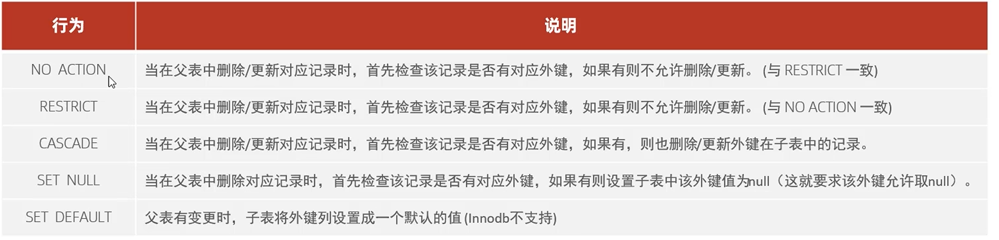

```mysql
# set null的用法
alter table emp
    add constraint fk_user_dept_id foreign key (dept_id) references dept(id) 
    on update set null on delete set null;
```

### 多表查询

#### 一对多

+ 案例：部门 与 员工的关系
+ 关系:一个部门对应多个员工，一个员工对应一个部门
+ 实现:在**多的一方建立外键**，指向一的一方的主键

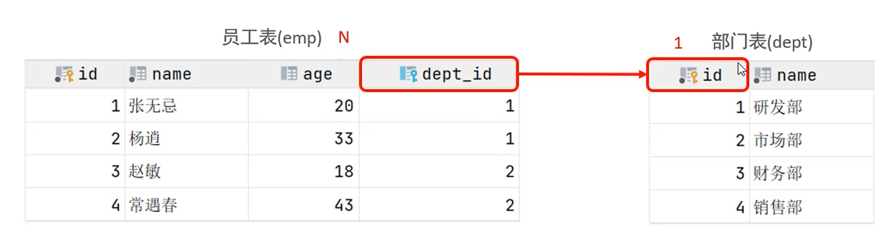

#### 多对多

+ 案例: 学生 与 课程的关系

+ 关系:一个学生可以选修多门课程，一门课程也可以供多个学生选择
+ 实现:建立第三张中间表，中间表至少包含两个外键，分别关联两方主键


#### 一对一

+ 案例:用户 与 用户详情的关系
+ 关系: 一对一关系，多用于单表拆分，将一张表的基础字段放在一张表中，其他详情字段放在另一张表中，以提升操作效率
+ 实现:在任意一方加入外键，关联另外一方的主键，并且设置外键为唯一的(UNIQUE)

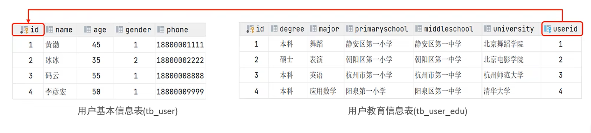

#### 多表查询

概述：概述:指从多张表中查询数据
笛卡尔积:笛卡尔乘积是指在数学中，两个集合A集合 和 B集合的所有组合情况。(在多表查询时，需要消除无效的笛卡尔积)

```mysql
select * from emp,dept where emp.dept_id = dept.id;
```

#### 内连接

内连接查询的是两张表交集的部分

隐式内连接

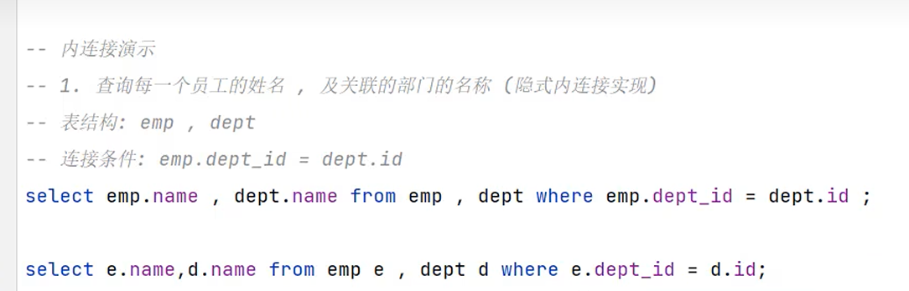

显示内连接

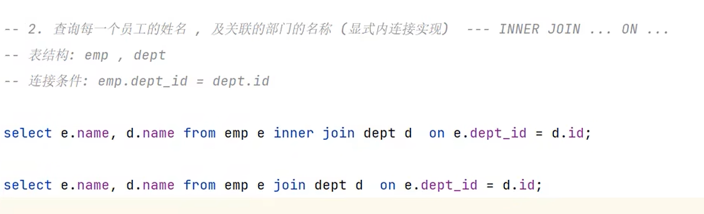

####  外连接

+ 左外连接

```mysql
SELECT 字段列表 FROM 表1 LEFT [OUTER]JOIN 表2 ON 条件 …;
```

相当于查询表1(左表)的所有数据 包含 表1和表2交集部分的数据

+ 右外连接
  + 同理左改右

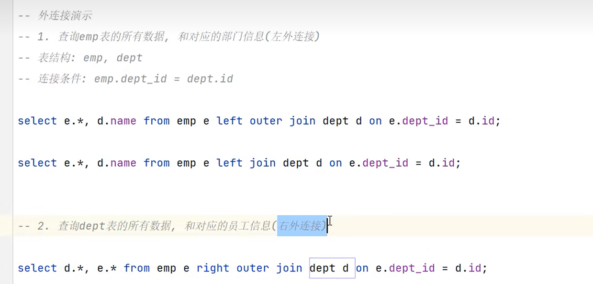

#### 自连接

自连接查询语法:

```mysql
SELECT 字段列表 FROM 表A 别名A JOIN 表A 别名B ON 条件…;
```

自连接查询，可以是内连接查询，也可以是外连接查询。

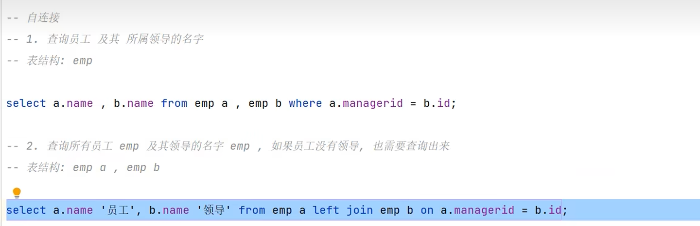

> 自连接一张表把他看做两张表，注意要起别名。

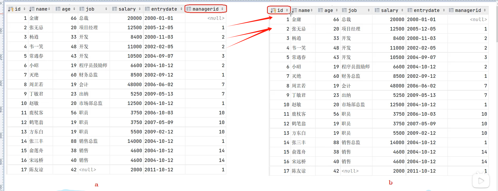

#### 联合查询-union,union all

对于union查询，就是把多次查询的结果合并起来，形成一个新的查询结果集

```mysql
SELECT 字段列表 FROM 表A ….
UNION [all]
SELECT 字段列表 FROM 表B.../
```

+ 对于联合查询的多张表的列数必须保持一致，字段类型也需要保持一致。
+ union all 会将全部的数据直接合并在一起，union 会对合并之后的数据去重.

#### 子查询

概念:SQL语句中嵌套SELECT语句，称为**嵌套查询**，又称**子查询**

+ 标量子查询

```mysql
# 根据销售部部门ID，查询员工信息
select * from emp where dept_id = (select id from dept where name ='销售部');
```

+ 列子查询

  + 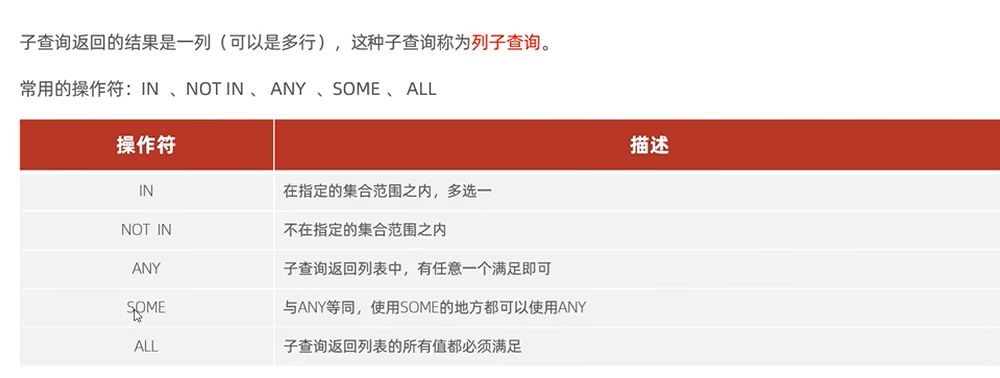

  + 查询的结果是一列多行

    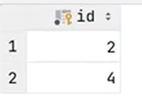

```mysql
# .根据部门ID，查询员工信息
select * from emp where dept id in (select id from dept where name ='销售部'or name ='市场部');

-- 2.查询比财务部所有人工资都高的员工信息

-- a.查询所有财务部人员工资
select id from dept where name ='财务部';
select salary from emp where dept id = (select id from dept where name ='财务部');
-- b.比财务部所有人工资都高的员工信息
select * from emp where salary > all 
( select salary from emp where dept id = (select id from dept where name = '财务部'));

# 查询比研发部其中任意一人工资高的员工信息
-- a.查询研发部所有人工资
select salary from emp where dept_id = (select id from dept where name ='硏发部');
-- b.比研发部其中任意一人工资高的员工信息
select * from emp where salary > some 
( select salary from emp where dept id = (select id from dept where name = '发洲') );
```

+ 行子查询

  + 子查询返回的结果是一条记录多个字段，这种子查询称为行子查询。

    常用的操作符:=、IN、NOT IN

```mysql
# 查询与“张无忌”的薪资及直属领导相同的员工信息
select * from emp where (salary,managerid)= (select salary, managerid from emp where name = '张无忌');
```


+ 表子查询
  + 子查询是多行多列

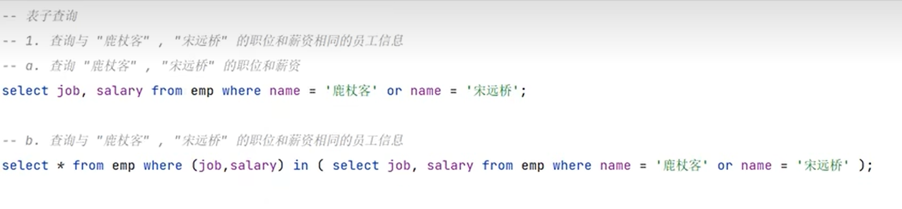

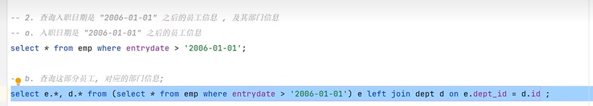	

>  练习

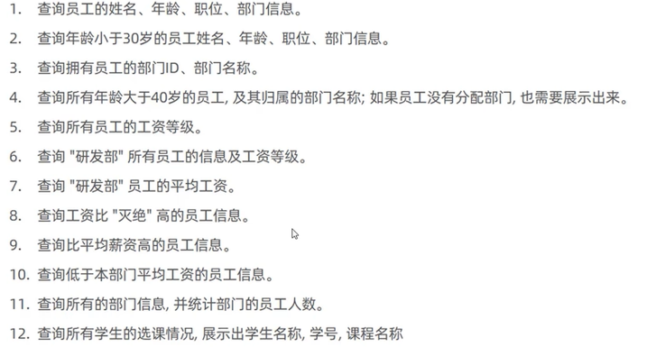

```mysql
# 5 查询所有员工的工资等级
select e.* ,s.salary from e,s where e.salary between salary_min and salary_max;
# 6 查询"研发部"所有员工的信息及工资等级
# 把连接条件拆分为两个表
#  e.salary between salary_min  and salary_max； e.dep_id = dep_id
# 查询条件 d.name ='研发部';
select e.*, s.grade
from emp e,
     dept d,
     salgrade s
where e.dept_id = d.id
  and (e.salary between s.losal and s.hisal)
  and d.name = '研发部';
  
# 查询低于本部门平均工资的员工信息。
-- a查询指定部门平均薪资
select avg(e1.salary)from emp el where e1.dept id = 1;
-- b 
select * from emp e2 where e2.salary < 
(select avg(e1.salary) from emp el where el.dept_id =e2.dept_id);

-- 用使用 JOIN 和 GROUP BY 的优化方法：
select *
from emp e1
         left join
         (select dept_id, avg(salary) AS avg_salary from emp GROUP BY dept_id) e2 on e1.dept_id = e2.dept_id
where e1.salary < e2.avg_salary;

# 11
SELECT dept.id, dept.name, COUNT(*)
FROM dept
JOIN emp e ON e.dept_id = dept.id
GROUP BY dept.id;

# 12查询所有学生的选课情况,展示出学生名称,学号,课程名称
select s.name s.no,c.name
from student s,
     student_course sc,
     course c
where s.id = sc.studentid
  and sc.courseid = c.id;
```

### 事务

事务 是一组操作的集合，它是一个不可分割的工作单位，事务会把所有的操作作为一个整体一起向系统提交或撤销操作
请求，即这些操作要么同时成功，要么同时失败。

+ 开启事务

```mysql
START TRANSACTION 或 BEGIN
```

+ 提交事务

```mysql
commit;
```

+ 回滚事务

```mysql
ROLLBACK;
```

#### 事务的四大特性

+ 原子性(Atomicity):事务是不可分割的最小操作单元，要么全部成功，要么全部失败。
+ 一致性(Consistency):事务完成时，必须使所有的数据都保持一致状态。
+ 隔离性(lsolation):数据库系统提供的隔离机制，保证事务在不受外部并发操作影响的独立环境下运行。
+ 持久性(Durability):事务一旦提交或回滚，它对数据库中的数据的改变就是永久的。

#### 并发事务问题

+ 脏读

  一个事务读到另一个事务还没有提交的事务

+ 不可重复读

  一个事务先后读取同一条记录，但两次读取的数据不同，称之为不可重复读。

  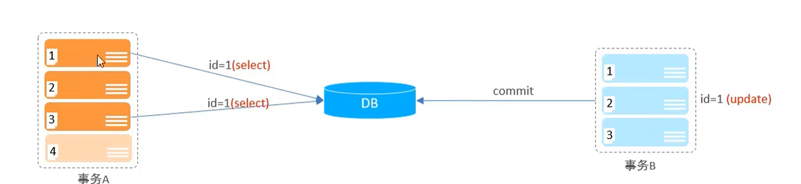

+ 幻读

  一个事务按照条件查询数据时，没有对应的数据行，但是在插入数据时，又发现这行数据已经存在，好像出现了
  “幻影”。

  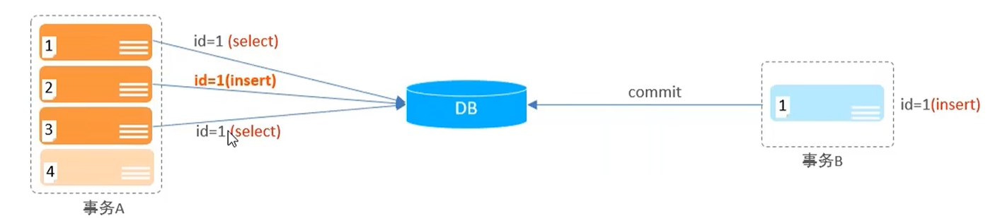

  **隔离级别**

  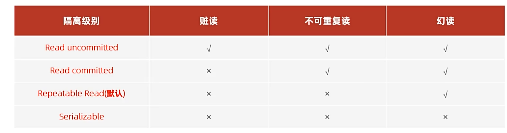

```mysql
-- 查看事务隔离级别
SELECT @@TRANSACTION ISOLATIRN;

-- 设置事务的隔离级别
SET [ SESSION | GLOBAL ] TRANSACTION ISOLATION LEVEL {READ UNCOMMITED | READ COMMITED | REPEATABLE READ | SERIALZABLE } 
```

注意:事务隔离级别越高，数据越安全，但是性能越低。

## 进阶


# leetcode

## 简单

### 查找重复的电子邮箱

**自己 答案**

```mysql
select distinct a.email as Email from Person a inner join Person b on a.email = b.email where a.id != b.id 
```

解释：

> 本来一张表相当于查两张表，性能差

**正确答案**

```mysql
select email as Email From Person Group by email Having  count(*) > 1;
```

**解释**

> 先`group by`后`having`分组 
>
> 因为它体现了“重复”最本质的含义：
>
> 出现次数 > 1 就是重复。


