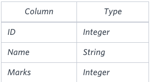
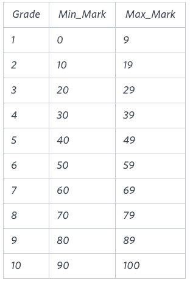
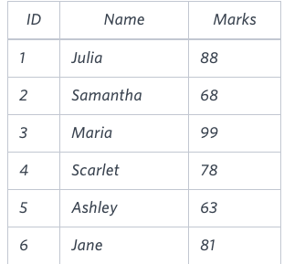
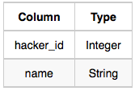
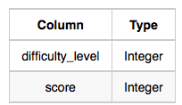
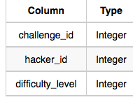
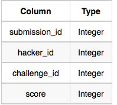
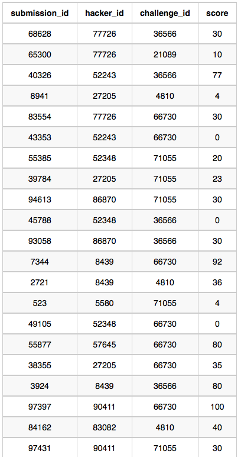

# 黑客松

## select

### 题目一 

>   

```mysql

```

### 题目二 order by righ()

知识点： order by 、right( 字符串，数字)

> 题目：查询 STUDENTS 数据库中所有得分高于 75分 的学生的姓名。按姓名的最后三个字符对结果进行排序。如果两个或多个学生的姓名最后三个字符相同（例如：Bobby、Robby 等），则按 ID 升序进行二次排序。
>
>   

```mysql
SELECT Name
from students
where marks > 75
ORDER by right(name,3) ,id;
```

### 题目三 正则

知识点：regexp ‘’    正则表达式

> 查询STATION中不以元音字母开头且不以元音字母结尾的城市名称列表。你的结果不能包含重复项。
>
>   

```mysql
SELECT distinct(city)
from station
where city regexp '^[^aeiou]' and city regexp '[^aeiou]$';
```

### 题目四 正则

知识点：正则表达式中 `^` 表示开头 `$` 表示结尾

> 查询STATION中 不以元音字母结尾的 城市名称列表。结果不能包含重复项。

```mysql
select distinct(city) from station where city regexp '[^aeiou]$'
```

### 题目五 正则

知识点：正则表达式中 `^` 表示开头 `$` 表示结尾

> 查询STATION中以元音字母(a,e,i,o,u)结尾的CITY名称列表。结果不能包含重复项。

```mysql
SELECT distinct city from station where city regexp '\w*[aeiou]$'
```

### 题目六 order by    limit

知识点：order by    limit

> 查询STATION中名称长度最短和最长的两个城市，以及它们各自的长度(即名称中字符的数量)。如果存在多个最小或最大的城市，请选择按字母顺序排列时排在首位的那个
>
> station 表
>
> | Field | TYPE        |
> | ----- | ----------- |
> | ID    | NUMBER      |
> | CITY  | VARCHAR(21) |
> | STATE | VARCHAR(21) |
> | LAT_N | NUMBER      |
> | LAT_W | NUMBER      |
>
> 输出：
>
> ```
> ABC 3
> PQRS 4
> ```
>
> 解释：
>
> 按照字母顺序排列时，城市名称被列作ABC、DEF、PQRS和WXY，长度分别为3、3、4和3。最长的名称是PQRS，但最短名称城市的选项有3个。请选择ABC，因为它按字母顺序排在首位。

```mysql
SELECT city,length(city) from station ORDER BY length(city),city limit 1;
SELECT city,length(city) from station ORDER BY length(city) desc ,city limit 1;
```


## basic join

### 题目一 内连接 join

> 根据城市和国家表，查询所有大陆为"亚洲"的城市的总人口。
>
> **注意**：CITY.CountryCode和 COUNTRY.Code是匹配的键列。
>
> **输出：** CITY
>
> | Field       | Type         |
> | ----------- | ------------ |
> | ID          | NUMBER       |
> | NAME        | VARCHAR2(17) |
> | COUNTRYCODE | VARCHAR2(3)  |
> | DISTRICT    | VARCHAR2(20) |
> | POPULATION  | NUMBER       |
>
>  

```mysql
SELECT A.NAME 
from city a  
join country b 
on  a.countrycode = b.code 
WHERE  b.CONTINENT =  'Africa'
```

总结:

多表查询 字段时 要表明是哪个表的字段 
比如 a和b 表就标明 a.name   

### 题目二 查询大洲 join

> 根据城市和国家表，查询所有大州(COUNTRY.Continent)及其相应的平均城市人口(CITY.Population)，并向下取整到最接近的整数。
>
> 注意:CITY.CountryCode和COUNTRY.Code是匹配的键列。
>
> 表描述如下
>
>  
>
>  

```mysql
SELECT b.continent,floor(avg(a.population)) 
from city a
join country b
on a.countrycode = b.code
GROUP by b.continent;
```

### 题目三  报告  

条件显示 + 分段排序

> 布置了一项任务，要求她生成一份包含三列内容的报告:姓名、成绩和分数。凯蒂不希望列出那些成绩低于8分的学生的姓名。报告应按成绩从高到低排列--即高成绩先被录入。如果有多名学生被评定为相同成绩(8-10分)，则需按姓名字母顺序对这些学生进行排序。最后，如果成绩低于8分，则使用"NULL"作为其姓名，并按成绩从高到低列出这些学生。如果有多名学生被分配到了相同的成绩(1-7)时，请按他们的成绩从高到低排列这些特定学生。

给定两个表格：学生表和成绩表。学生表包含三列：ID、姓名和分数。

	

成绩包含以下数据：



**示例输入**



**示例输出**

```
Maria 10 99
Jane 9 81
Julia 9 88 
Scarlet 8 78
NULL 7 63
NULL 7 68
```

注意 如果成绩低于 8 分，则姓名显示为“NULL”。

```mysql
SELECT  
    CASE 
    when g.Grade >= 8 then s.Name
    ELSE NULL
    END as Name,g.Grade,
    s.Marks
from Students s
left join Grades g
on s.Marks between Min_mark and Max_mark
order by g.Grade desc,s.Name
```

### 题目四 顶级竞争对手 

> 朱莉娅刚刚完成了一场编程竞赛的主持工作，现在她需要你的帮助来整理排行榜!请编写一条查询语句，以打印出那些在一项以上的挑战中取得满分的黑客的相应黑客ID和姓名。按照黑客在获得满分的挑战总数上降序排列输出结果。如果有多名黑客在相同数量的挑战中均取得满分，则需按黑客ID的升序进行排序。

以下表格包含竞赛数据：

+ 黑客：hacker_id是黑客的ID，name是黑客的名字。

  

+ 难度：难度等级是挑战的难易程度，而分数则是处于该难度等级下可获得的最高分数。

 

+ 挑战：challenge_id 是挑战的 ID，hacker_id 是创建挑战的黑客的 ID，difficulty_level 是挑战的难度级别

 

+ 提交：submission_id 是提交的 ID，hacker_id 是提交该提交的黑客的 ID，challenge_id 是提交所属挑战的 ID，score 是提交的分数。

 

**示例输入**	

 

**示例输出**	

```
90411 Joe
```

**解释：**

> 黑客 86870 在难度等级为 2 的挑战 71055 中获得 30 分，因此 86870 在此挑战中获得满分。黑客 90411 在难度等级为 2 的挑战 71055 中获得 30 分，因此 90411 在此挑战中获得满分。黑客 90411 在难度等级为 6 的挑战 66730 中获得 100 分，因此 90411 在此挑战中获得满分。只有黑客 90411 在多个挑战中获得满分，因此我们将他们的 hacker_id 和 name 以空格分隔的形式打印出来。

```mysql
/*
Enter your query here.
*/
SELECT 
s.hacker_id,
h.name
from Submissions  s 
join Hackers h
on h.hacker_id = s.hacker_id
join Challenges c
on s.challenge_id = c.challenge_id
join Difficulty  d
on d.difficulty_level = c.difficulty_level
where d.score = s.score
GROUP BY s.hacker_id,h.name
having  count(distinct s.challenge_id) > 1
order by count(distinct s.challenge_id) desc, s.hacker_id asc
```

总结：

+ 多表查询 多个join串联
+ join 一定要跟在 from后面
+ SELECT 里的字段，必须出现在 GROUP BY 中，或者被聚合函数包起来

执行顺序：

+ from
+ join ...on
+ where 
+ group by
+ having
+ select
+ order

