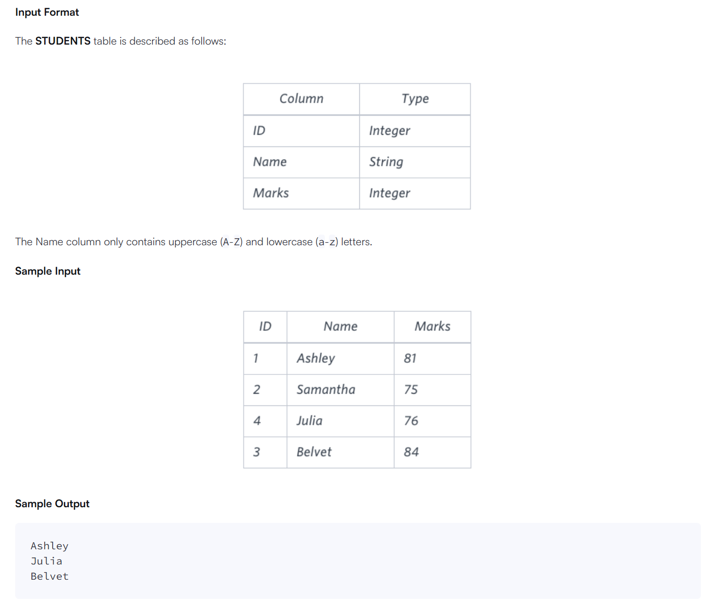
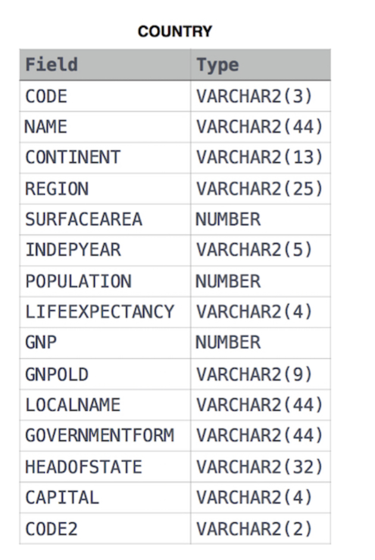
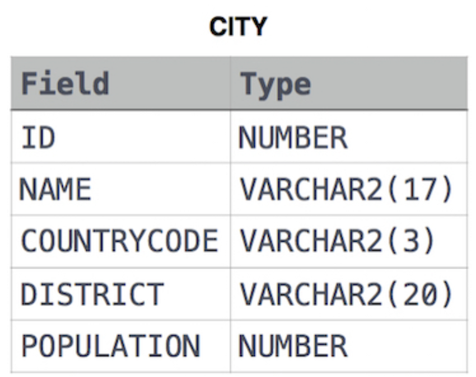

# 黑客松

## select

### 题目一 

>   

```mysql

```

### 题目二 order by righ()

知识点： order by 、right( 字符串，数字)

> 题目：查询 STUDENTS 数据库中所有得分高于 75分 的学生的姓名。按姓名的最后三个字符对结果进行排序。如果两个或多个学生的姓名最后三个字符相同（例如：Bobby、Robby 等），则按 ID 升序进行二次排序。
>
>   

```mysql
SELECT Name
from students
where marks > 75
ORDER by right(name,3) ,id;
```

### 题目三 正则

知识点：regexp ‘’    正则表达式

> 查询STATION中不以元音字母开头且不以元音字母结尾的城市名称列表。你的结果不能包含重复项。
>
>   

```mysql
SELECT distinct(city)
from station
where city regexp '^[^aeiou]' and city regexp '[^aeiou]$';
```

### 题目四 正则

知识点：正则表达式中 `^` 表示开头 `$` 表示结尾

> 查询STATION中 不以元音字母结尾的 城市名称列表。结果不能包含重复项。

```mysql
select distinct(city) from station where city regexp '[^aeiou]$'
```

### 题目五 正则

知识点：正则表达式中 `^` 表示开头 `$` 表示结尾

> 查询STATION中以元音字母(a,e,i,o,u)结尾的CITY名称列表。结果不能包含重复项。

```mysql
SELECT distinct city from station where city regexp '\w*[aeiou]$'
```

### 题目六 order by    limit

知识点：order by    limit

> 查询STATION中名称长度最短和最长的两个城市，以及它们各自的长度(即名称中字符的数量)。如果存在多个最小或最大的城市，请选择按字母顺序排列时排在首位的那个
>
> station 表
>
> | Field | TYPE        |
> | ----- | ----------- |
> | ID    | NUMBER      |
> | CITY  | VARCHAR(21) |
> | STATE | VARCHAR(21) |
> | LAT_N | NUMBER      |
> | LAT_W | NUMBER      |
>
> 输出：
>
> ```
> ABC 3
> PQRS 4
> ```
>
> 解释：
>
> 按照字母顺序排列时，城市名称被列作ABC、DEF、PQRS和WXY，长度分别为3、3、4和3。最长的名称是PQRS，但最短名称城市的选项有3个。请选择ABC，因为它按字母顺序排在首位。

```mysql
SELECT city,length(city) from station ORDER BY length(city),city limit 1;
SELECT city,length(city) from station ORDER BY length(city) desc ,city limit 1;
```


## basic join

### 题目一 内连接 join

> 根据城市和国家表，查询所有大陆为"亚洲"的城市的总人口。
>
> **注意**：CITY.CountryCode和 COUNTRY.Code是匹配的键列。
>
> **输出：** CITY
>
> | Field       | Type         |
> | ----------- | ------------ |
> | ID          | NUMBER       |
> | NAME        | VARCHAR2(17) |
> | COUNTRYCODE | VARCHAR2(3)  |
> | DISTRICT    | VARCHAR2(20) |
> | POPULATION  | NUMBER       |
>
>  

```mysql
SELECT A.NAME 
from city a  
join country b 
on  a.countrycode = b.code 
WHERE  b.CONTINENT =  'Africa'
```

总结:

多表查询 字段时 要表明是哪个表的字段 
比如 a和b 表就标明 a.name   

### 题目二 内连接 join

> 根据城市和国家表，查询所有大州(COUNTRY.Continent)及其相应的平均城市人口(CITY.Population)，并向下取整到最接近的整数。
>
> 注意:CITY.CountryCode和COUNTRY.Code是匹配的键列。
>
> 表描述如下
>
>  
>
>  

```mysql
SELECT b.continent,floor(avg(a.population)) 
from city a
join country b
on a.countrycode = b.code
GROUP by b.continent;
```


