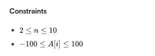

# py_exercise

网址：

黑客松

https://www.hackerrank.com/dashboard 

## basic

### e1 找出亚军

> 根据你大学运动会的参赛者得分表，你需要找出亚军分数。你被给予n个分数。将它们存储在一个列表中，并找到亚军的分数。
>
> ​	输入格式
> 第一行包含n。第二行包含一个由n个整数组成的数组A，每元素之间用空格分隔。
>
>   
>
> 输入
>
> ```
> 5
> 2 3 6 6 5
> ```
>
> 输出
>
> ```
> 5
> ```
>
> 解释
>
> 给定列表是[2,3,6,6,5]。最大分值为6，次大分值为5。因此，我们打印5作为亚军得分。

```python
def  find_sec(n,arr):
    list_arr = list(arr)
    sec_max = None
    max = None
    for i in list_arr:
        if max is None or i > max:
            if max is not None:
                sec_max = max
            max = i
        elif i != max and (sec_max is None or i > sec_max):
            sec_max = i
    print(sec_max)
n = 5
arr = map(int, "-1 -1 -2 ".split())
find_sec(n,arr)
```

考虑正负数的情况

将负数的判断 放在 > 的前面

### e2 求前一个数的和

> 需求：遍历前10个数字，并在每次迭代中打印当前数和上一个数的总和。

```python
p_num = 0
for i in range(1,11):
    x_num = p_num + i
    print(f"Current Number {i} Previous Number {p_num} Sum: {x_num}")
    p_num = i
```

### e3 计算两个数的乘积和 和

> 给定两个整数，编写一个Python程序，仅当它们的乘积等于或小于1000时返回其乘积;否则返回它们的和。

```python
```

### e4  嵌套列表

> 给定一个班级中N名学生的姓名和成绩，将它们存储在一个嵌套列表中，并打印出成绩排名第二低的学生的姓名。
>
> **注意**: 如果有多名学生的成绩为第二低分，则按字母顺序排列他们的名字，并在每行打印一个名字。
>
> **示例**
>
> 记录列表=[["chi",20.0],["beta",50.0],["alpha",50.0]]
>
> 分数的有序列表是[20.0,50.0]，因此第二低分是50.0。有两个学生的分数为该值:["beta"，"alpha"]。按字母
>
> 顺序排序后，姓名依次打印如下:
>
> ```
>alpha
> beta
> ```
> 
> 约束条件
>
> + 2 《 N 《 5
>+ 总会有一个第二低的分数
> 
> 输出格式
>
> 打印成绩第二低的学生姓名。如果有多个学生，按字母顺序排列并逐个输出在新行上。
>
> 举例输入：
>```
> 5
> Harry
> 37.21
> Berry
> 37.21
> Tina
> 37.2
> Akriti
> 41
> Harsh
> 39
> ```
> 
> 输出：
>
> ```
>Berry
> Harry
> ```
> 
> 本班有5名学生，其姓名和成绩已整理成以下列表:
>
> python_students = [['Harry', 37.21], ['Berry', 37.21],['Tina',37.2], ['Akriti',41], ['Harsh',39]]
>
> 最低成绩为37.2，属于Tina。第二低成绩为37.21，属于Harry和Berry，因此我们按字母顺序排列他们的名字，并将每个名字打印在新行上。
>

```python
def find_sec(arr):
    min_score  = None
    sec = None
    sec_li = []
    for i in arr:
        if min_score is None or i[1] < min_score:
            if min_score is not None:
                sec = min_score
            min_score = i[1]
        elif i[1] != min_score and (sec is None or i[1] <= sec):
            sec =  i[1]   
    for name, score in arr:
        if score == sec:
            sec_li.append(name)
    fin_li = sorted(sec_li)   
    for i in fin_li:
        print(i)
if __name__ == "__main__":
    # arr = [["chi",37.21],["beta",37.21],["plpha",37.2],["alpha",26]]
    # find_sec(arr)
    # print(find_sec(arr))
    arr = []
    for _ in range(int(input())):
        name = input()
        score = float(input())
        arr.append([name,score])
    print(arr)
    # find_sec(arr)
```

待优化

