## 一、Fiddler简介

> Fiddler是位于客户端和服务器端的HTTP代理
>
> + 目前最常用的http抓包工具之一
> + 功能非常强大，是web调试的利器
>   + 监控浏览器所有的HTTP/HTTPS流量
>   + 查看、分析请求内容细节
>   + 伪造客户端请求和服务器响应测试网站的性
>   + 解密HTTPS的web会话
>   + 全局、局部断点功能

> 使用场景:
>
> + 接口调试，线上环境调试，web性能分析
> + 判断前后端bug、开发环境hosts设置、mock、弱网断网

## 二、基本操作

### 2.1 抓取请求

[Fiddler抓包工具保姆级使用教程（超详细）_抓包软件怎么使用-CSDN博客](https://blog.csdn.net/Mubei1314/article/details/122389950)

默认不支持抓取https协议，要想抓取https


> tools 》 options 》https 》actions 》 点击 Export Root Certificate to Desktop 》

 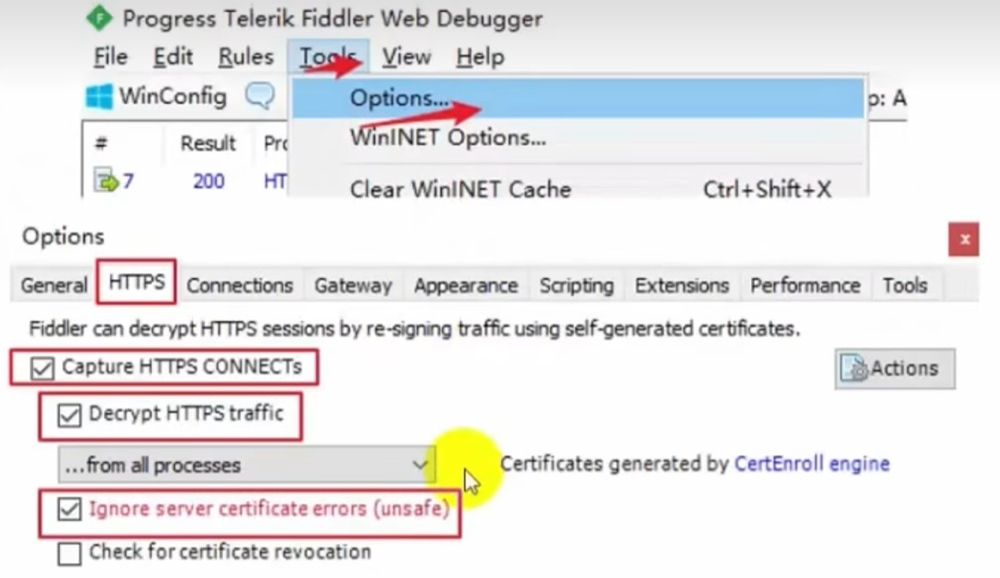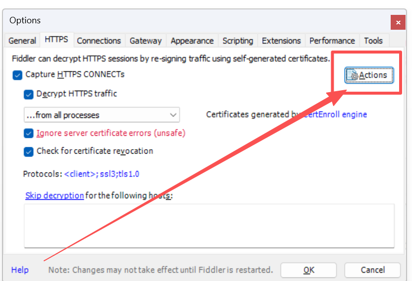

 

 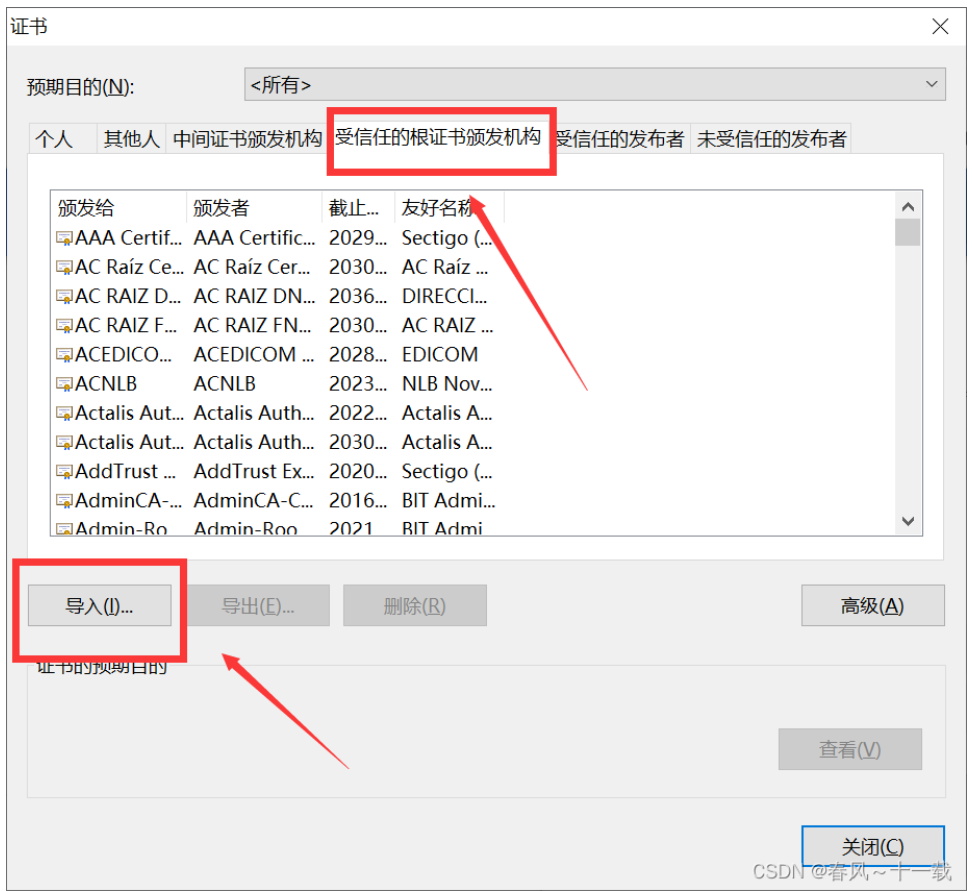

**aciton**

 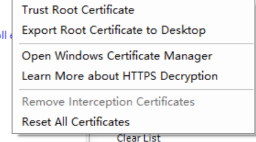

`Reset All Certificates` 重新设置证书

`Open Windows Certificate Manager` 打开证书位置

`Trust Root Certificate`: 信任证书

### 2.2 删除请求

clear

### 2.3 过滤请求

 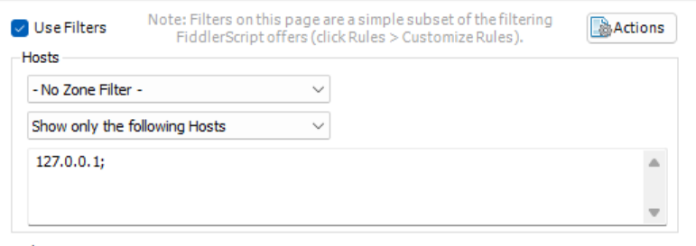

### 2.4 导出saz文件

> + 用于给开发做请求处理
> + 以及做请求分类管理

 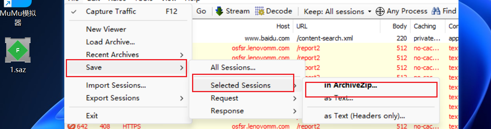

**重放请求**

+ 快捷键 R  重放一次        
+ shift + r  控制次数进行重置   
+ ctrl选中 在 shift + del
+ ctrl + x 清除所有

### 2.5 工具栏 


**断点**

 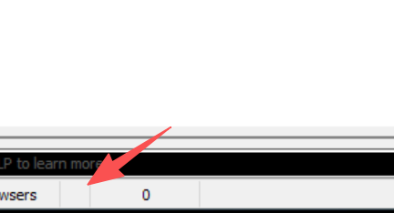

如图所示：设置一个全局的断点 

**decode**

解码编码    做一个全局的解码编码

**find**

查找请求 

快捷键 ctrl + f

**TextWizard**

 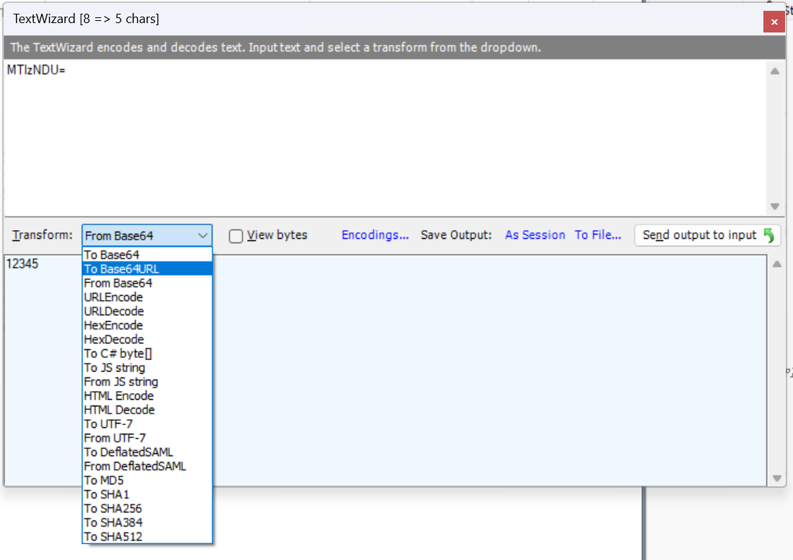

### 2.6 监控面板

 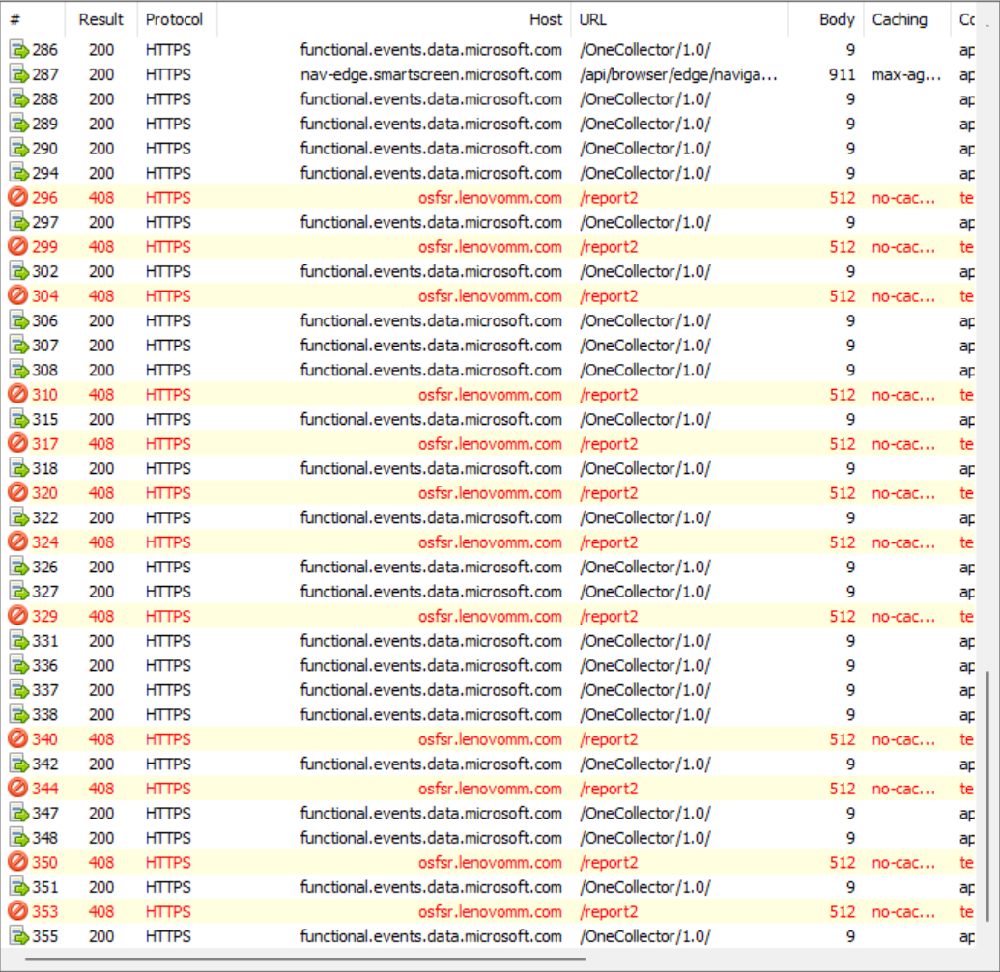

#### 2.6.1 添加 ip 列

**在会话列表去添加ip列**

rules 》 customize rules 

》 查找 “static function Main()” 字符串 》 添加 FiddlerObject.UI.lvSessions.AddBoundColumn("ServerIP", 120, "X-HostIP");

重启fiddler

**自定义请求**

 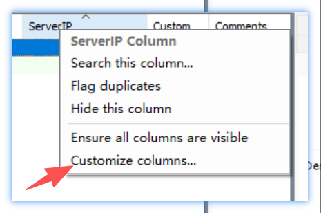

### 2.7 命令行

 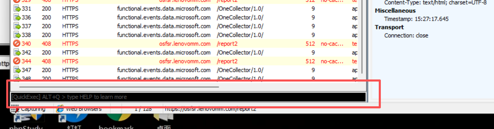

[命令行使用文档 quickexec ](https://www.telerik.com/fiddler/fiddler-classic/documentation/knowledge-base/quickexec)

例如 

> `> 1000` 抓取大于1000kd的请求 

### 2.8 辅助行

 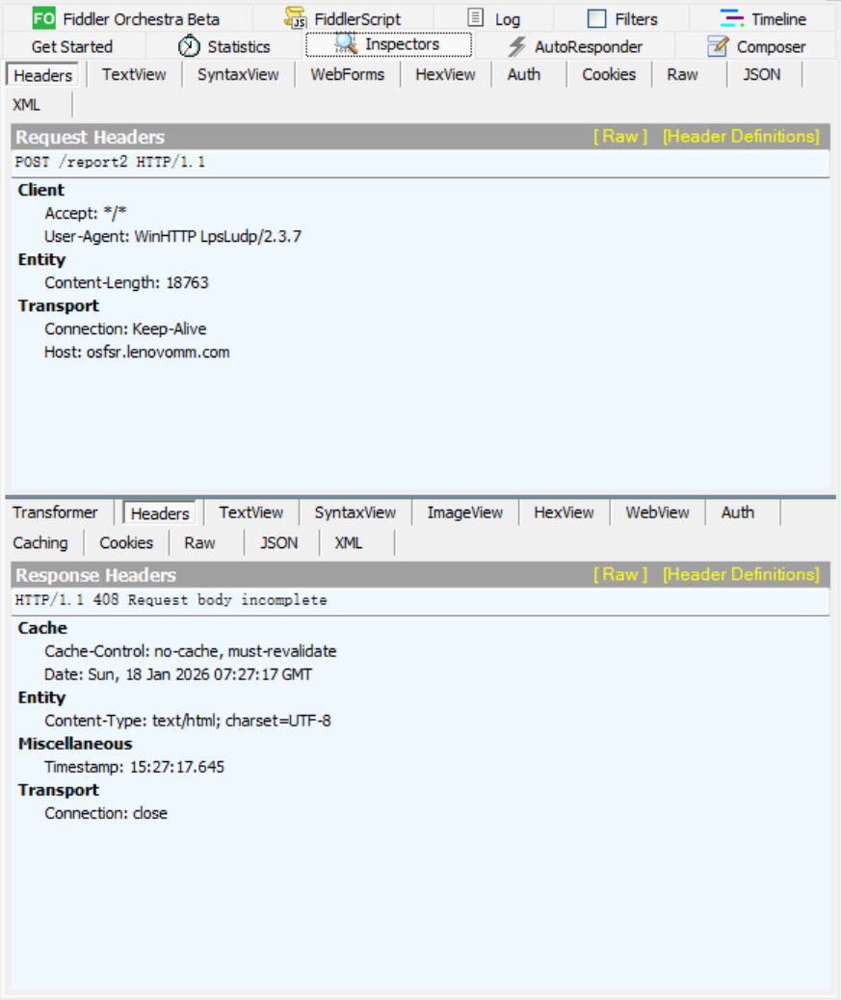

+ Statistics : 性能查看工具 

+ inspectors： 检查器 
  + 以不同形式去展示报文
  + Headers
    Textview
    SyntaxView
    WebForms
    HexView
    Auth
    Cookes
    RaW
    JSON     

+ **AutoResponder**： 自动响应器

  + 场景：生产环境出了问题》拦截》重定向》本地》指定响应

  + 通过篡改请求 去看前端反应结果

  + mock测试

+ **Composer** :设计器

  + 放包的工具  

  + 抓取真实的请求修改并发送 HTTP/HTTPS 请求，用来模拟客户端请求并查看服务器响应。

  + 修改参数值

    删除/新增参数

    验证必填参数、非法参数

  + vs Postman  设计器更偏向对真实请求的修改和重放，适合问题定位；Postman 更偏向系统化接口测试和回归。

+ **filters** :过滤器

  + 过滤请求的工具

  + 请求域名（Host）

    请求 URL

    请求方法（GET / POST 等）

    客户端 IP / 进程

    响应状态码（200 / 404 / 500 等）

    响应类型（HTML / JSON / 图片等）

  + 场景：我们只关注某个系统和页面的请求

  + **注意：在不使用的时候要将fidler关掉**

### 2.9 断点

 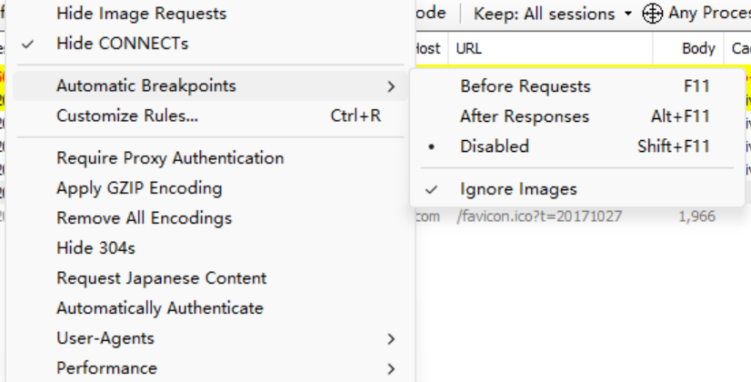

对**全局**请求进行拦截

**局部断点**

响应前断点 `bpu '路径名 （可以是部分)'` 

```shell
bpu login # 拦截路径有login的请求
bpu # 取消
```

响应后断点 `bpafter`

**应用场景：**

通过对请求进行拦截，可以做一些极端测试 例如：

+ 对响应的数据进行删除
+ 网络中断测试   
  + 在服务器响应的时候，做断言处理，看客户端的处理结果

### 2.10 弱网测试

 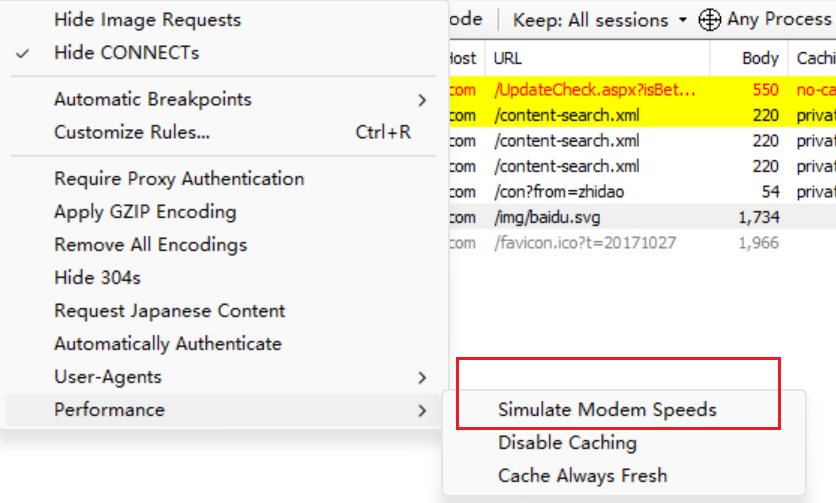

开启默认弱网测试

**自定义网速**

`rules` > `customize Rules ` > 搜索 > 修改对应的值

 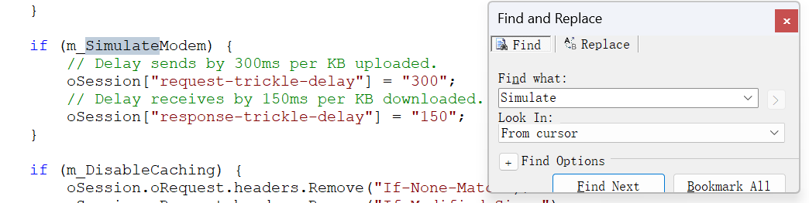


## 三、抓包

什么是抓包？

抓取客户端发给服务器的消息

抓取服务器发给客户端的消息

**应用场景**

+ 通过抓包工具截取观察网站的请求信息，更深入了解网站
+ 帮助我们进行日志定位与描述
+ 通过抓包工具拦截修改请求信息，绕过界面的限制，测试服务端的功能

### 3.1 移动端抓包

> 步骤

+ tools->Options->Connections，勾选Allow remote computers to connect
+ 手机和电脑连上在同一个局域网
+ 在网路中设置代理
+ 为手机安装ssl证书
+ 

## 接口和接口自动化