技能大纲

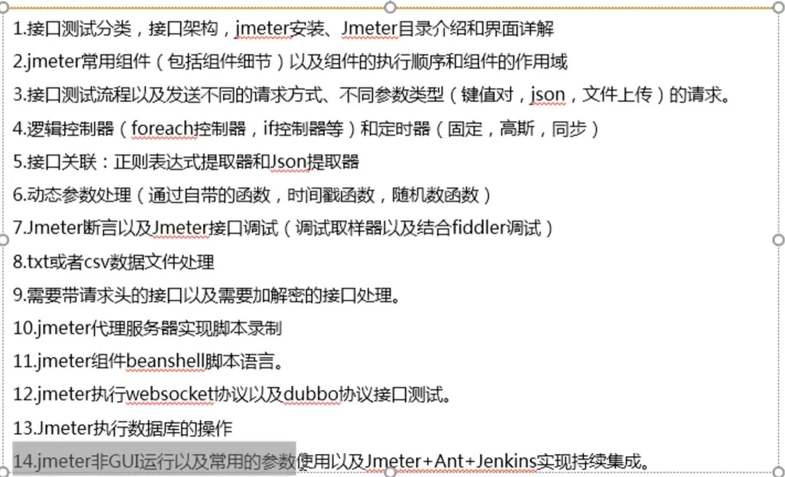

[JMeter 官方帮助文档](https://jmeter.xiniushu.com/)

# Jmeter测试入门

## 一、接口测试的分类

内部接口：测试被测系统各个子模块之间的接口，或者被测系统提供给内部系统使用的接口。

外部接口：

+ 被测系统调用外部的接口。
+ 系统对外提供的接口。

接口测试的重点：检查**接口参数**传递的正确性，接口功能的正确性，输出结果的正确性，以及对各种
异常情况的异常处理，以及权限控制，分页，调用次数的限制。

## 二、目前接口架构的设计

基于RestFul架构，基于json规范。基于http协议

​	RESTFul规则：

​	接口地址:http://127.0.0.1/user，get(查询用户)，post(新增用户),put(修改用户),delete(删除用户)	

​	Json数据格式：只有两种数据类型

​	**键值对**：{key:value}

​	**数组**:[arr1,arr2]


​	http协议详解：

​	请求：请求头，请求行，请求正文

​	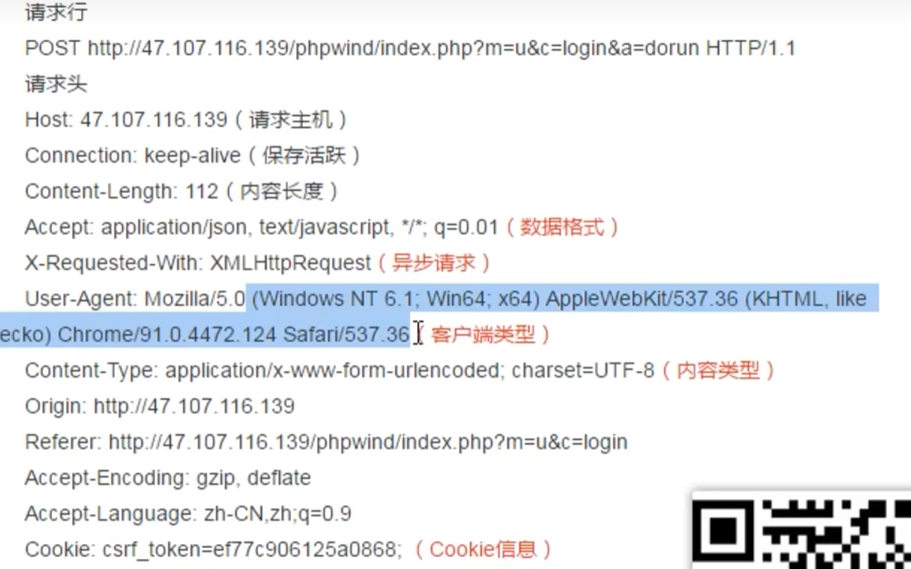

​	响应：响应头，响应行，响应正文

​	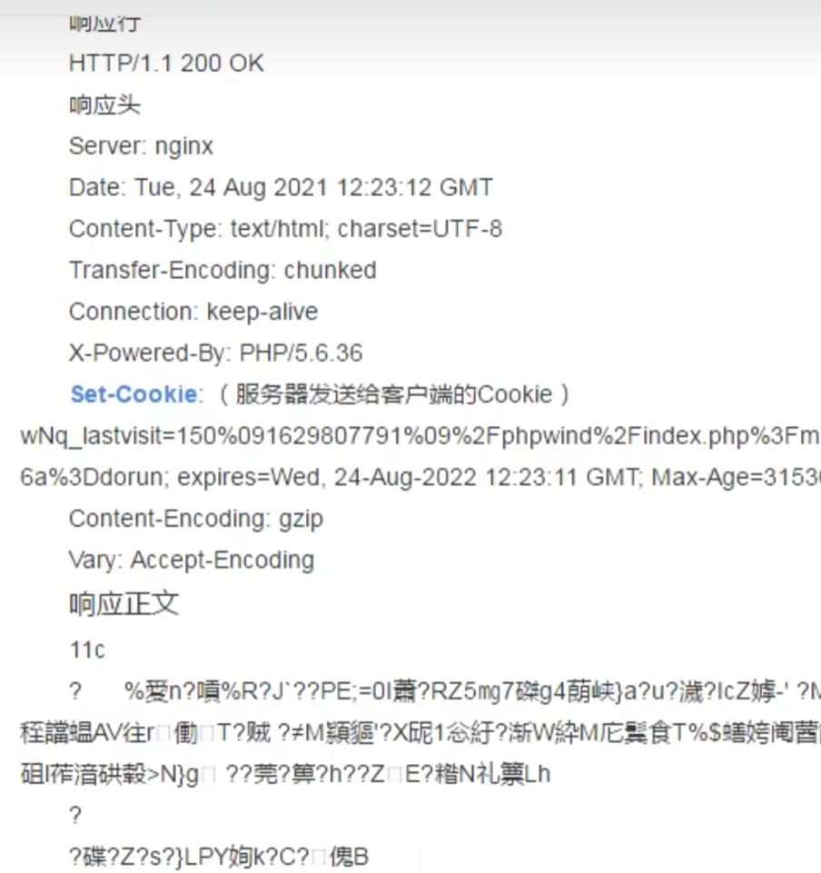

​	set-cookie 服务器发送给客户端的Cookie,只有在第一次请求的时候

## 三、Jmeter的目录结构

bin目录：存放Jmeter的启动脚本，配置文件，模块文件。

​	Jmeter.bat 启动Jmeter

​	Jmeter.properties   核心配置文件

docs:离线帮助文档

extras:存放与第三方的集成构建文件，集成Ant.Jetkins.

## 四、Jmeter的常用组件

1.测试计划。:起点。所有组件的容器。
2.线程组:代表一定数量的用户。
3.取样器:像服务器发送请求的最小单元,
4.逻辑控制器:结合取样器实现一些复杂的逻辑。
5.前置处理器:在请求之前的工作
6.后置处理器:在请求之后的工作
7.断言:用于判断请求是否成功。
8.定时器:负责在请求之间的延迟间隔。同定，高斯，随机
9.配置元件:配置信息
10.监听器:负麦收集结果


**顺序**
测试计划》线程组》配置组件》前置处理器》定时器》取样器（请求）》后置处理器》断言》监听器。


**作用域**

必须组件：测试计划，线程组，取样器

辅助组件：除了必须组件外


`辅助组件作用于父组件，同级组件，以及同级组件下的所有子组件。`


## 五、Jmeter执行接口测试

1.流程：拿到api接口文档，或者用fiddler去抓包，熟悉接口业务，接口地址，鉴权方式，入参，出参，错误码。

2.编写接口测试用例。

​	`测试思路`

​	正例：输入入参，查看接口成功返回。

​	反例：
​		鉴权：空，错误，鉴权过期，鉴权次数限制......
​		参数：空。类型错误，长度错误，错误码的覆盖。
​		其他：黑名单，分页。

3.使用接口测试工具执行。

4.Jmeter+Ant+Git+Jenkins实现持续集成输出接口测试报告，通过电子邮件发送。

## 六、接口测试实战

端口号：

​	http:80

​	https:443

状态码：

​	100，200，30x重定向，404页面没找到，500服务器错误。

鉴权码：

1.通过接口获取，appid,secret
2.登录之后自动生成，username，password

cookie和token是很有可能同时存在鉴权。

cookie，session和token的区别和意义


```
1.jmeter简介和安装以及目录介绍
2.jmeter常用组件(组件细节)以及执行顺序和它们的作用域
3.发送不同的请求方式以及不同参数类型(键值对，json，文件上传)的请求
```

​	

### 6.1、Jmeter接口关联（参数传递）

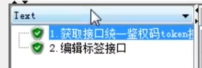

需求：第二个接口需要上一个接口的返回值

实现：

1. 正则表达式提取器（接口测试用这个多）

   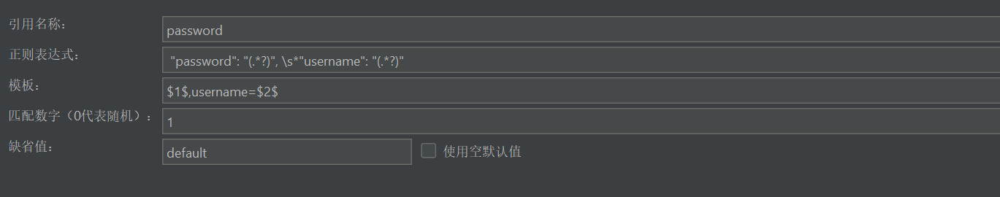

2. JSONpath表达式提取器

   从根目录开始找(绝对路径):$.expires_in

   从任意目录开始找(相对路径):$..expires_in

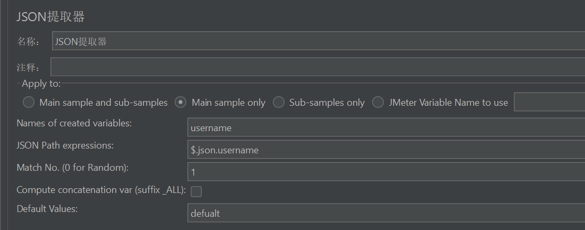

### 6.2 实现接口业务闭环

增、删、改、查 接口

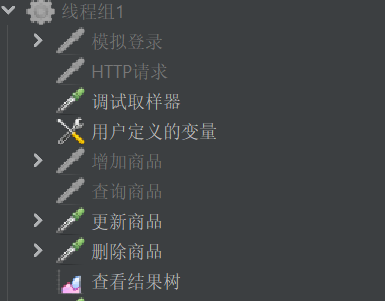

方式

> 根据接口文档，在Jmeter添加一个线程组，添加 取样器 选择http请求，会根据接口文档，选择JSOO提取器加用户定义的变量实现接口关联。

如果请求需要cookie，我会使用http消息头管理器

图片上传功能是在高级选择java

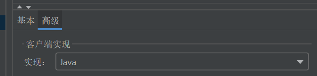

### 6.3 Jmeter动态参数处理

用函数助手对话框生成随机数，用配置元件中的用户定义的变量进行全局使用

### 6.4 Jmeter 接口测试断言

响应断言

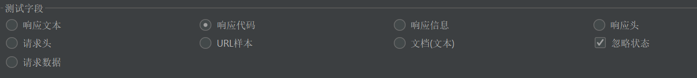

+ 业务断言
  
+ 响应文本：返回的json数据
  + 响应代码：200,404
  + 响应信息：OK
  + 响应头：
  + 文档(文本):返回的json数据以文本的方式去判断
  + 忽略状态：当有多个断言时，如果有一个断言失败了，另一个成功了，那么结果是成功。请求数据。
  
+ 状态断言

  

  字符串:响应内容包含需要匹配的字符串，大小写敏感，不支持正则

  包括: 响应内容包含需要匹配的字符串，大小写敏感，支持正则

  匹配的字符串，大小写敏感，支持正则相等:响应内容完全

  等于需要匹配的字符串，大小写敏感，不支持正则

### 6.5 Jmeter 接口测试调试方案

1.通过【查看结果树】里面的请求信息和响应信息。

2.使用【调试取样器】

3.JMETER结合fidder实现调试（将fidder作为代理服务器）

​	在没用接口文档，只能通过抓包去获取接口信息的时候使用。

### 6.6 CSV参数化处理


### 6.7 必须带请求头的接口

http消息头管理器

作用

用来做用户认证

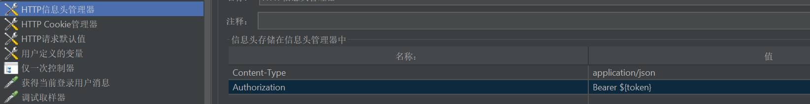

### 6.8 Jmeter作为代理服务器实现脚本录制

**位置**
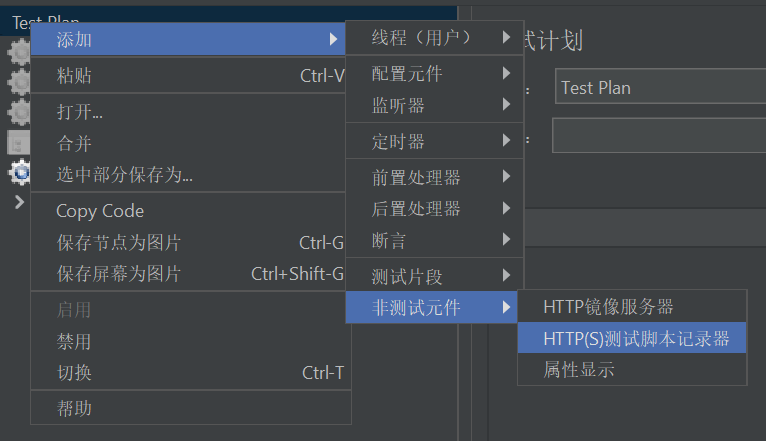

**方式**

使用Jmeter自带的http代理服务器实现。把（Jmeter作为代理）

​	1.设置端口和录制位置
​		和电脑代理服务器的端口号一致

​	2.设置本机的请求通过代理去发送

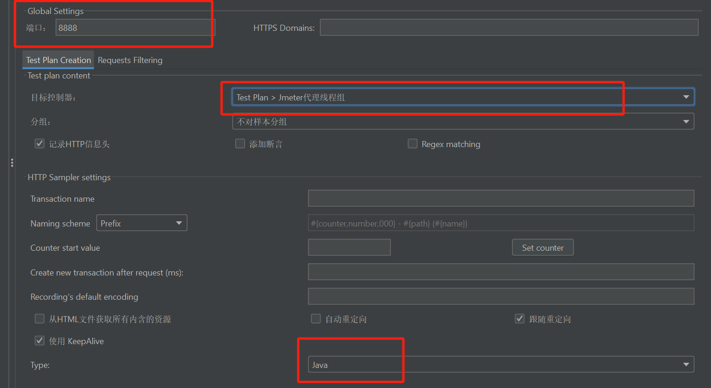

**技巧**

代理服务器可以去过滤图片，也要给浏览器去jmeter的认证。

## 七、Jmeter中BeanShell组件和语法规则

BeanShell是一种完全符合java语法规则的脚本语言，同时他还有自己的语法规则。
Java包括：javase，javaee,javame
Jmeter有哪些Bean Shell

1.前置处理器：Beanshell预处理程序。

2.定时器：BeanShell

3.采样器：BeanShell

4.后置处理器：BeanShell

5.断言：BeanShell

6.监听器：BeanShell

### 7.1 内置变量和语法规则

1. log 打印日志

```java
log.info("44")
log.error("44")
//控制台打印
System.out.println("控制台打印")
```

2. vars表示:JmeterVariables，操作Jmeter变量，(只能在当前线程组使用)

   1）用户定义的变量

   2）正则表达式，JSON提取器

   3) 定义变量

   ```java
   //获取变量的值
   log.info(vars get("mashang"));
   log.info(vars.get("access_token"));
   //beanshell组件之间通信
   vars put("www"."yyy");
   ```

3. props用于存取Jmeter的全局静态变量。（可以跨线程组）

```java
//获取全局静态变量
log,info(props.get("Jmeter"));//此变量可以是配置文件中的变量
props.put("aaa","bb");
```

4.prev 获取到前面一个取样器返回的信息。

```java
log.info(prev.getResponsecode());
log.info(prev.getResponseDataAsstring())
```

5. ctx 上下文

```java
System.out.println("ctx.getproperties")
```

**情景**

```
达飞:金融贷款。很多接口。其中有这种接口。需要做加密处理。 MD5,base64,SHA,RSA.都不是这些加密方式。
为什么？加密规则是开发自定义的。
```

`凡是Jmeter做不到的，那么都可以使用BeanShell解决`

### 7.2 Jmeter数据库的使用

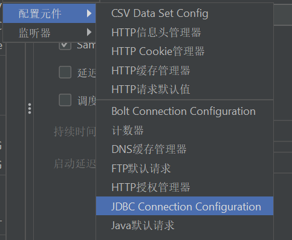			

配置原件》JDBC

1. 准备数据库的驱动jar包

   1)mysql,oracle...

   放到jmeter的lib目录下

2. 新建一个：JDBC connect config..

连接池的名称：

3. 新建一个：JDBC request

**问题：Host is not allowed to connect to this MySQL server** 

```mysql
//遇到没有权限的时候，设置ip进行权限授权
CREATE USER 'root'@'192.168.1.%' IDENTIFIED BY '123456';
GRANT ALL PRIVILEGES ON *.* TO 'root'@'192.168.1.%' WITH GRANT OPTION;
FLUSH PRIVILEGES;
```

### 7.3 Jmeter的非GUI(界面)方式运行。

1. 执行JMX文件的命令：jmeter -n -t E:\Note\test.jmx -l E:\Note\cli\result.jtl -e -o final

2. 命令行参数：

   -n -t   -n 非界面方式运行   -t 指定jmx文件的位置。

   -l      -l 指定生成的jtl格式的结果。

   -e -o   -e 生成HTML报告，-o指定HTML报告的文件夹（这个文件夹必须空目录）


#### 7.3.1 测试报告 

+ Dashboard：提供了整体的概览信息，显示了关于测试结果的总体摘要。
+ Charts：提供了关于性能指标的图表，如吞吐量、响应时间、活跃用户数等。
+ Custom Graphs：允许根据自己的需求创建和显示自定义的图表。

[参考网址](https://blog.csdn.net/m0_61066945/article/details/136062323)


### 7.4 使用Jmeter+Ant+Jenkins实现持续集成

1.下载ANT并解压，解压之后把ant的bin目录设置到path环境变量


## 八、性能测试

### 8.1 业务性能指标

**1.并发用户数**：同一时间同时访问系统的用户数。

用这项目的人有10万人。

系统用户数：10万

在线用户数：1万

并发用户数：500

并发场景：单一接口并发，多接口并发。

2.**吞吐量/吞吐率**

衡量服务器的处理能力
TPS:每秒完成的事务数（用的最多），事务里面可以有多个请求。  计算方式：总的事务数/总的采样时间
QPS:每秒完成的查询数
RPS:每秒完成的请求数
`本质上三个都是一个东西`

HPS:每一秒的点击率

**3.响应时间**

平均响应时间AVG，

90%，从小到大排序，选择第90个。

95%，从小到大排序，选择第95个.

99%，从小到大排序，选择第99个

标准偏差

**4.资源利用率**

CPU，内存，磁盘，网络

阿里云默认网络大小:1Mbps=1024Kbps=**128KB/S**

1个字节/Byte=8位/bit

**5.事务错误率** 非常低的要求 低于0.1% 


### 8.2 性能测试的类型

1. 性能测试：指标测试
2. 基准测试：一个接口在没有压力的情况下的各项指标。60分。
3. 负载测试：不断加压，不断加并发用户数，然后查看性能指标，最优并发用户数。

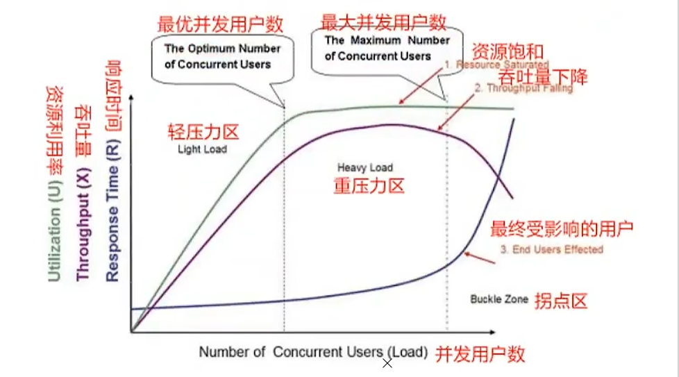

4. 压力测试：破坏性测试，最大并发用户数。
5. 稳定性测试：在最优并发用户数的压力下持续8-12小时。

`负载和压力测试的区别`

负载测试关注“撑得住吗？”，压力测试关注“什么时候会崩？

### 8.3 性能测试流程 

1. 性能需求分析
2. 计划和方案
3. 准入调查阶段
4. 测试执行阶段
5. 监控分析以及调优阶段
6. 测试总结

### 8.4 性能测试脚本生成以及完善

+ 录制压测脚本

+ 完善脚本

  + http cookie管理器--录制之前就要加的。作用是在录制的过程中自动的去关联cookie。
+ http请求默认值：为了能够在多个环境之间自由的切换
  
  + 加断言·
+ **事务控制器**：当我们需要把多个请求统计在一起的时候       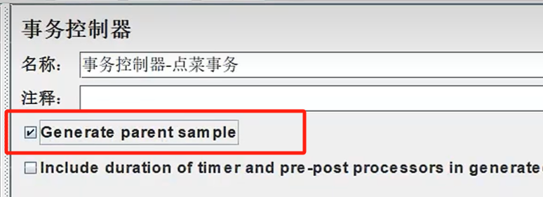
  
  + **仅一次控制器**,类似登录接口（仅需实现一次）   
+ 十个线程就有十个请求
  + **吞吐量控制器**：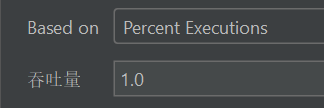
  + based on：
      + Percent,..（默认）：按百分比分配流量，
    + Total：代表总次数。
    + 场景：电商项目，搜索的接口比其他接口访问的多，就可以用吞吐量控制器，进行分配流量。
+ **同步计时器-集合点**：用于做并发操作
  
  + 场景：我会用来做订单这块
  
+ 查看结果树： 
  
  + 请求参数：请求方式，请求地址，请求参数，请求头
    
  + 响应参数：响应码，响应头，响应体（响应消息，响应数据）
    
  + 聚合报告：查看主要的性能指标
  
    + 样本：请求多少次
  + 平均值：**平均响应时间**
    
    + 异常率：事务错误率
+ 吞吐率：TPS  
  
  + 网络吞吐率：阿里云默认网络大小：1Mbps=1024kbps=128KB/s   1 byte = 8 bit
    
  + 汇总报告：主要看标准偏差
  
    1个接口请求三次 ，10,20,30（10,50,100）
  
  + 用表格查看结果；主要是看并发情况 （starttime）

### 8.5 压测(gui界面压测，非gui压测)

压测场景：100用户访问项目，某个接口做10个并发

线程数：用户数

循环次数：访问次数

调度器：持续时间+永久

**很重要的两个参数：用于分布式集群压测**

`-r`:表示启动所有远程压力机进行压测。

`-R`：指定特定的远程压力机执行压测，多台用，隔开。

### 8.6 Jmeter的插件的安装以及监控使用

1.下载一个插件管理包jmeter-plugins-manager版本.jar，放到jmeter重启jmeter，那么就有了插件管理

如果我们想要去监控服务器的性能:CPU，内存。

1. 需要在服务器安装一个ServerAgent.zip，用于收集服务器的性能，通过4444端口输出。
2. 在PerfMon Metrics Collector组件通过4444端口去捕获服务器

jmeter -n -t E:\Note\test.jmx -l E:\Note\cli\result.jtl -e -o final  -R 19...

**监控图的作用**

1. 看趋势，找拐点
2. 写性能测试报告

### 8.7 实际性能压测的场景设置

场景：性能测试用例

1. 旧系统来自于运维

2. 新系统来自于合理评估

   按场景和规则评估：做OA，总用户10000个，测试打卡功能做并发，8：30-9:30

   一般大部分的公司很难超过500。5000以上一定要集群。

服务器（集群）和压力机（集群）


+ **单接口基准测试**：使用一个用户测试接口5分钟。

  目的：为了在没有任何压力的情况下:查看各项性能指标。

+ **单接口负载测试场景**

  通过逐渐的对一个接口进行施压直到出现性能**拐点**。获得被测接口的最大处理能力以及它的相关的性能指标。

+ **混合负载压测测试场景**

  目的是为了验证整个业务的最大的最优的性能体现。重点在于模型的设计。模型来目于数据(来自生厂环境的日志或者产品经理给出的)。
  压测策略，压测场景，压测用例:

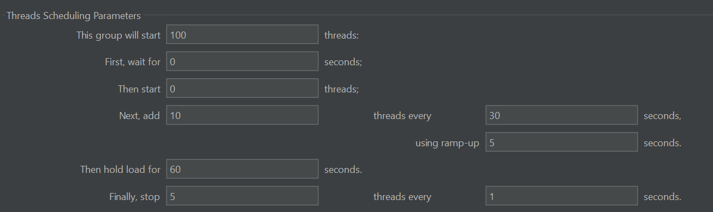

+ this group start 启动多少个线程，100
+ first wait for  等待多少秒才开始压测，一般为0
+ then start  一开始有多少个线程

--------------------

+ next add `10` threads every `30` seconds   using rang-up `5`  seconds.

​    每多少秒启动多少个虚拟用户数，每组数据持续运行多少秒

+ Then hold load for 60

  全部加载完成后，负载运行60秒

-----

+ **压力测试场景**

  验证系统的极限。直到有任何一个性能指标超出预期。

+ **稳定性测试场景**

  在压力测试的场景下持续的运行4-24个小时。

## 九、无界面压测时，查看Linux服务器的性能

top、htop

这里主要看id的数据，就是剩余cpu的数据

### 9.1 grafana监控平台

centos + php + mysql + nginx

**无界面压测中如何实时的监控**

grafana+influxdb+jmeter组合

原理

+ 运行jmeter时会把数据写入influxdb
+ influxdb实时存储执行的结果
+ grafana连接influxdb，将他的数据展示为图表

实现：

[][[搭建jmeter压测监控之grafana_jmeter grafana-CSDN博客](https://blog.csdn.net/weixin_40686603/article/details/108234151)]

# 性能测试实战

## 1、压测情景分析

+ 分析业务场景，确定 压测范围
+ 梳理 场景中 所涉及的接口 （确定接口间的调用顺序，依赖关系）
+ 梳理完毕后，检查接口正确性

```
做压测之前，先做接口测试
```

## 2. 收集性能数据

+ 性能数据是动态化。需要通过执行压测，从而收集数据
+ 借助性能压测工具，去针对系统进行压测
+ 借助工具（聚合报告）收集系统的性能数据
+ 压测的思路：通过特定工具，模拟对系统的不同并发压力值
  + 慢慢的添加数据

