# Postman接口测试

## 一、接口测试流程及用例设计

1. 拿到接口api文档(通过抓包工具获取)，熟悉接口业务，接口地址，鉴权方式，入参，鉴权码

2. 编写接口用例及评审

   思路：

   ​	正例：输入正常入参，接口能够正常返回数据

   ​	反例：

   ​		鉴权反例：鉴权码为空，鉴权码错误，鉴权码过期

   ​		参数反例:参数为空，参数类型异常，参数长度异常

   ​		错误码覆盖：根据业务而定的。

   ​		其他错误场景：接口黑名单，接口调用次数限制，分页场景。

3. 使用接口测试工具Postman执行接口测试
4. Postman+Newman+Jenkins实现持续售成，并且输出测试报告并且发送邮件，

## 二、Postman执行接口测试

### 2.1 postman的界面介绍

+ Home 主页

+ Workspaces 工作空间
  + Collections 集合，项目集合。
  + APIS        api文档
  + Environments 环境变量，全局变量
  + Mock Server  虚拟服务器
  + Monitors   监听器
  + Hisory    历史记录

### 2.2 执行接口测试

**请求页签**

+ Params:get请求传参
+ authorization:鉴权
+ headers:请求头
+ Body:post请求传参
  + form-data:既可以传键值对参数也可以传文件。
  + x-www-from-urlencoded:只能够传键值对参数
  + raw :json ,text ,xml ,html ,javascript
  + binary:把文件以二进制的方式传参。

+ pre-request-script:请求之前的脚本。
+ tests:请求之后的断言。【新版本】在script的post-response
+ cookies:用于管理cookie信息。

**响应页签**

+ Body：接口返回的数据。
  + Pretty:以Json，html，XML....不同的格式查看返回的数据。
  + Raw:以文本的方式查看返回的数据。
  + PreView:以网页的方式查看返回的数据。
+ Cookies:响应的Cookie信息
+ Headers:响应头
+ Test Results”断言的结果。
+ 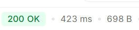
+ 200 状态码
+ ok 状态信息
+ 423ms 响应时间
+ 698B 响应的字节数

`面试题`

【说说get请求和post请求的区别？】

1、get请求一般是获取数据，post一般是发送数据

2、post请求比get请求安全 ，POST参数在请求体中，外部不易见

3、本质区别，传参不一样

+ get请求在地址栏后面以 ? 的方式传参，多个参数之间用&分隔。
+ post请求是在body以表单的方式传参。

### 2.3 Postman的环境变量及全局变量

环境变量:环境变量就是全局变量

全局变量:全局变量是能够在任何接口里面访问的变量

问题：多种环境下怎么切换？开发环境，测试环境，生成环境

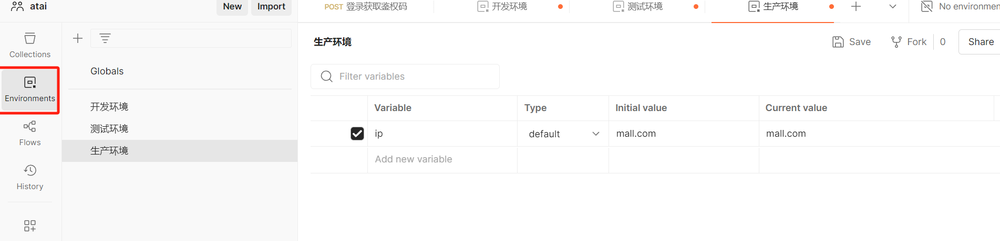

answer：用环境变量`{{变量名}}`实现环境变量的切换

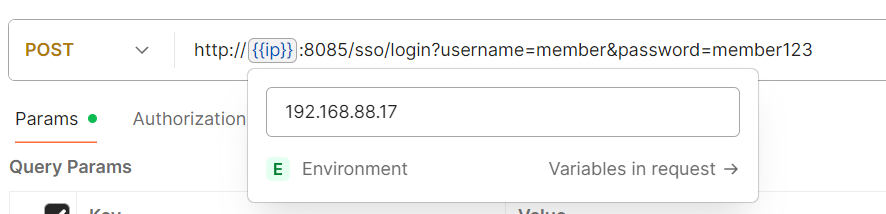

### 2.4 接口关联

1. 使用json提取器实现接口关联

**获得鉴权码**

```js
console.log(pm.response.text());
//将字符串解析成对象
var result = JSON.parse(pm.response.text());
console.log(result);
//设置token全局变量
var result1 = pm.globals.set("token",result.data.token);

使用{{}}的方式提取token作为全局变量
```

2. 使用正则表达式提取器实现接口关联

```js
// 使用正则表达式提取器实现接口关联，match匹配
var result  = pm.response.text().match(new RegExp(`"token": "(.*?)"`));
console.log(result);
```

### 2.5 内置动态参数以及自定义的动态参数

postman内置的动态参数：

{{$timestamp}} 生成当前时间的时间戳

{{$randomInt}} 生成0-1000之间的随机数

{{$guid}}   生成速记GUID字符串

#### 2.5.1 自定义动态参数

```
//手动获得时间戳
var time = Date.now();
//设置全局变量
pm.globals.set("time", time);
```

### 2.6 文件上传接口

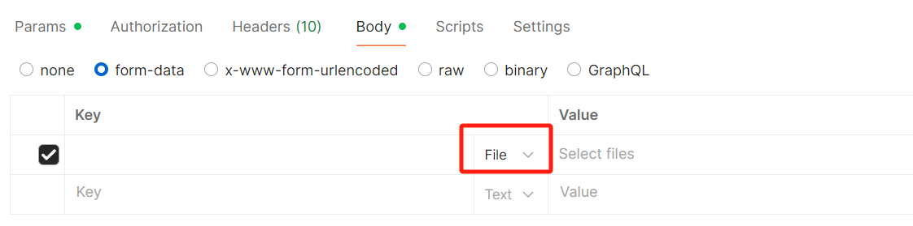

### 2.7 断言

#### 2.7.1 断言的方式

状态断言、业务断言

Send arequest:发送一个请求；

**状态断言**

Status code: Codeis 200:断言返回码为200；

**业务断言**

Response body: Contains string:断言返回数据包含字符串；

Response body:ls equal to astring:断言返回数据等于字符串;

Response headers: Content-Type header check:断言响应头包含Content-Type;

Response timeis less than 200ms:断言响应时间少于200MS;

```js
//断言
//状态断言
pm.test("Status code is 200", function () {
    pm.response.to.have.status(200);
});
//业务断言
pm.test("断言响应码access_token", function () {
    pm.expect(pm.response.text()).to.include("access_token");
});
```

3.如何精准的断言带有动态参数的接口

第一步:不能用系统的时间戳({$timestamp}}

第二步:自己创建一个时间戳，并且是在请求之前

```js
var time =  Date.now();
pm.globals.set("time",time);
```

第三步:把参数改成自定义的时间戳

{{time}}

第四步:断言

```js
pm.test("断言响应码access_token", function () {
    pm.expect(pm.response.text()).to.include("access_token" + pm.globals.get("time"));
});
```

#### 2.7.2 全局断言

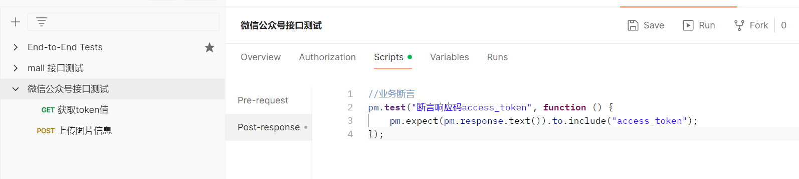

在collection上设置 全局断言

### 2.8 postman批量执行

功能

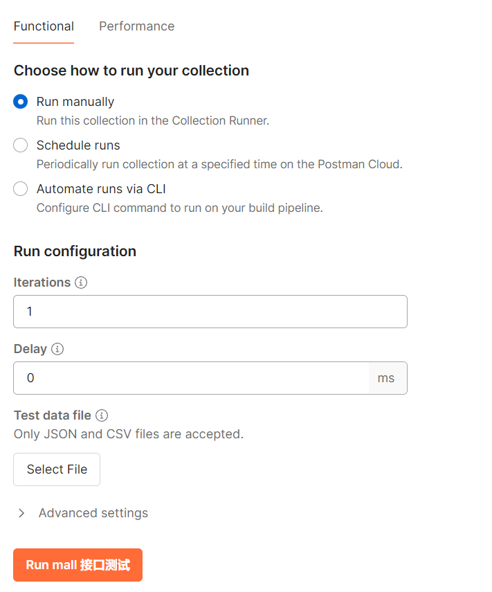

### 2.9 postman-cli的运行

**主要用于Jenkins持续集成接口自动化测试**

第一步根据命令安装 cli  %USERPROFILE%\AppData\Local\Microsoft\**WindowsApps**

```shell
powershell.exe -NoProfile -InputFormat None -ExecutionPolicy AllSigned -Command "[System.Net.ServicePointManager]::SecurityProtocol = 3072; iex ((New-Object System.Net.WebClient).DownloadString('https://dl-cli.pstmn.io/install/win64.ps1'))"
```

第二步：配置path路径  

C:\Users\atai\AppData\Local\Microsoft\WindowsApps

第三步：通过cli命令去运行

```
postman login --with-api-key POSTMAN_API_KEY_REDACTED
```

**性能**

受限，一个月只能使用25次，最大虚拟用户数100，最大的持续时间60分钟)

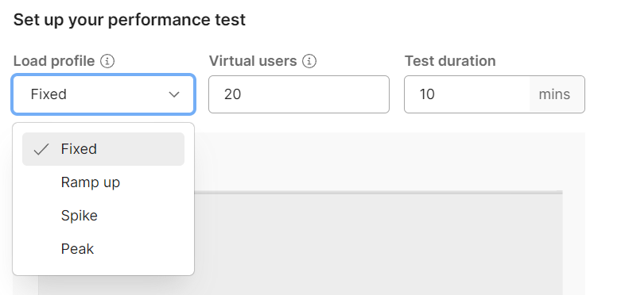

Fixed:固定

Ramp up:逐步加强

Spike:尖刺

Peak:尖峰

Virtual users : 虚拟用户数

Test duration:  持续时间

`重大的坑 ：批量运行的时候，图片附件是有问题的`

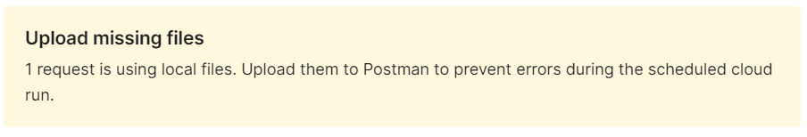

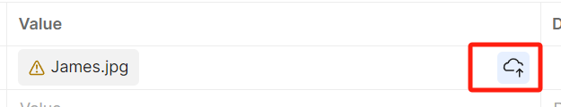

这里点击上传到云端就可以批量运行了

总结：做批量测试的时候，有附件一定要上传云端。

### 2.10 Postman数据驱动CSV测试

**什么是数据驱动?**
通过数据驱动用例执行，本质上请求四要素里面的请求参数不同，因为不同的数据传入接口得到不同的结果。所以我们可以先把这些数据设置好，然后读取这个数据文件执行用例。实现覆盖**正反例**。

**方式一**（结构）

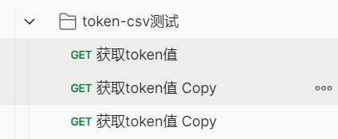

方式二（csv）

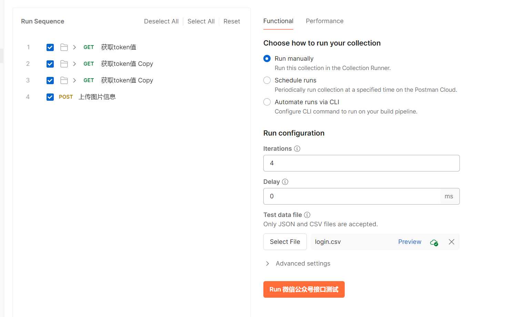

**细节**

断言部分 根据业务断言的话，在csv中添加`断言关键词`

```js
var  result = JSON.parse(pm.response.text());
if(result.access_token){
    pm.globals.set("token",result.access_token);
}

var data =  pm.iterationData.toObject();
pm.test("业务断言", function () {
    console.log(data.assert_value)
    pm.expect(pm.response.text()).to.include(data.assert_value);
});
```

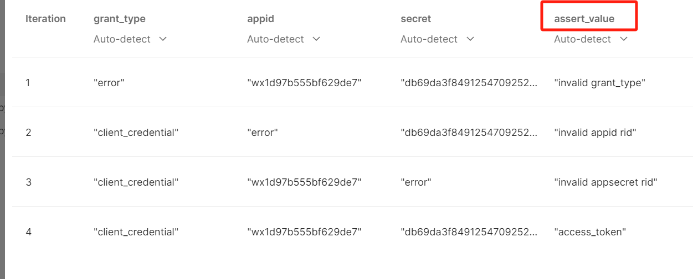

### 2.11 加密接口