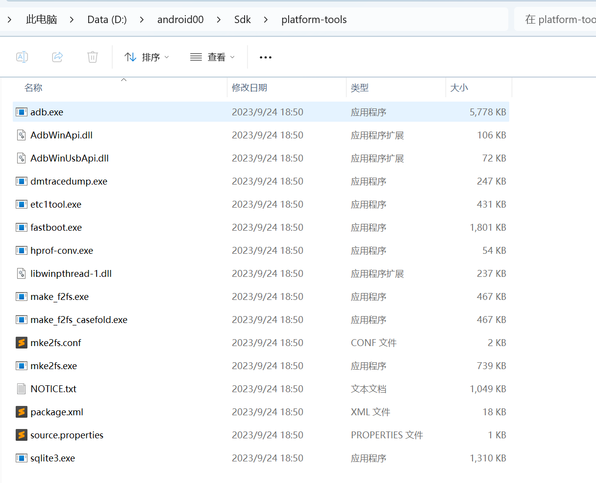
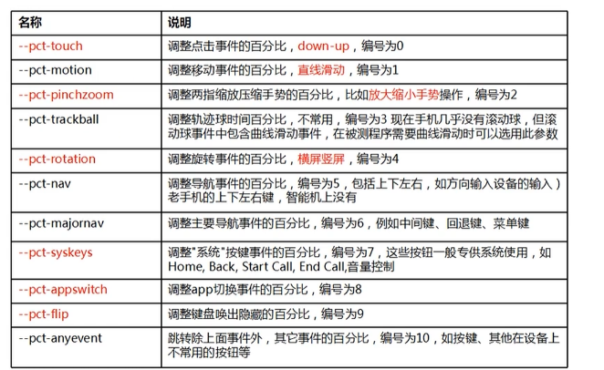

# ADB命令

## 一、adb的安装

用于完成电脑和手机之间的通信控制。

[][[Android sdk下载安装配置教程 - 知乎 (zhihu.com)](https://zhuanlan.zhihu.com/p/313606629)]

**安装sdk**

1. 下载sdk 


2. 下载 sdk platforms


3. 配置环境变量



## 二、将设备和电脑连接起来

安装模拟器

1. 将手机进入开发者选项，通过点击手机版本号7次

2. 开发者选项中，打开usb调试。
3. 连接手机  以mumu为例

```
C:\Users\atai>adb connect 127.0.0.1:7555
connected to 127.0.0.1:7555
```

4. 连接成功后，用 adb devices 去查看连接的设备


## 三、常用的adb命令

**adb shell**：进入安卓系统 内部 进行操作   基本的linux命令都可以操作，直接使用。

**adb install 【包路径】**： 将文件安装到手机上

**adb uninstall 【安卓系统中的包名】**: 将apk卸载

**adb pull** 【路径】：拉取到手机的命令

**adb push** 【路径】：推送到手机的命令

**adb dumpsys** ：获取系统服务的状态信息

**adb root**：获得root权限

### 3.1 包管理（pm）

**adb shell pm list package**：列出手机中安装的所有应用的package名字。 -3 参数:用于列出第三方应用

放在了system/bin日录下的pm脚本

### 3.2 获得应用的activity

1. `adb shell dumpsys activity|findstr "mFocus"`

   ​     一定注意，使用这个命令的时候，打开你的被测应用。

   ​		实际上获取的是当前应用打开的activtiy名，有可能并不是启动用的activity

2. 使用sdk中的aapt工具 来进行apk包的解析

   ​	获取到的一定是启动用的activity

   `aapt dump badging E:\bilibili_3.42.0_APKPure.apk |findstr launchable` 

3. adb shell monkey -p com.tencent.mobileqq -v -v -v 1

    通过查看日志信息中，找到using开头的哪一句，其中的activity名字就是启动页面

   

### 3.3 压力测试

#### 3.3.1 monkey应用场景

monkey是整体对app进行伪随机操作的一个工具

Monkey测试是Android平台自动化测试的一种手段，通过Monkey程序模拟用户触摸屏幕滑动Trackbal、按键等操作来对设备上的程序进行**压力测试**，检测程序多久的时间会发生异常 

monkey是命令行工具

+ monkey在什么时候使用
  + 等产品稳定的时候，用monkey去测试应用的稳定性，健壮性

#### 3.3.2 monkey参数详解

usage: monkey [-p ALLOWED_PACKAGE [-p ALLOWED_PACKAGE] ...]
              [-c MAIN_CATEGORY [-c MAIN_CATEGORY] ...]   

​			  [--ignore-crashes] [--ignore-timeouts]
​      		[--ignore-security-exceptions]
​              [--monitor-native-crashes] [--ignore-native-crashes]
​              [--kill-process-after-error] [--hprof]
​              [--match-description TEXT]
​              [--pct-touch PERCENT] [--pct-motion PERCENT]
​              [--pct-trackball PERCENT] [--pct-syskeys PERCENT]
​              [--pct-nav PERCENT] [--pct-majornav PERCENT]
​              [--pct-appswitch PERCENT] [--pct-flip PERCENT]
​              [--pct-anyevent PERCENT] [--pct-pinchzoom PERCENT]
​              [--pct-permission PERCENT]
​              [--pkg-blacklist-file PACKAGE_BLACKLIST_FILE]
​              [--pkg-whitelist-file PACKAGE_WHITELIST_FILE]
​              [--wait-dbg] [--dbg-no-events]
​              [--setup scriptfile] [-f scriptfile [-f scriptfile] ...]
​              [--port port]
​              [-s SEED] [-v [-v] ...]
​              [--throttle MILLISEC] [--randomize-throttle]
​              [--profile-wait MILLISEC]
​              [--device-sleep-time MILLISEC]
​              [--randomize-script]
​              [--script-log]
​              [--bugreport]
​              [--periodic-bugreport]
​              [--permission-target-system]
​              COUNT

`adb shell monkey -p []` 

**-p**：包名 

**-v**：表示日志详细程度

```text
Level 0 : adb shell monkey -p 包名 -v 50     //默认级别，仅提供启动提示、测试完成和最终结果等少量信息
2）Level 1 : adb shell monkey -p 包名 -v -v 50   //提供较为详细的日志，包括每个发送到Activity的事件信息
3）Level 2 : adb shell monkey -p 包名 -v -v -v 50   //最详细的日志，包括了测试中选中/未选中的Activity信息
```

**-s**

用于**指定伪随机数生成器**的seed值。如果使用**相同的种子值**重新运行Monkey，第二次将**生成相同的事件序列**，

例子：

Monkey测试1：adb shell monkey -p 【包名】 -s 101【提前指定】 100  

Monkey测试2：adb shell monkey -p 【包名】 -s 101【提前指定】 100  

两次设置的效果是相同，用于复现操作

**--throtle**

有延迟效果

**--ignore-crashes**

**--ignore-timeouts**

如果使用该参数,则执行中发生了奔溃或者anr的问题,会结束app.重新启动执行操作继续之前的事件数,直到事件数结束,而且会在日志中记录该问题

**--ignore-security-exceptions**

**参数比事件**




## 四、日志查看

android日志系统提供了记录和查看系统调试信息的功能，日志都是从各种软件和一些系统的缓冲区中记录下来的，缓冲区可以通过logcat命令来查看和使用

adb locat -b 以二进制输出日志

+ Radio:输出通信系统的log

+ System:输出系统组件的log

+ Events:输出event模块的log

+ Main:所有java层的log(不属于上面3层的log)

如想输出通信系统的log:adb logcat -b radio

### 4.1 日志定位

adb locat -v time  

1. **crash问题** ：系统崩溃，毫无征兆的闪退

出现问题后

重新执行 adb locat 抓取日志后 搜索 FATAL EXCEPTION（致命异常）

2. **anr问题**

adb locat 

+ 搜索 anr in，

有时也要查看 cpu的占用率 查看

+ 查找trace文件

