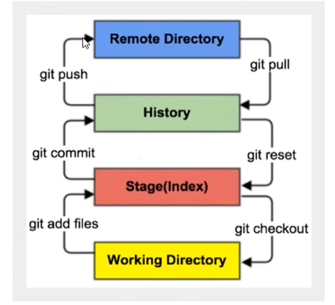
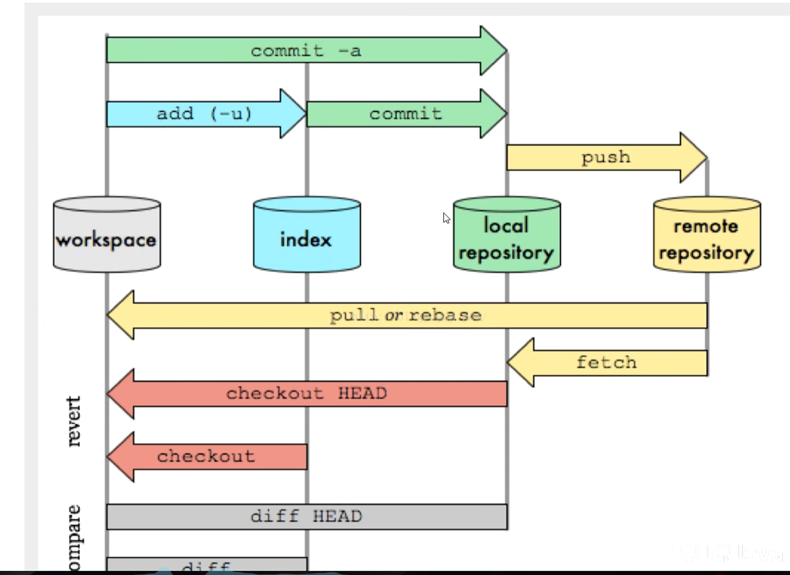
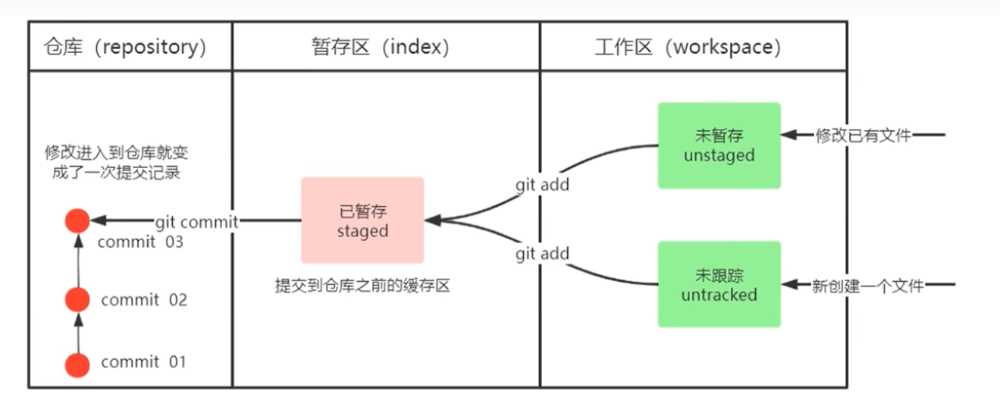
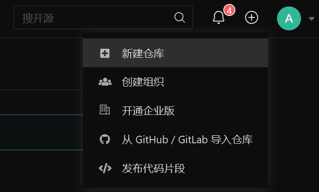

# Git

## 一、目标

+ 了解Git的命令
+ 能够概述git的工作流程
+ 能够使用git的基本命令
+ 熟悉git代码托管服务

## 二、基本的命令学习

1. `d` : 改变目录
2. `cd..` : 回退到上一个目录，直接cd进入默认目录
3. `pwd`: 显示当前所在的目录路径。
4. `ls(ll)`:都是列出当前目录中的所有文件,只不过川(两个I)列出的内容更为详细。
5. `touch`: 新建一个文件，如touch index.js就会在当前目录下新建一个index.js文件。
6. `rm`: 删除一个文件，
7. `rm -r` : 删除一个文件夹
8. `mkdir`:新建一个文件夹
9. `mv`:mv移动文件，mvindex.htmlsrcindex.html是我们要移动的文件，src是目标文件
10. `clear`:清屏
11. `history`:查看命令历史
12. `help`:帮助
13. `#`:表示注释

## 三、基本理论学习

>  工作区域

Git本地有三个工作区域:工作目录(WorkingDirectory)、暂存区(Stage/Index)、资源库(Repository或GitDirectory)。如果在加上远程的git仓库(Remote Directory)就可以分为四个工作区域。文件在这四个区域之间的转换关系如下:

 

+ Workspace:工作区，就是你平时存放项目代码的地方
+ Stage（index）:暂存区，用于临时存放你的改动，事实上它只是一个文件，保存即将提交到文件列表信息
+ Repository:仓库区(或本地仓库)，就是安全存放数据的位置，这里面有你提交到所有版本的数据。其中HEAD指向最新放入仓库的版本
+ Remote:远程仓库，托管代码的服务器，可以简单的认为是你项目组中的一台电脑用于远程数据交换

> 工作流程

git的工作流程一般是这样的:

1. 在工作目录中添加、修改文件;  					
2. 将需要进行版本管理的文件放入暂存区域;   git add
3. 将暂存区域的文件提交到git仓库。            git   commit

 

## 四、git项目搭建

**获取本地仓库**

`git init` 初始化当前目录为本地仓库

本地目录 会多了 `.git`文件

### 3.1 基本配置

**所有的配置文件，其实都保存在本地!**

`git config -l` 查看文件配置

`git config --system --list` 查看系统配置   在文件夹 gitconfig下

`git config --global  --list` 查看global全局配置 

```shell
$ git config --global  --list
user.name=atai
user.email=666@qq.com
credential.https://gitee.com.provider=generic
```

**每个git 都需要设置用户名和邮箱**

1. 进入git bash

2. 设置用户信息

   ```
   git config --global user.name "itcast"
   git config --global user.eamil "666@qq.com"
   ```

3. 查看配置信息

   ```
   git config --global user.name
   git config --global user.email
   ```

### 3.2 为命令起别名（可选）

解决每次都要输入好多参数，我们可以使用别名

1. 打开用户目录，创建`./bashrc`文件

2. 在`./bashrc`文件 中输入如下内容

   ```shell
   # 用于输出git提交日志
   alias git-log='git 1og --pretty=oneline --all --graph --abbrev-commit'
   alias ll='ls -al'
   ```

   ⚠️ 注意 3 个关键点：

   1. **等号左右不能有空格**
   2. **命令必须放在引号里**
   3. **整个是一行**

3. 在`./bashrc`文件 执行`source ~/bashrc`

### 3.3 基础操作命令

git工作目录下，对于文件的修改，删除和更新会存在几个状态，这些修改的状态会随着我们执行git的命令，而发生变化。



##### 3.3.1 查看修改的状态（status）

- 作用 : 查看的修改的状态(暂存区、工作区)
- 命令形式：`git status `

##### 3.3.2 添加工作区到暂存区（add）

+ 作用 : 添加工作区一个或多个文件的修改到暂存区
+ 命令形式:`git add 单个文件名  通配符`
  + 将所有文件添加到暂存区 git add ,

##### 3.3.3 提交暂存区到本地仓库(commit)

+ 作用:提交暂存区内容到本地仓库的当前分支
+ 命令形式 ： `git commit- m '注释内容'`

##### 3.3.4 查看提交日志 （log）

+ 作3.3用:查看提交记录
+ 命令形式: `git log [option]`
  + [options]
    + `-all` 显示所有分支
    + .`--pretty=oneline` 将提交信息显示为一行
    + `--abbrev-commit` 使得输出的commitld更简短 
    + `--graph` 以图的形式显示

##### 3.3.5 版本回退

+ 作用: 版本切换

+ 命令形式:`git reset --hard commitID`

  + `COMMITID` 可以使用 `git -log` 或 `git log` 指令查看
  
+ 如何查看已经删除的记录？
  
+ `git reflog`
  + 此指令可以查看已经删除的提交记录

#####  3.3.6 将文件夹添加到忽略列表

  

### 3.4 分支

3.4.1 查看本地分支

`git branch `

3.4.2 创建本地分支

`git branch 分支名`

3.4.3 切换分支

`git checkout 分支名`                                                       

  切换不存在的分支

`git checkout -b 分支名`

3.4.4 合并分支

`git merge 分支名称`

3.4.5 删除分支

 

## 五、git远程仓库 

### 5.1 创建远程仓库

gitee创建仓库

 

### 5.2  配置SSH公钥

+ 生成SSH公钥

  + ssh-keygen -t rsa
  + 不断回车
+ 查看ssh公钥

  + cat ~/.ssh/id_rsa.pub
+ 验证 是否配置成功
  +  `ssh -T git@gitee.com`

### 5.3 操作远程仓库

+ 初始化本地仓库，然后与已创建的远程仓库对接

  + `git remote add <远端路径> <仓库路径>`
    + 远端名称，默认是origin，取决于远端服务器设置
    + 仓库路径，从远端服务器获取此URL

+ 查看远程仓库

  + `git remote`

+ 推送远程仓库

  + 命令：`git push [-f] [远端名称] [分支名]`

    例如：git push remote orgin

  + -f 表示强制覆盖

+ 从远端仓库克隆

  + `git clone <仓库地址><本地目录>`

+ 从远程仓库去拉取和抓取   远程分支和本地的分支一样，我们可以进行merge操作，只是需要先把远端仓库里的更新都下载到本地，再进行操作。

  + 抓取命令：`git fetch [remote name][branch name]`
    + 将仓库里的更新都抓取到本地，不会进行合并
    + 如果不指定远端名称和分支名，则抓取所有分支
  + 拉取命令：`git pull [remote name][branch name]` `
    + 拉取指令就是将远端仓库的修改拉到本地并自动进行合并，等同于fetch+merge
    + 如果不指定远端名称和分支名，则抓取所有并更新当前分支。
  + 解决合并冲突
    + 远程分支也是分支，所以合并时冲突的解决方式也和解决本地分支冲突相同相同

### 5.4 Sparse-checkout  

> 背景：我在b环境只想拉取一部分文件，不想将整个文件拉取下来
>
> Sparse-checkout:用于拉取仓库的部分和 指定文件

在 需要拉取代码的环境进行配置:

+ 拉取代码

  + ```shell
    git clone --no-checkout <仓库地址>
    cd <文件名>
    ```

+ 开启sparse-checkout

  + ```shell
    # 告知这是一个稀疏仓库
    git sparse-checkout init --cone  
    ```

+ 指定允许出现的目录

  + ```shell
    git sparse-checkout set 02_Business-Testing<文件名>
    
    ```

+ 触发一次checkout

  + ```shell
    git checkout master
    ```

+ 验证是否为sparse-checkout

  + ```shell
    git status
    # You are in a sparse checkout.
    ```

取消sparse ：

  ```shell
git sparse-checkout disable # 关闭sparse-checkout
  ```

```shell
git checkout -f master      # 强制恢复工作区
```


