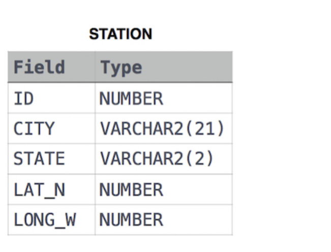

# 黑客松

## select

### 题目一 

知识点：order by    limit

> 题目： 查询STATION中拥有最短和最长城市名称的两个城市，以及它们各自的名称长度(即名称中字符的个数)。如果存在多个最小或最大的城市，请选择按字母顺序排列时排在首位的那一个。
>
> 解释： 按照字母顺序排列时，城市名称被列作ABC、DEF、PORS和WXY，长度分别为3、3、4和3。最长的名称是PQRS，但最短名称城市的选项有3个。请选择ABC，因为它按字母顺序排在首位。  

```mysql

```

### 题目二

知识点： order by 、right( 字符串，数字)

> 题目：查询 STUDENTS 数据库中所有得分高于 75分 的学生的姓名。按姓名的最后三个字符对结果进行排序。如果两个或多个学生的姓名最后三个字符相同（例如：Bobby、Robby 等），则按 ID 升序进行二次排序。
>
>  

```mysql
SELECT Name
from students
where marks > 75
ORDER by right(name,3) ,id;
```

### 题目三

知识点：regexp ‘’    正则表达式

> 查询STATION中不以元音字母开头且不以元音字母结尾的城市名称列表。你的结果不能包含重复项。
>
>  

```mysql
SELECT distinct(city)
from station
where city regexp '^[^aeiou]' and city regexp '[^aeiou]$';
```

### 题目四

知识点：正则表达式中 `^` 表示开头 `$` 表示结尾

> 查询STATION中 不以元音字母结尾的 城市名称列表。结果不能包含重复项。

```mysql
select distinct(city) from station where city regexp '[^aeiou]$'
```

### 题目五

知识点：正则表达式中 `^` 表示开头 `$` 表示结尾

> 查询STATION中以元音字母(a,e,i,o,u)结尾的CITY名称列表。结果不能包含重复项。

```mysql
SELECT distinct city from station where city regexp '\w*[aeiou]$'
```

### 题目六

知识点：

> 查询STATION中名称长度最短和最长的两个城市，以及它们各自的长度(即名称中字符的数量)。如果存在多个最小或最大的城市，请选择按字母顺序排列时排在首位的那个
>
> station 表
>
> | Field | TYPE        |
> | ----- | ----------- |
> | ID    | NUMBER      |
> | CITY  | VARCHAR(21) |
> | STATE | VARCHAR(21) |
> | LAT_N | NUMBER      |
> | LAT_W | NUMBER      |
>
> 输出：
>
> ```
> ABC 3
> PQRS 4
> ```
>
> 解释：
>
> 按照字母顺序排列时，城市名称被列作ABC、DEF、PQRS和WXY，长度分别为3、3、4和3。最长的名称是PQRS，但最短名称城市的选项有3个。请选择ABC，因为它按字母顺序排在首位。

```mysql
SELECT city,length(city) from station ORDER BY length(city),city limit 1;
SELECT city,length(city) from station ORDER BY length(city) desc ,city limit 1;
```


