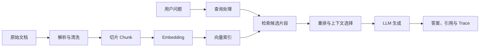

# RAG 核心知识

> [!info] 笔记定位
> 这篇笔记回答“RAG 是怎么工作的”。当前先建立整体结构，具体评测方法见 [[01_RAG评测与测试]]，项目实践见 [[02_RAG项目实践]]。

## 一、RAG 是什么

RAG（Retrieval-Augmented Generation，检索增强生成）是在大模型回答问题前，先从外部知识库中检索相关内容，再让模型根据检索证据生成答案。

它主要解决三个问题：

- 大模型不知道私有知识；
- 模型训练数据可能过时；
- 单纯依靠模型记忆容易产生幻觉，回答也难以追溯来源。

RAG 不等于向量数据库。向量数据库只是检索链路中的一个组件，完整系统还包括文档处理、切片、检索、上下文构造、生成、引用和评测。

## 二、RAG 完整链路



可以把它分成两个阶段：

### 1. 知识入库

```text
文档 → 解析 → 清洗 → 切片 → Embedding → 建立索引
```

### 2. 查询问答

```text
问题 → 查询处理 → 检索 → 重排 → 上下文 → 生成 → 引用
```

## 三、知识入库中的核心概念

### 1. 文档解析与清洗

把 Markdown、PDF、Word、图片等文件转换成可处理的文本，同时尽量保留标题、页码、表格和来源信息。

清洗不是简单删除“特殊字符”，而是去掉重复页眉页脚、导航、广告、乱码和重复内容，同时保留标题层级、表格关系、错误码、版本、权限范围、来源路径等会影响检索和溯源的信息。清洗后的文档应能够回指原文；高风险数据还要做脱敏、权限标记和版本管理。

### 2. Chunk 切片

Chunk 是从原始文档中切出来的一段内容，也叫“知识片段”或“切片”。切片是拆分文档的过程，Chunk 是这个过程产生的结果，Chunk Size 则是控制每个片段大小的参数；它们都不是 Prompt。

```text
原始文档 → 切片 → 多个 Chunk → Embedding → 建立索引
用户问题 → 检索相关 Chunk → 选出 Top-K → 交给 LLM 回答
```

例如，一篇同时包含“CSV 参数化”和“响应断言”的 JMeter 文档，可以按照标题拆成两个 Chunk。检索“如何使用 CSV 参数化”时，系统比较的是问题与这些 Chunk，而不是直接把整篇文档交给模型。

一个 Chunk 通常不只有正文，还会保留原始文档路径、标题路径、Chunk 编号等元数据，并拥有对应的 Embedding 向量，以便检索和引用溯源。

常见参数：

- `Chunk Size`：单个片段允许包含的内容大小。过大容易混入无关主题，过小容易把完整答案切断；
- `Chunk Overlap`：相邻片段重复保留的内容，用来减少边界信息丢失，但设置过大也会增加重复；
- `Min Chunk Size`：过短片段的处理下限，避免产生缺少语义的零碎内容。

常见方式包括：

- 固定长度切片；
- 按标题或段落切片；
- 父子层级切片；
- 语义切片。

当前 `personal-test-rag` 使用标题感知切片：Chunk 最大长度为 1,400 个字符，相邻 Chunk 重叠 150 个字符，最小 Chunk 为 80 个字符。

#### 固定长度切分为什么可能间接增加幻觉

固定长度切分不会直接让模型产生幻觉。风险来自机械边界可能切断“条件—结论”、表头—数据行、步骤链或异常说明，使检索得到的证据不完整或缺少标题上下文；如果生成阶段仍要求模型回答，模型就更容易依靠自身知识补齐缺口。

```text
机械边界切断语义 → 检索命中不完整证据 → 上下文缺少必要条件 → 模型自行补全 → 幻觉风险上升
```

固定长度切分仍可作为简单基线。改进时优先使用标题、段落、列表和表格边界，保留标题路径和来源元数据，并用适量 Overlap 或父子切片补充上下文；是否更好必须通过固定 Gold Set 比较 Hit@K、Faithfulness、延迟和成本，不能只凭经验判断。

### 3. Embedding

Embedding 把文本转换成表达语义特征的数字向量，使系统能够计算问题和知识片段在语义上的相似程度。它不是给文本随机分配坐标；在同一个 Embedding 模型产生的向量空间中，语义相近的文本通常距离更近。

例如，“会员退款需要多久”和“会员多久可以申请退款”用词不同，但语义接近，因此它们的向量也应较接近。入库时对 Chunk 生成向量，查询时也要使用兼容的 Embedding 模型对问题生成查询向量，才能进行有意义的相似度比较。

> [!warning] 常见误区
> Embedding 相似表示“语义可能相关”，不等于内容正确，更不等于相似度分数是正确概率。更换 Embedding 模型、维度或向量处理方式后，旧向量通常不能直接混用，需要重建并重新评测索引。

### 4. 向量索引

向量索引用来保存和搜索 Embedding。一次可用的检索结果通常需要同时关联三类信息：

- Chunk 正文：最终提供给模型的知识内容；
- Embedding 向量：用于相似度检索；
- Metadata：文档来源、标题路径、页码、版本、权限范围和 Chunk ID 等信息，用于过滤、引用和溯源。

小规模数据可以使用精确检索，数据量较大时通常使用近似最近邻索引。向量数据库或向量索引是检索组件，不是完整的 RAG 系统，也不应成为原始文档的唯一副本。

## 四、查询与检索中的核心概念

### 1. Query 与查询向量

Query 是用户提交的问题。进入向量检索前，系统通常先用与知识库兼容的 Embedding 模型把 Query 转换成查询向量，再与 Chunk 向量比较。

```text
用户问题 → Query Embedding → 查询向量 → 检索候选 Chunk
```

查询处理还可能包含去除无关对话、补充上下文、改写和关键词提取，但 Query 本身、Query Rewrite 和 Query Embedding 是不同步骤。

### 2. Dense 向量检索

根据语义相似度寻找相关片段，适合同义表达，但可能不擅长精确编号、专有名词和关键词匹配。

### 3. BM25 关键词检索

根据词语匹配和词频进行检索，适合精确关键词、产品名、错误码和业务编号。

### 4. 混合检索

同时使用向量检索和关键词检索，再融合两路结果，以兼顾语义和关键词。

LexarRAG 中的 `HybridRetriever` 是混合检索流程的编排类，不是模型或数据库。它接收问题、候选语料和知识库过滤条件，按配置执行 Query Rewrite、Dense、BM25、RRF、父切片扩展和 Rerank，最后返回包含四阶段文档列表与检索日志的 `RetrievalResult`。离线检索评测可以仅在内存中关闭 Query Rewrite，直接复用这个类，以避开答案生成但保留真实检索实现。

### 5. Query Rewrite

对用户问题进行改写、补全或扩展，降低口语化、歧义和上下文缺失对检索的影响。

### 6. Retrieval 与 Top-K

Retrieval（检索召回）是根据 Query 从索引中找出可能相关的 Chunk。测试这一层时，首先关心“正确证据是否进入候选结果”，而不是最终答案是否写得流畅。

Top-K 表示按当前检索分数排序后保留前 K 条结果。例如 `Top-K = 5` 表示保留前 5 个候选 Chunk；它只是结果数量参数，不是评分算法、模型或效果指标。

K 较小可能漏掉正确证据，K 较大可能引入更多干扰内容并增加重排、上下文和生成成本。最佳取值要结合固定评测集比较命中、排序、延迟和成本，不能只凭单个问题判断。

### 7. Rerank

Rerank（重排序）对初步检索出的候选 Chunk 做更精细的相关性判断，让真正支持问题的证据优先进入最终上下文。

```text
Retrieval 粗召回 → 候选 Chunk → Rerank 精排 → 选择最终上下文
```

Retrieval 负责尽量不要漏掉可能相关的证据，Rerank 负责改善候选结果的先后顺序；Rerank 不能找回召回阶段完全没有找到的 Chunk。

## 五、上下文、生成与引用

### 1. 上下文构造

Context（上下文）是从候选 Chunk 中筛选、排序并组织后，实际提供给大模型作为回答依据的内容。它需要控制相关性、证据完整性、顺序、重复内容、权限和总长度，并保留可用于引用的来源映射。

```text
候选 Chunk → 重排与筛选 → 最终 Context
最终 Context + 用户问题 + Prompt → LLM → 答案
```

在普通 RAG 链路中，LLM 不会自己搜索知识库；检索系统先找到资料并构造 Context，LLM 只能根据收到的问题、Prompt 和 Context 生成答案。即使正确 Chunk 曾经被召回，如果它在重排、裁剪或上下文组装时丢失，生成阶段仍然缺少正确证据。

### 2. Prompt 约束

告诉模型只能根据知识库证据回答，在证据不足时拒答，并按要求返回引用。

### 3. 引用

引用应当来自实际送给模型的知识片段，并能追溯到文档、标题、页码或 Chunk。

#### 引用代号与证据 UUID

证据 UUID 是后端为知识片段分配的真实唯一标识，用于数据库查询、引用校验、Trace 和原文溯源；`R1`、`R2` 是一次模型调用内使用的临时代号，目的是避免模型抄写或编造很长的 UUID。

```text
知识片段 UUID → 本次 Prompt 映射为 R1 → 模型返回 R1
→ 后端校验 R1 → 映射回 UUID → 保存正式引用
```

- UUID 类似知识片段的“身份证号”，本身不表达内容含义。
- `R1` 类似本次 Prompt 中的“座位号”，只在当前调用有效；下一次调用的 `R1` 可能代表另一条证据。
- `R1` 不能代替数据库中的 UUID。最终结果仍应保存 UUID 和来源元数据，保证可以定位到真实 Chunk。
- 当前测试用例生成项目中的 `evidence_id` 是证据 UUID；`TC-RAG-2162` 是正式测试用例的业务编号，二者用途不同。

### 4. 拒答

当知识库没有可靠证据时，系统应明确说明无法回答，而不是依靠模型常识补全答案。

## 六、简单 RAG 与复杂 RAG

| 维度 | 简单 RAG | 复杂 RAG |
| --- | --- | --- |
| 文档 | 少量、格式统一 | 多格式、OCR、表格和复杂版式 |
| 切片 | 固定长度或标题切片 | 父子切片、语义切片 |
| 检索 | 单路向量检索 | Dense、BM25、查询改写和混合检索 |
| 排序 | 相似度直接排序 | RRF 融合和 Rerank |
| 上下文 | 直接拼接 Top-K | 去重、扩展、压缩和分组 |
| 运维 | 手动重建 | 版本、发布、回滚和审计 |
| 评测 | 基础命中率 | 分层指标、Trace 和版本回归 |

## 七、常见组件在 RAG 中的作用

| 组件 | 主要作用 |
| --- | --- |
| PostgreSQL | 保存文档、Chunk、任务和业务数据 |
| pgvector | 让 PostgreSQL 支持向量存储和检索 |
| Milvus | 面向向量检索的独立数据库 |
| SQLAlchemy | Python 数据访问和模型映射 |
| Alembic | 管理数据库结构变更 |
| Redis | 缓存、队列和异步任务协调 |
| LLM | 根据上下文生成答案 |
| Embedding 模型 | 把问题和知识片段转换成向量 |
| Rerank 模型 | 对候选片段进行相关性重排 |

## 八、从测试视角建立整体认识

RAG 测试不能只看“最终答案对不对”，还要观察每一层的输入、输出和失败表现，判断错误最早从哪里出现。

| 层级 | 最小检查点 | 常见失败信号 |
| --- | --- | --- |
| 文档与数据 | 内容完整、版本正确、冲突与权限可控 | 知识缺失、过期或不同版本互相矛盾 |
| 解析与 Chunk | 标题、正文、表格和条件关系没有被破坏 | 答案被切断、表头与数据分离、来源不可追溯 |
| Embedding | 入库与查询模型兼容，语义近邻表现合理 | 同义问法距离异常、换模型后效果突变 |
| Retrieval | 正确证据能够进入候选 Top-K | 知识库有答案，但只召回相似干扰内容 |
| Rerank | 正确证据在候选中被排到前面 | 正确 Chunk 已召回，却在精排后被压低或丢失 |
| Context | 最终证据相关、完整、未被错误裁剪 | 正确 Chunk 曾出现，但没有实际送给 LLM |
| 生成、引用与拒答 | 回答忠于 Context，引用对应证据，无依据时拒答 | 有证据却答错、引用错位或超出证据编造 |

排查时可以使用这条最小判断链：

```text
最终答案错误
├─ 正确证据未进入候选结果 → 检查数据、解析、切片、Embedding、Query 和 Retrieval
├─ 正确证据进入候选但未进入 Context → 检查 Top-K、融合、Rerank 和上下文裁剪
└─ 正确证据已进入 Context 但仍答错 → 检查 Prompt、LLM、引用映射和拒答策略
```

具体的 Gold Set、Hit@K、MRR、Faithfulness、对比实验和回归方法见 [[01_RAG评测与测试]]；项目中的实际配置和验证结果见 [[02_RAG项目实践]]。

## 九、知识反馈闭环

知识反馈闭环是把问答、生成或澄清过程中发现的知识缺口，转换为**可审核的源文档变更**，审核通过后再发布新的知识版本；澄清答案本身只是候选依据，不应直接成为线上知识。

```text
发现知识缺口 → 收集澄清答案 → 生成文档变更提案 → 人工审核差异
→ 更新源文档 → 发布新知识版本 → 重建索引 → 回归检索与生成
```

- 源文档仍是唯一事实来源，向量库只是可重建索引；不能只把答案写入向量库而不更新原文。
- 变更提案至少保存目标文档、目标章节、变更类型、变更前后内容、依据、影响范围和审核状态。
- “继续本次生成”和“发布为长期知识”是两个动作：答案可以先帮助当前任务继续，但只有经过业务负责人确认的内容才能进入知识库。
- 无法确定目标文档、与现有规则冲突或涉及高风险业务结论时，应保持草稿状态并交由人工选择或退回补充。
- 发布后要保留版本、审计和回滚能力，并用相关问题与负例检查新知识能否被召回、是否引入冲突或错误回答。
