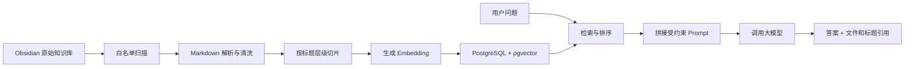

# 个人知识库 RAG 项目进度与实施说明

> [!info] 当前状态
> 项目状态：规划中
> 当前阶段：阶段 0——数据治理与安全检查
> 原始知识库：`/Users/Admin/Documents/Note/01_origin`
> 计划代码目录：`/Users/Admin/Documents/personal-test-rag`

## 文档用途

这是一份长期维护的项目文档，用来：

1. 记录 `personal-test-rag` 的目标、架构和实施方法。
2. 记录已经完成的工作、当前问题和下一步任务。
3. 保存重要决策及其原因，避免后续重复讨论。
4. 为下一次继续开发提供完整上下文。

相关入口：

- [[00_目录|个人知识库总目录]]
- [[04_AI应用开发/01_AI应用开发路线|AI 应用开发阶段学习路线]]
- [[04_AI应用开发/02_RAG知识库/08_RAG|RAG 基础概念]]
- [[04_AI应用开发/02_RAG知识库/12_pgvector|pgvector]]
- [[04_AI应用开发/ai客服项目/07_跨境电商AI客服助手项目|跨境电商 AI 客服助手项目]]

## 一、项目定位

### 项目名称

`personal-test-rag`

### 首版产品

个人软件测试知识助理。

首版重点回答以下内容：

- Python、SQL、Linux、HTTP 等通用技术问题；
- Apifox、Postman、JMeter、Pytest、Playwright、ADB、Fiddler 等测试工具问题；
- 软件测试理论、接口测试、自动化测试和项目测试思路；
- 现有项目实战笔记中的业务链路、测试点和问题复盘。

回答必须展示引用来源，包括相对文件路径和标题层级。知识库没有依据时，应明确说明没有找到可靠资料，不能编造答案。

### 项目边界

| 层级 | 职责 | 是否是原始知识 |
| --- | --- | --- |
| Obsidian 知识库 | 日常记录、整理、修订和审核 | 是，唯一真实来源 |
| `personal-test-rag` | 解析、清洗、切片、索引、检索、生成和评测 | 否 |
| PostgreSQL / pgvector | 保存文档信息、切片和向量索引 | 否，可删除重建 |

基本原则：

```text
知识库负责“写什么”
RAG 项目负责“怎么找到并回答”
向量数据库只是可重建的检索索引
```

### 首版不做

- 不做模型训练或微调；
- 不做 Redis、Celery 和微服务；
- 不做 Agent、MCP 和 GraphRAG；
- 不处理图片 OCR、录音、视频和复杂扫描件；
- 不开发 Vue 或 React 前端；
- 不把简历、面试录音、公司专项转写或私钥导入索引；
- 不把完整知识库发布到公开演示环境。

## 二、知识库审计结论

审计时间：2026-07-10。

### 资料规模

| 项目 | 结果 |
| --- | ---: |
| `/Note` 下 Markdown | 137 篇 |
| `01_origin` 主知识库 Markdown | 136 篇 |
| Markdown 正文规模 | 约 41.8 万字符 |
| Markdown 标题 | 2,024 个 |
| 代码围栏 | 1,270 个 |
| 机械估算切片 | 约 688 个 |
| Word | 4 个 |
| PDF | 1 个 |
| XMind | 4 个 |
| Excel | 1 个 |
| 录音 | 3 个，另有文本转写 |
| 图片 | 152 张 |

### 内容判断

- 通用技术栈、软件测试学习、项目实战和面试准备资料已经足够支撑 RAG 练习。
- 最适合的首版方向是“个人软件测试知识助理”。
- 求职和面试资料价值较高，但涉及隐私，只能进入私有知识空间。
- AI 应用开发目录目前以短概念卡片为主，适合作为学习路线，不足以单独支撑完整的 AI 开发问答。
- 跨境电商 AI 客服可以作为后续业务项目，但还需要补充正式的商品、物流、退款、优惠券和投诉 SOP。

### 数据质量问题

- 核心笔记缺少统一的 `domain`、`status`、`source`、`visibility` 和 `updated` 元数据；
- 存在空笔记和大量过短的概念笔记；
- 导航中有 2 处指向同一篇缺失 Playwright 笔记的链接；
- 有约 15 张未被笔记引用的图片；
- 面试准备、公司专项和归档内容存在主题重复；
- Word 宝典资料内容较大，但存在时效、版权和质量不一致风险。

### 安全问题

> [!danger] 在开发公开演示前必须处理
> 当前知识库对应的 GitHub 仓库处于公开状态。审计发现 Git 历史中仍有已经从当前版本删除的敏感二进制资料，当前版本也有面试转写被版本控制跟踪。`.gitignore` 只能阻止以后新增文件，不能删除 Git 历史。

安全要求：

1. 在清理前将知识仓库视为私有资料源。
2. 备份后再评估是否使用 `git filter-repo` 清理历史，并确认强制推送影响。
3. RAG 导入使用白名单，不能对整个目录无条件递归索引。
4. API 密钥只保存在代码项目的 `.env` 中，并通过 `.gitignore` 排除。
5. 公开代码仓库只放程序和脱敏的 `sample_knowledge`。

## 三、总体架构与数据流程



### 文档入库流程

```text
扫描知识库白名单
→ 读取 Markdown 和 YAML 元数据
→ 清洗 Obsidian 链接、嵌入语法和无关标记
→ 按标题层级切片并保留 heading_path
→ 生成 Embedding
→ 写入 PostgreSQL / pgvector
→ 记录本次同步结果
```

### 问答流程

```text
接收用户问题
→ 生成问题向量
→ 执行向量 Top-K 检索
→ 按领域和可见性过滤
→ 后续增加关键词检索与 rerank
→ 选择最终上下文
→ 要求大模型只依据上下文回答
→ 返回答案、引用、相关度和耗时
```

## 四、推荐代码项目结构

```text
personal-test-rag/
├── app/
│   ├── main.py
│   ├── api/
│   │   ├── knowledge.py
│   │   ├── query.py
│   │   └── health.py
│   ├── ingestion/
│   │   ├── loader.py
│   │   ├── cleaner.py
│   │   ├── splitter.py
│   │   ├── embedding.py
│   │   └── indexer.py
│   ├── retrieval/
│   │   ├── vector_search.py
│   │   ├── keyword_search.py
│   │   └── reranker.py
│   ├── rag/
│   │   ├── prompt.py
│   │   └── service.py
│   ├── db/
│   │   ├── models.py
│   │   ├── session.py
│   │   └── migrations/
│   └── core/
│       ├── config.py
│       └── logging.py
├── config/
│   └── corpus.yaml
├── evals/
│   ├── questions.jsonl
│   └── results/
├── tests/
├── frontend/
│   └── app.py
├── sample_knowledge/
├── docker-compose.yml
├── requirements.txt
├── .env.example
├── .gitignore
└── README.md
```

### 目录职责

| 目录或文件 | 职责 |
| --- | --- |
| `app/main.py` | 创建 FastAPI 应用并注册路由 |
| `app/api/knowledge.py` | 知识同步和同步状态接口 |
| `app/api/query.py` | RAG 问答接口 |
| `app/api/health.py` | 应用和数据库健康检查 |
| `app/ingestion/loader.py` | 扫描白名单并读取 Markdown、元数据和文件状态 |
| `app/ingestion/cleaner.py` | 清洗 Obsidian 语法，保留有意义文本和代码 |
| `app/ingestion/splitter.py` | 按标题和长度切片，生成稳定的标题路径 |
| `app/ingestion/embedding.py` | 封装 Embedding 模型，支持批量生成向量 |
| `app/ingestion/indexer.py` | 根据文件哈希执行新增、更新、删除和跳过 |
| `app/retrieval/vector_search.py` | pgvector 相似度检索 |
| `app/retrieval/keyword_search.py` | 第二阶段关键词检索 |
| `app/retrieval/reranker.py` | 第二阶段重排序 |
| `app/rag/prompt.py` | 约束回答边界、引用格式和拒答规则 |
| `app/rag/service.py` | 串联检索、上下文和大模型调用 |
| `app/db/` | SQLAlchemy 模型、连接和 Alembic 迁移 |
| `app/core/config.py` | 从环境变量加载路径、模型和数据库配置 |
| `config/corpus.yaml` | 定义知识库路径、白名单和排除规则 |
| `evals/questions.jsonl` | 保存问题、参考答案和预期来源 |
| `frontend/app.py` | Streamlit 问答与引用展示页面 |
| `sample_knowledge/` | 公开演示使用的脱敏或虚构知识 |

## 五、知识来源和同步策略

### 首版知识白名单

首版只选择 30～50 篇内容成熟、隐私风险较低的 Markdown，不一次导入所有资料。

`config/corpus.yaml` 示例：

```yaml
vault_path: /Users/Admin/Documents/Note/01_origin

include:
  - "01_通用技术栈/**/*.md"
  - "02_测试学习/00_测试学习导航.md"
  - "02_测试学习/01_项目实战/**/*.md"
  - "02_测试学习/02_测试理论/**/*.md"
  - "02_测试学习/03_练习题/**/*.md"

exclude:
  - "**/.git/**"
  - "**/.obsidian/**"
  - "**/daily/**"
  - "**/99_归档/**"
  - "**/99_附件与归档/**"
  - "**/05_简历/**"
  - "**/06_原始资料/**"
  - "**/*转写*"
  - "**/*简历*"
```

首版只允许 `.md`。Word、PDF、XMind、Excel、图片和录音必须等到对应解析器、隐私规则及测试齐全后再开放。

### 知识新增流程

1. 原始资料先放到“待整理”，默认不索引。
2. 整理为一篇主题明确的 Markdown。
3. 添加标题、领域、状态、来源、可见性和更新时间。
4. 将笔记移动到正式白名单目录。
5. 执行增量同步。
6. 提出至少 1 个应该由该笔记回答的问题，检查引用是否正确。

推荐的笔记元数据：

```yaml
---
title: JMeter 参数化
domain: 软件测试
type: 技术笔记
status: active
visibility: private
source: 个人学习整理
updated: 2026-07-10
tags:
  - JMeter
  - 接口测试
---
```

### 增量同步规则

- 新文件：解析、切片、生成向量并写入数据库；
- 已修改：在事务内替换该文档的旧切片；
- 未变化：根据 SHA-256 内容哈希跳过；
- 已删除：将文档和切片标记为不可用，确认后再物理删除；
- 解析失败：保留旧索引，记录失败原因，不能留下半更新状态；
- 更换 Embedding 模型：使用新索引版本并全量重建，不能混用不同维度向量。

同步入口：

```bash
python -m app.ingestion.sync
```

## 六、最小数据模型

### `documents`

| 字段 | 用途 |
| --- | --- |
| `id` | 文档主键 |
| `source_path` | 相对知识库路径，唯一 |
| `title` | 文档标题 |
| `domain` | 技术栈、测试理论、项目实战等领域 |
| `visibility` | `private` 或后续扩展的可见范围 |
| `status` | `active`、`draft`、`archived` |
| `content_hash` | 判断内容是否变化 |
| `source_modified_at` | 原文件修改时间 |
| `indexed_at` | 最近成功索引时间 |
| `is_active` | 删除或排除后停止检索 |

### `document_chunks`

| 字段 | 用途 |
| --- | --- |
| `id` | 切片主键 |
| `document_id` | 所属文档 |
| `chunk_index` | 文档内稳定顺序 |
| `heading_path` | 例如 `JMeter > 参数化 > CSV Data Set Config` |
| `content` | 用于检索和回答的正文 |
| `token_count` | 控制上下文长度 |
| `embedding` | pgvector 向量；维度必须和模型一致 |
| `metadata` | JSONB 扩展信息 |

### `index_runs`

| 字段 | 用途 |
| --- | --- |
| `id` | 同步批次标识 |
| `started_at` / `finished_at` | 同步耗时 |
| `status` | `running`、`success`、`partial`、`failed` |
| `discovered_count` | 扫描到的文件数 |
| `indexed_count` | 新增或更新数 |
| `skipped_count` | 未变化数 |
| `deleted_count` | 停用数 |
| `failed_count` | 失败数 |
| `error_summary` | 脱敏后的错误摘要 |

## 七、首版接口

### `POST /admin/knowledge/sync`

用途：执行知识库增量同步。

首版只监听 `127.0.0.1`，不对公网开放。请求支持预检：

```json
{
  "dry_run": false
}
```

响应：

```json
{
  "run_id": "index-run-id",
  "status": "success",
  "discovered": 35,
  "indexed": 3,
  "skipped": 31,
  "deleted": 1,
  "failed": 0
}
```

### `POST /query`

请求：

```json
{
  "question": "JMeter 如何使用 CSV 做参数化？",
  "top_k": 5,
  "domain": "软件测试"
}
```

响应：

```json
{
  "answer": "根据知识库生成的回答",
  "citations": [
    {
      "source_path": "01_通用技术栈/06_接口测试工具/JMeter/Jmeter笔记.md",
      "heading_path": "JMeter > 参数化",
      "score": 0.82
    }
  ],
  "request_id": "query-request-id",
  "elapsed_ms": 1800
}
```

规则：

- `question` 去除首尾空格后不能为空；
- `top_k` 默认 5，首版限制为 1～10；
- 引用必须来自实际送给大模型的上下文；
- 检索结果低于相关度阈值时，返回“知识库中没有可靠依据”；
- 不允许大模型虚构文件、标题、订单或规则。

### `GET /health`

检查 FastAPI 服务、PostgreSQL 连接、pgvector 扩展和当前索引版本。密钥、连接串和知识正文不能出现在响应中。

## 八、如何开展项目

### 阶段 0：数据治理与安全

输入：现有知识库和审计结论。

- [x] 完成知识库目录、格式和规模审计；
- [x] 确认首版方向为个人软件测试知识助理；
- [x] 确认知识库、程序和向量索引三层边界；
- [ ] 处理公开仓库和历史敏感文件风险；
- [ ] 选出首版 30～50 篇 Markdown 白名单；
- [ ] 为首版文档补充必要元数据。

验收：白名单中不包含简历、密钥、录音、转写、公司私密材料和未授权原始文档。

### 阶段 1：创建项目骨架

- [ ] 在知识库外创建 `personal-test-rag`；
- [ ] 创建 FastAPI 应用、配置模块和健康检查；
- [ ] 使用 Docker Compose 启动 PostgreSQL + pgvector；
- [ ] 配置 SQLAlchemy 和 Alembic；
- [ ] 创建三张最小数据表；
- [ ] 提供 `.env.example` 和安全的 `.gitignore`。

验收：全新环境可按 README 启动，`GET /health` 能确认服务和 pgvector 正常。

### 阶段 2：Markdown 入库

- [ ] 实现白名单和排除规则；
- [ ] 读取 YAML、标题、正文、代码块和表格；
- [ ] 清洗 Obsidian 链接但保留可读别名；
- [ ] 按标题优先切片，建议每块 300～600 tokens、重叠 50～80 tokens；
- [ ] 实现 Embedding 批处理；
- [ ] 根据内容哈希增量更新；
- [ ] 输出同步报告。

验收：连续运行两次同步时，第二次应全部跳过；修改一篇笔记时，只重建该文档切片。

### 阶段 3：最小 RAG 问答

- [ ] 实现问题向量化和 pgvector Top-K；
- [ ] 构造只允许使用检索上下文的 Prompt；
- [ ] 接入一个 OpenAI-compatible LLM 客户端；
- [ ] 返回答案、引用和耗时；
- [ ] 实现低相关度拒答；
- [ ] 完成 `/query` 接口测试。

验收：至少 10 个代表性问题能返回正确来源；无答案问题不会编造结论。

### 阶段 4：检索优化

- [ ] 增加关键词检索；
- [ ] 使用融合排序组合关键词和向量结果；
- [ ] 增加 rerank；
- [ ] 支持按领域、状态和可见性过滤；
- [ ] 调整切片大小、Top-K 和相关度阈值。

验收：优化方案必须通过评测数据证明效果优于纯向量基线。

### 阶段 5：项目评测

- [ ] 建立 30～50 条测试问题；
- [ ] 每条记录问题、参考要点和预期来源；
- [ ] 记录检索 Hit@5、引用正确性和拒答情况；
- [ ] 比较不同切片、Embedding 和检索参数；
- [ ] 后续接入 Ragas，但保留人工验证。

首版目标：

- 检索 Hit@5 不低于 80%；
- 已回答问题必须带真实引用；
- 白名单外敏感文件进入索引的数量为 0；
- 无依据问题可以稳定拒答。

### 阶段 6：Streamlit 页面

- [ ] 展示问题输入、回答和引用；
- [ ] 展示检索片段、相关度和耗时；
- [ ] 提供手动同步按钮和同步结果；
- [ ] 明确标记低相关度回答。

验收：用户能够从页面完成同步、提问并打开对应 Obsidian 来源。

### 阶段 7：工程化

- [ ] 为应用和数据库提供 Docker 配置；
- [ ] 增加结构化日志、超时、重试和错误分类；
- [ ] 增加单元测试、集成测试和评测回归；
- [ ] 编写备份、恢复和全量重建说明；
- [ ] 公共仓库只提交代码和脱敏示例知识。

验收：新环境可以按照 README 完成部署、索引、提问和测试。

## 九、测试重点

### 文档处理

- Markdown 有或没有 YAML 都能处理；
- 中文标题、代码块、表格和 Obsidian 链接不会被错误拆断；
- 空文件、过短内容和编码异常会被跳过并记录；
- 排除目录和敏感文件永远不会进入索引。

### 增量索引

- 首次运行建立索引；
- 第二次运行保持幂等；
- 修改文件只更新相关文档；
- 删除文件会停用对应切片；
- 解析或 Embedding 失败时保留上一个可用版本；
- 更换 Embedding 模型后不会混用旧向量。

### 检索与回答

- 精确术语、同义表达和跨标题问题都能检索；
- 引用路径和标题层级真实存在；
- 无关问题、越权领域和低相关度问题会拒答；
- Prompt 注入内容不能绕过“只依据知识库回答”的边界；
- 大模型超时或失败时返回明确错误，不伪造答案。

## 十、参考项目

| 项目 | 用途 | 当前建议 |
| --- | --- | --- |
| [langchain-ai/rag-from-scratch](https://github.com/langchain-ai/rag-from-scratch) | 学习索引、检索和生成基本原理 | 第一阶段阅读 |
| [pgvector/pgvector-python](https://github.com/pgvector/pgvector-python) | SQLAlchemy、向量查询和混合检索示例 | 主要代码参考 |
| [Cinnamon/kotaemon](https://github.com/Cinnamon/kotaemon) | 文档问答、混合检索、rerank 和引用体验 | 作为效果基准 |
| [1Panel-dev/MaxKB](https://github.com/1Panel-dev/MaxKB) | PostgreSQL + pgvector 的成熟知识库产品 | 后期研究架构 |
| [infiniflow/ragflow](https://github.com/infiniflow/ragflow) | 复杂文档解析和企业级流程 | 后期对比，不作为入门代码 |
| [vibrantlabsai/ragas](https://github.com/vibrantlabsai/ragas) | RAG 测试集与评测 | 阶段 5 使用 |

## 十一、重要决策记录

| 日期 | 决策 | 原因 |
| --- | --- | --- |
| 2026-07-10 | 建立独立的 `personal-test-rag` 项目 | 避免代码、虚拟环境和数据库污染 Obsidian 知识库 |
| 2026-07-10 | 现有 Obsidian 知识库作为唯一原始知识来源 | 保持知识维护入口统一，向量索引可随时重建 |
| 2026-07-10 | 首版做个人软件测试知识助理 | 当前测试、技术栈和项目实战资料最成熟 |
| 2026-07-10 | 使用 FastAPI + PostgreSQL + pgvector + SQLAlchemy + Alembic | 与当前学习路线一致，也能练习完整后端和数据迁移 |
| 2026-07-10 | 首版只支持白名单 Markdown | 降低解析复杂度和隐私风险，先验证核心 RAG 闭环 |
| 2026-07-10 | 前端使用 Streamlit | 快速完成可演示界面，不提前投入复杂前端工程 |
| 2026-07-10 | 先做纯向量基线，再增加关键词和 rerank | 每一步都能通过评测验证真实收益 |

## 十二、本次对话摘要

### 背景

用户希望把现有个人知识库改造成 RAG 知识库，并通过真实项目练习 RAG 开发。

### 已完成讨论

1. 检查了知识库的目录、文件格式、内容规模和主题分布。
2. 确认现有知识足够支持个人软件测试知识助理。
3. 区分了“技术练习语料”和“生产业务知识”：现有资料能练习 RAG，但跨境电商客服仍需正式业务规则。
4. 讨论了新增知识的方法：知识继续写入 Obsidian，审核完成后由 RAG 项目增量同步。
5. 确认需要新建独立代码项目，但新项目不承担原始知识积累。
6. 确认代码项目和知识库分开管理，向量数据库只保存可重建索引。
7. 调研了适合参考的 GitHub RAG 项目，并确定从基础实现和 pgvector 示例开始。
8. 决定创建本进度文档，持续记录项目状态和实施过程。

### 当前结论

```text
先处理数据安全和知识白名单
→ 创建 personal-test-rag 项目骨架
→ 完成 Markdown 增量索引
→ 完成带引用的最小问答
→ 建立评测集
→ 再增加混合检索、rerank、界面和复杂附件
```

## 十三、进度日志

### 2026-07-10

已完成：

- 知识库审计；
- RAG 项目方向选择；
- 知识库、代码项目和向量索引边界设计；
- 首版技术栈和项目结构设计；
- GitHub 参考项目调研；
- 实施阶段和验收标准设计；
- 创建本项目进度与实施说明。

下一步：

1. 处理知识仓库公开状态和历史敏感文件风险。
2. 从成熟 Markdown 中选出首版 30～50 篇白名单。
3. 在知识库目录外创建 `personal-test-rag` 项目骨架。
4. 创建 PostgreSQL + pgvector 开发环境和第一版数据库迁移。

## 十四、问题与待确认项

- [ ] 最终使用哪一个 Embedding 模型以及对应向量维度；
- [ ] 首版使用哪一个 OpenAI-compatible LLM 服务；
- [ ] 是否需要把部分面试工具专项资料加入私有索引；
- [ ] 敏感 Git 历史采用仅转私有还是进一步执行历史清理；
- [ ] 首版 30～50 篇知识白名单的最终文件清单。

模型一旦选定必须在配置中固定名称和版本；更换模型时执行全量重建，不能将不同模型生成的向量写入同一索引。

### 2026-07-27：简易 RAG 后端框架实施

项目目录：

`/Users/Admin/Documents/personal-test-rag`

本次确定的本地模型方案：

- LLM：Ollama `qwen3:8b`；
- Embedding：Ollama `bge-m3`；
- 向量维度：1,024；
- 模型接口：OpenAI-compatible；
- 首版不使用 rerank。

已完成：

- 安装 uv `0.11.32`，通过 uv 准备 Python `3.12.13`；
- 创建 FastAPI、SQLAlchemy、Alembic、PostgreSQL/pgvector 项目骨架；
- 创建 `documents`、`document_chunks`、`index_runs` 三张表的 Alembic 迁移；
- 建立八篇 Markdown 私有白名单，程序只读原始 Obsidian 文件；
- 实现 Frontmatter、Obsidian 语法清洗、标题层级切片和 1,400/150 字符切片规则；
- 实现文件哈希、索引配置哈希、增量同步、失败保留旧索引和 PostgreSQL advisory lock；
- 实现 Ollama Embedding/LLM 客户端、精确余弦检索、低相关度拒答和程序生成引用；
- 实现 `/health`、`/admin/knowledge/sync`、`/query`；
- 创建十条检索评测数据、检索评测脚本和手动端到端脚本；
- 编写 Docker Compose、完整 README、私有配置示例和脱敏示例知识。

验证结果：

- 普通测试：`30 passed`；
- 数据库集成测试：`1 skipped`，原因是本机尚未安装 Docker Desktop；
- Alembic 离线 SQL 生成成功，确认包含 `CREATE EXTENSION vector` 和 `VECTOR(1024)`；
- 私有白名单只读扫描成功：8 篇文档，共生成 281 个待索引切片；
- 健康检查在数据库和 Ollama 均缺失时正确返回 HTTP 503、`unhealthy`；
- uv 锁文件、CLI 参数、评测 JSONL 和 Docker Compose YAML 已完成静态验证；
- 未复制、移动、删除或改写私人知识正文；未写入真实密钥。

外部环境状态：

- Docker Desktop：未安装，因此 PostgreSQL、pgvector 迁移和数据库集成测试尚未进行真实运行验证；
- Ollama：未安装；
- `qwen3:8b`：未下载、未验证；
- `bge-m3`：未下载、未验证；
- 本地模型端到端问答：尚未验证；
- 检索 Hit@5：必须完成真实 `bge-m3` 索引后才能测量。

当前阻塞：

1. 需要用户安装并启动 Docker Desktop。
2. 需要用户安装 Ollama，并确认后下载 `qwen3:8b` 和 `bge-m3`。
3. 外部环境就绪后才能验证数据库迁移、八篇真实知识同步、本地模型问答和检索指标。

下一步：

1. 启动 Docker 数据库并执行 Alembic 迁移。
2. 使用独立测试数据库运行数据库集成测试。
3. 下载两个 Ollama 模型并执行八篇知识的首次同步与第二次幂等同步。
4. 运行十条检索评测，根据最高分校准 `MIN_RELEVANCE_SCORE`。
5. 运行 `scripts/manual_e2e.py` 验证 JMeter 问答和真实引用。

补充验证：完成 API 响应契约、模型拒答和思考内容清洗测试后，最终普通测试结果更新为 `31 passed, 1 skipped`；跳过项仍为需要 Docker 的数据库集成测试。
