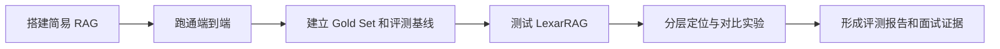

# RAG 项目实践

> [!info] 笔记定位
> 这篇笔记回答“我实际搭建、测试和验证过什么”。实践分为两个阶段：先用简易 RAG 建立可控基线，再测试 LexarRAG 的复杂链路。

相关知识：[[00_RAG核心知识]]、[[01_RAG评测与测试]]。

## 一、实践路线



两个阶段不是重复造两个项目：

- `personal-test-rag` 用来理解每一层、控制变量并验证评测方法；
- `LexarRAG` 用来练习复杂系统的黑盒评测、白盒 Trace 和版本回归。

## 二、记录规则

为了避免把“计划做”和“已经做过”混在一起，后续统一使用以下状态：

| 状态 | 含义 |
| --- | --- |
| 已实现 | 代码或配置已经存在 |
| 已验证 | 已实际运行，并保存了命令、输出或报告 |
| 待验证 | 已有实现，但当前还没有真实运行证据 |
| 计划中 | 尚未实现，只是后续方案 |

每次实验至少记录：

```text
实验目标
→ 基线版本与配置
→ 本次只修改的变量
→ 使用的评测集版本
→ 指标结果
→ 失败样本
→ 结论与下一步
```

## 三、第一阶段：personal-test-rag

项目位置：[personal-test-rag README](/Users/Admin/Documents/personal-test-rag/README.md)

### 1. 阶段目标

自己搭建一条最小、可解释、可控制的 RAG 链路，理解数据怎样进入知识库、问题怎样找到 Chunk，以及怎样证明检索和回答有效。

### 2. 当前范围

```text
Markdown 白名单
→ 清洗
→ 标题感知切片
→ bge-m3 Embedding
→ PostgreSQL + pgvector 精确余弦检索
→ qwen3:1.7b 生成（当前本机配置）
→ 答案与程序生成的真实引用
```

首版暂不包含：

- PDF、Word、图片和 OCR；
- BM25、查询改写和 Rerank；
- Agent 和工具调用；
- 登录、复杂权限和前端。

### 3. 当前能力概览

| 能力 | 当前状态 |
| --- | --- |
| FastAPI、SQLAlchemy、Alembic 项目骨架 | 已实现 |
| Markdown 白名单、清洗和标题切片 | 已实现 |
| Ollama Embedding 和 LLM 客户端 | 已实现 |
| pgvector 精确向量检索 | 已实现 |
| 增量同步、失败保留旧索引 | 已实现 |
| 低相关度拒答和真实引用 | 已实现 |
| 10 条检索评测数据与脚本 | 已实现，需扩充 |
| 31 条普通自动化测试 | 已验证，2026-08-08 全部通过 |
| PostgreSQL/pgvector、Ollama 与本地模型 | 已验证，数据库健康；`bge-m3`、`qwen3:1.7b` 已就绪 |
| 真实知识索引 | 已验证，当前有 8 篇文档、283 个 Chunk；同步 dry-run 全部跳过 |
| API 启动与真实端到端问答 | 待验证，检查时 8000 端口未启动服务 |
| 10 条检索评测基线 | 待验证，`evals/results` 尚无真实结果 |

### 4. 第一阶段评测重点

初始评测先保持简单：

- 正确文档或标题是否进入 Top-5；
- 第一个正确结果排在第几位；
- 无答案问题是否拒答；
- 引用是否来自实际知识库；
- 检索和完整问答耗时；
- 失败属于解析、切片、检索还是生成。

### 5. 后续实践顺序

- [x] 确认 Docker、PostgreSQL、Ollama、模型和真实索引环境；
- [ ] 启动 API 并完成一次真实端到端问答；
- [ ] 运行现有 10 条检索评测并保存基线；
- [ ] 将评测集扩充到 30～50 条；
- [ ] 增加同义问法、相似概念、干扰项和无答案问题；
- [ ] 增加 MRR、延迟和失败分类；
- [ ] 分别比较 Chunk、Top-K 和拒答阈值；
- [ ] 形成第一份基线评测报告。

### 6. 实验记录

#### 2026-08-08：第一阶段环境复核

- 已验证：`uv run pytest -q` 的 31 条测试全部通过；PostgreSQL 容器健康；Ollama 已有 `bge-m3` 和 `qwen3:1.7b`。
- 已验证：数据库中有 8 篇文档和 283 个 Chunk；同步 dry-run 发现 8 篇文档均无需更新。
- 待验证：API 当时未启动，因此尚未留下真实问答和引用证据。
- 待验证：评测结果目录只有占位文件，10 条种子用例还没有第一份基线结果。

> [!todo] 等第一次真实评测完成后补充
> 这里记录配置、指标、失败样本和结论，不复制大段终端输出。完整 JSON 结果保留在项目的 `evals/results` 中。

## 四、第二阶段：LexarRAG

项目位置：[LexarRAG README](/Users/Admin/Documents/lexar-rag/README.md)

### 1. 为什么选择它作为被测系统

LexarRAG 已经包含比简易项目更完整的企业知识库能力，适合用来练习复杂 RAG 的测试和评测，而不是继续停留在概念层面。

当前可以观察的链路包括：

- PDF、DOCX、XLSX、PPTX、HTML、图片和 OCR；
- 文档清洗和质量报告；
- 父子层级切片；
- Dense + BM25 混合检索；
- Query Rewrite、RRF 和 Rerank；
- 上下文分组、压缩、引用和置信度；
- 知识草稿、发布、版本和回滚；
- Retrieval Log、审计和回放。

### 2. 与简易 RAG 的差异

| 维度 | personal-test-rag | LexarRAG |
| --- | --- | --- |
| 实践目的 | 理解基础链路并建立基线 | 练习复杂系统评测 |
| 文档 | Markdown 白名单 | 多格式、OCR 和复杂版式 |
| 切片 | 标题感知切片 | 父子层级切片 |
| 检索 | Dense 向量检索 | Dense + BM25 + RRF |
| 查询优化 | 无 | Query Rewrite |
| 重排 | 无 | Rerank |
| 上下文 | 直接使用 Top-K | 扩展、去重、分组和压缩 |
| 运维 | 增量同步 | 草稿、发布、版本和回滚 |
| 可观测性 | 基础分数和引用 | 较完整的 Retrieval Log |

### 3. 当前评测能力判断

LexarRAG 已经有多个 `evaluate_*` 脚本，可以检查：

- 接口是否产生回答；
- 回答是否包含引用；
- 是否返回来源、证据分组和 Citation Highlight；
- 是否记录置信度和 Retrieval Log。

这些更接近冒烟验证和链路检查。后续还需要补充带真值的评测集，以及 Hit@K、Recall@K、MRR、回答正确性和 Faithfulness 等指标。

#### 第 2 天最小检索评测闭环（计划中）

当前已验证的线上知识范围是 Release v2：只包含 `lexar-rag-smoke.md` 的一个 Chunk，标题路径为 `LexarRAG Smoke Test`。因此第一版种子集先固定为 4 条可回答问题和 2 条无答案问题，不把仓库 README 或模型常识误当成线上知识真值：

| 类型 | 问题方向 | 预期判定 |
| --- | --- | --- |
| 正例 | Milvus 的职责 | 命中 smoke 文档并回答“向量存储” |
| 正例 | Embedding 的职责 | 命中 smoke 文档并回答“生成向量” |
| 正例 | 检索后由谁回答 | 命中 smoke 文档并回答“生成模型根据证据回答” |
| 正例 | 测试关键词 | 命中 smoke 文档并回答 `RAG_SMOKE_2026` |
| 负例 | Milvus 向量数据如何备份和恢复 | 与来源有词面重叠，但当前线上知识中没有备份策略依据 |
| 负例 | 项目支持哪些 OCR 格式 | 当前线上知识中无依据，即使仓库 README 写过也不能算可回答 |

人工核对时固定 `question`、`gold_source`、`gold_heading`、`reference_points`、`answerable`、`dataset_version`，并记录 Release、Revision、模型、Top-K、阈值和功能开关。第 2 天的第一份基线只评检索：使用原始问题，关闭 LLM Query Rewrite，不执行答案生成；分别保存 Dense、BM25、RRF 和 Rerank 的有序结果，正例计算 Hit@K 和 MRR，负例检查是否错误保留无关证据。

第 2 天计划使用自定义 Python 检索评测脚本 `backend/scripts/evaluate_retrieval_seed.py`，直接调用项目 `HybridRetriever`，并在脚本内将 `rewrite_enabled` 临时设为 `false`；不修改线上配置。Embedding 和 Rerank 仍属于被测检索链路，应固定模型版本，并同时保留 RRF 重排前与 Rerank 重排后的结果。该脚本尚未实现；首轮不引入 Ragas、DeepEval 等额外评测框架。

脚本实现按六步组织：读取并校验 JSONL 用例；解析当前 Published Release 和目标 collection；读取有效运行配置并仅在内存中关闭 Query Rewrite；加载该 Release 的固定语料；逐题调用 `HybridRetriever.invoke()`，保存 Dense、BM25、RRF、Rerank 的来源、标题、Chunk、排名、分数和耗时；最后按人工 `gold_sources`/`gold_headings` 计算各阶段 Hit@K、MRR 和负例错误召回率，连同安全配置快照写入 JSON。环境或模型服务异常单独记为执行错误，不计入检索失败；报告不保存 API Key、完整服务地址或其他秘密。

`GET /api/v2/chat/stream` 和前端“智能问答”页面保留为下一阶段的端到端黑盒测试入口，用来评价回答、引用、拒答和完整延迟。该接口同时包含 LLM Query Rewrite 与答案生成，不能单独证明检索质量；当接口样本失败时，再用第 2 天的分阶段检索结果定位问题。当前前端开发服务器监听 3001，Vite 代理目标是后端 8002；聊天接口会创建会话和审计记录，不是纯只读调用。

当前已验证的有效配置为：`retrieval_k=50`、`retrieval_score_threshold=0.1`、`rerank_top_k=4`，Query Rewrite、Dense、BM25、父切片扩展和 Rerank 均开启，`rrf_k=60`。这一组值只能作为首份基线记录，不能直接解释为“最优配置”。

失败定位按阶段判断：Gold Passage 在 Dense/BM25 均缺失属于召回问题；进入候选但在 RRF 或 Rerank 后消失属于融合或重排问题；无答案问题仍保留 smoke Chunk 属于错误召回或证据门控问题；正确证据已进入最终上下文而答案仍错，才转向生成层排查。

### 4. 第二阶段测试路线

> [!note] 学习路线调整（计划中）
> Gold Set 和检索评测可以直接以 LexarRAG 作为主要被测系统，这样能同时练习企业级知识版本、混合检索、重排和 Trace。首轮仍应限制为一小批可人工审核的固定知识，并先只评检索、不接生成判分；`personal-test-rag` 保留为结构简单、便于解释指标与排查评测脚本的对照基线。

首轮按阶段分别保存 Dense、BM25、RRF、Rerank 和最终上下文的有序结果，用同一份 Gold Passage 计算 Hit@K、Recall@K 和 MRR，才能判断结果在哪一层改善或退化。

#### 第一步：理解系统

梳理知识入库和问答链路，确认每一层的输入、输出、配置和 Trace 字段。

#### 第二步：建立黑盒基线

使用固定知识和问题，从用户视角验证回答、引用、拒答、权限、稳定性和延迟。

#### 第三步：建立 Gold Set

为问题标记预期来源、片段、答案要点、是否可回答、风险等级和数据集版本。

#### 第四步：白盒定位

结合 Retrieval Log 检查 Dense、BM25、RRF、Query Rewrite、Rerank 和最终上下文，确定失败发生在哪一层。

#### 第五步：功能消融

在同一评测集上逐步比较：

```text
Dense Only
→ Dense + BM25
→ 增加 Query Rewrite
→ 增加 RRF
→ 增加 Rerank
→ 增加父子扩展与上下文压缩
```

#### 第六步：版本回归

保存系统版本、知识版本、模型、Prompt 和检索配置，比较优化前后的效果、延迟和失败样本。

### 5. 后续实践顺序

- [x] 完成本地环境和依赖检查；
- [ ] 梳理一条完整请求的 Retrieval Log；
- [x] 选择小规模、可人工审核的测试知识；
- [ ] 建立并人工核对第一版 6 条种子集；
- [ ] 跑出检索基线并解释至少一个实际失败样本；
- [ ] 将种子集扩充为 30～50 条 Gold Set；
- [ ] 运行现有冒烟评测脚本；
- [ ] 增加检索层指标；
- [ ] 增加回答判分和人工抽检；
- [ ] 完成至少一组消融实验；
- [ ] 输出测试报告、失败案例和改进建议。

### 6. 实验与缺陷记录

#### 2026-08-09：LexarRAG 启动前检查

- 已验证：后端 `.env` 和 `.venv312` 已存在，Python 3.12.13 可导入 FastAPI、SQLAlchemy 与 PyMilvus；MySQL、Redis、Milvus 端口正在监听，Docker daemon 可用。
- 已验证：当前最新发布知识版本为 Release v2，包含 KB 1 `lexar-rag-smoke.md`、Revision 1 和一个 Chunk。
- 待验证：8000 端口尚未监听，API 和真实评测尚未运行。
- 环境缺口：仓库指南提到的 `docker-compose.local.yml` 在当前提交 `2ce89a3` 中不存在，因此暂时不能直接执行文档中的完整环境启动命令。
- 结论：可以直接开始最小种子集和检索基线练习；在保存结果 JSON 与失败记录前，评测结论仍标记为“待验证”。
- 下一步：先恢复或补齐本地部署方式，配置必需服务与模型，再固定一条问题追踪 `Query Rewrite → Dense/BM25 → RRF → Rerank → 父子扩展/上下文压缩 → 生成与引用`。

## 五、两个阶段最终要形成的能力

完成两阶段实践后，需要能够回答：

1. 一个最小 RAG 是怎样搭建和运行的；
2. 怎样构建可靠的评测集；
3. 怎样计算检索层和生成层指标；
4. 怎样区分解析、检索、重排和生成问题；
5. 怎样用固定评测集证明一个优化确实有效；
6. 怎样将一次失败转化成可重复的回归用例。

## 六、七天学习验收标准（计划中）

每天按“能讲清楚、能独立操作、能留下证据”验收，不以看完资料或运行过一次命令作为掌握。

> [!warning] 适用边界
> 这七天是“RAG 与客服智能体评测专项”，能够覆盖伊智面试中的评测集、批量执行、检索指标、裁判校准、多轮 Agent 和失败定位，但不等于完整的伊智式 AI 测试面试准备。完整准备还需单独补充 AI 生成用例的可追溯工作流、AI 生成 UI 脚本的工程化，以及 SaaS/支付功能测试与表达训练。

执行前提：每天至少保留一段完整的实操时间；LexarRAG 的环境检查最晚在第 4 天完成。第 5 天只要求分析一条完整 Trace，不要求一天掌握或改造全部复杂链路。

| 天数 | 最低掌握程度 | 可复核证据 |
| --- | --- | --- |
| 第 1 天：最小 RAG | 能画出入库与问答链路，说明 Chunk、Embedding、检索、生成和引用各自作用；启动 API，独立完成一次同步和问答 | 一次成功问答及其检索结果、引用或运行记录 |
| 第 2 天：Gold Set 与检索评测 | 能说明 Gold Source、Hit@K、MRR、拒答准确率和延迟；能人工核对种子集并运行第一份基线；能解释至少一个失败样本 | 固定版种子集、检索结果 JSON、失败样本记录 |
| 第 3 天：答案评测 | 能区分回答正确性、Faithfulness、相关性和引用正确性；能为小样本标注答案要点，设计判分 Rubric，并用人工结果校准裁判；至少包含一组客服话术业务样本，不能只测技术笔记 | 带 `reference_points` 的用例、人工与裁判对照结果 |
| 第 4 天：多轮 Agent 与工具调用 | 能区分最终答案评测和轨迹评测；检查工具名称、参数、权限、幂等、业务结果和失败兜底；用小规模模拟对话验证，不要求搭建完整多 Agent 平台 | 多轮用例、工具 Trace、确定性断言和至少一个失败轨迹 |
| 第 5 天：LexarRAG 单链路分析 | 能把 Dense、BM25、Query Rewrite、RRF、Rerank、父子切片和上下文压缩放回完整链路；只选一条请求，用 Trace 判断结果在哪一层变化 | 一条完整请求的链路图与 Retrieval Log；环境未跑通只能标记“理解”，不能标记“已验证” |
| 第 6 天：报告与失败案例 | 能写清环境、数据集、配置、指标、失败、结论和限制；失败案例能够复现，并能给出有证据的改进方向 | 一份基线评测报告和至少 2 个可复现失败案例 |
| 第 7 天：面试表达 | 能按“结论—步骤—业务例子—指标”回答评测集来源、批量执行、裁判校准、RAG 召回、多轮 Agent 和失败定位；能区分已实现、已验证和计划中 | 一次录音或文字模拟回答、计时结果和追问清单 |

阶段完成不等于掌握全部公式或复杂框架。七天结束时的最低目标，是能够独立完成并解释一个最小 RAG 评测闭环，再把同样的方法迁移到 LexarRAG。

## 七、面试中的能力边界

后续表达统一采用：

> 我已经实现了什么；哪些内容经过了真实运行验证；哪些是我在 LexarRAG 中完成的测试与评测；哪些仍然只是下一步计划。

不把代码存在等同于运行验证，也不把学习方案描述成生产项目经验。
